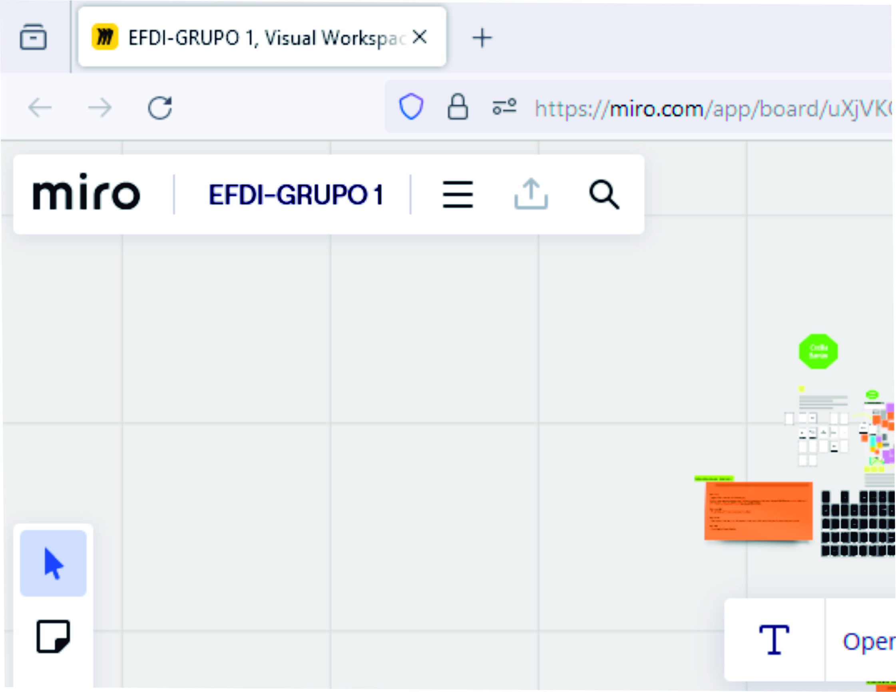

---
hide:
    - toc
---

# MD01

Hoy doy inicio al módulo de diseño desde una óptica innovadora y centrada en las personas, empleando esta herramienta: el Atlas de Señales Débiles.
Para módulo busque información acerca de como puede ser útil esta herramienta para nosotros los estudiantes y diseñadores. 
El Atlas de Señales Débiles nos ayuda a identificar pequeñas señales de cambio que podrían tener un gran impacto en el futuro. ¿Cómo funciona?
Primero, recopila y organiza estas señales de cambio que pueden ser tendencias emergentes, nuevas tecnologías o incluso cambios sociales y culturales. Al agruparlas, podemos entender mejor las posibles direcciones hacia las que se dirige el mundo.
Segundo, nos proporciona palabras clave para la investigación y experimentación. Dichas palabras clave nos ayudan a enfocar nuestros esfuerzos y explorar áreas específicas que podrían ser importantes para el futuro. 
Tercero, el atlas nos ofrece un espacio de diseño inicial. Aquí podemos empezar a trabajar en ideas y soluciones que aborden los desafíos y oportunidades que se identifican a partir de las señales débiles.

En resumen, el Atlas de Señales Débiles es una herramienta que nos permite anticipar el futuro, diseñar estrategias y soluciones innovadoras. Nos ayuda a entender mejor nuestro entorno y estar preparados para los cambios que puedan venir. De esta manera podemos utilizar este atlas para crear un futuro sostenible y de mejor calidad para todos.

Utilizando la herramienta MIRO abrimos el Atlas de Señales Débiles y comenzamos eligiendo dos señales débiles del mazo como inicio del ejercicio, con el fin de familiarizarnos con la herramienta. 
Luego, las colocamos en los Espacios de Diseño de las señales débiles 01 y 02.
Después, describimos qué temas, ejemplos o palabras clave nos llevaron a elegir esas tarjetas, agregándolas al espacio de diseño para dejar un registro de nuestras ideas y considerando lo que significaban para nosotros.

Utilizando algunas Áreas de Oportunidad empleadas en Fab Lab Barcelona, buscamos oportunidades de posibles futuros emergentes. 
Aunque inicialmente nos pidieron que eligiéramos al azar, tuve que empezar de nuevo varias veces porque no lograba familiarizarme con el método. Me costó mucho encontrar posibles interconexiones y tardé bastante tiempo en avanzar con mi Espacio de Diseño.

Siguiendo con los ejercicios, tuve que seleccionar dos Conceptos Detonantes dispuestos en la parte inferior. Estos conceptos serán empleados como palabras clave en nuestro trabajo, colocando las tarjetas en el espacio de diseño para servir como herramientas que nos permitan descubrir oportunidades o relaciones que aún no habíamos considerado. Además, se nos solicitó vincular este ejercicio con alguna causa, problemática o área de investigación en la que estemos comprometidos, añadiéndola a la casilla 6.
Me resultó dificil identificar posibles escenarios en estas tarjetas y visualizar un futuro potencial o la dirección que podría tomar.

En esta etapa trabajamos en el Espacio de Diseño con el mapa multiescalar
El mapa multiescalar permite explorar y comprender las interconexiones entre diferentes escalas en diversos sistemas. Es un espacio de diseño donde diseñadores, estudiantes y profesionales pueden plasmar ideas y visualizar posibilidades futuras globales. Este espacio proporciona una amplia gama de opciones de acción al mostrar cómo diversos temas de interés están conectados en nuestros sistemas interconectados. Además este espacio de diseño puede ser físico o digital y puede contener experimentos, proyectos, materiales y productos que respaldan el desarrollo de intervenciones y acciones autorreflexivas complementando las capacidades del Atlas de señales débiles.

Para mapear mi idea de proyecto, tuvimos que encontrar los recursos, infraestructura, referentes y posibilidades utilizando posit divididos en:

Señales Débiles y Tópicos de interés.
Estado del Arte, Proyectos y Personas de Referencia.
Infraestructura, Espacio de Trabajo Extendido.
Materiales, Suministros, Materiales.
Posibles contextos de Intervención.
Ubicándolos desde el centro "yo" hasta el anillo global, completando así un mapa repleto de información personal."

Para finalizar, abordamos una parte que considero más compleja, donde describimos las continuidades actuales que son una descripción personal de la realidad en la que vivimos. En este proceso, el video proporcionado en la plataforma fue una herramienta fundamental, ya que me ayudó a comprender el contexto del mundo actual. En la segunda parte, exploramos diversos escenarios alternativos, imaginando futuros o presentes alternativos con soluciones para los desafíos que enfrentamos en la actualidad.

Posteriormente, desarrollamos acciones de diseño destinadas a apoyar nuestro presente alternativo. Estas acciones las dividí en tres áreas: medio ambiente, equidad social y políticas climáticas.

Una breve reflexión sobre el enfoque del diseño centrado en la persona. Sin duda, el diseño basado en la persona representa un enfoque muy diferente al que estaba acostumbrado en mi empresa. Allí, el diseño se centraba casi exclusivamente en las necesidades del cliente, y nuestro trabajo se limitaba en gran medida a servir como una guía estética y técnica para hacer el proyecto viable desde un punto de vista comercial.

Esta nueva perspectiva del diseño nos invita a reconsiderarnos como individuos, como parte integral de la naturaleza y a reflexionar sobre nuestra relación con el planeta. Nuestros valores comienzan a manifestarse en el proceso, obligándonos a pensar y tomar conciencia de los problemas profundos que enfrenta la humanidad, pero que a menudo pasamos por alto.

