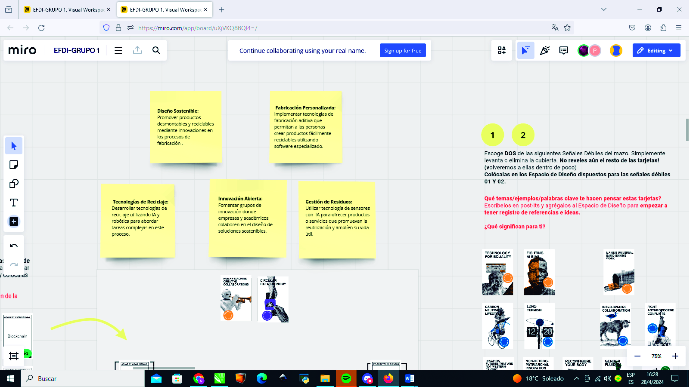
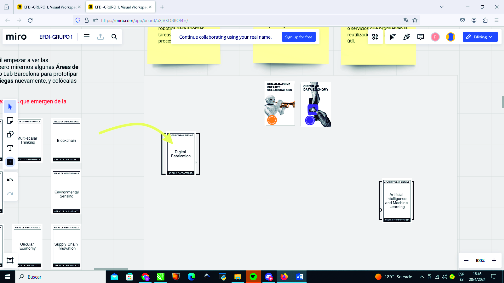
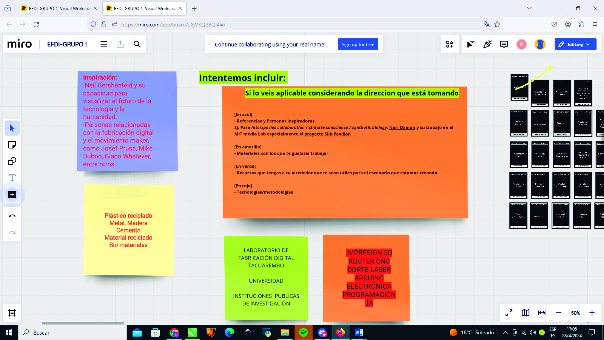
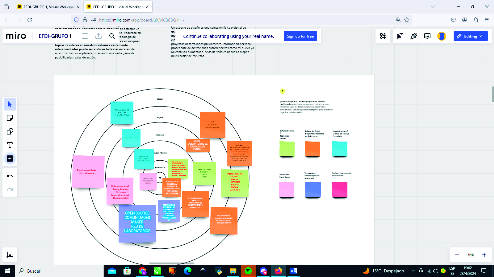

---
hide:
    - toc
---

# MD01

Hoy doy inicio al módulo de diseño desde una óptica innovadora y centrada en las personas, empleando esta herramienta: el Atlas de Señales Débiles.
En este módulo busque información acerca de como puede ser útil esta herramienta para nosotros los estudiantes y diseñadores. 
El Atlas de Señales Débiles nos ayuda a identificar pequeñas señales de cambio que podrían tener un gran impacto en el futuro. ¿Cómo funciona?
Primero, recopila y organiza estas señales de cambio que pueden ser tendencias emergentes, nuevas tecnologías o incluso cambios sociales y culturales. Al agruparlas, podemos entender mejor las posibles direcciones hacia las que se dirige el mundo.
Segundo, nos proporciona palabras clave para la investigación y experimentación. Dichas palabras clave nos ayudan a enfocar nuestros esfuerzos y explorar áreas específicas que podrían ser importantes para el futuro. 
Tercero, el atlas nos ofrece un espacio de diseño inicial. Aquí podemos empezar a trabajar en ideas y soluciones que aborden los desafíos y oportunidades que se identifican a partir de las señales débiles.

En resumen, el Atlas de Señales Débiles es una herramienta que nos permite anticipar el futuro, diseñar estrategias y soluciones innovadoras. Nos ayuda a entender mejor nuestro entorno y estar preparados para los cambios que puedan venir. De esta manera podemos utilizar este atlas para crear un futuro sostenible y de mejor calidad para todos.

Una breve reflexión sobre el enfoque del diseño centrado en la persona. Sin duda, el diseño basado en la persona representa un enfoque muy diferente al que estaba acostumbrado en mi empresa. Allí, el diseño se centraba casi exclusivamente en las necesidades del cliente, y nuestro trabajo se limitaba en gran medida a servir como una guía estética y técnica para hacer el proyecto viable desde un punto de vista comercial.

Esta nueva perspectiva del diseño nos invita a reconsiderarnos como individuos, como parte integral de la naturaleza y a reflexionar sobre nuestra relación con el planeta. Nuestros valores comienzan a manifestarse en el proceso, obligándonos a pensar y tomar conciencia de los problemas profundos que enfrenta la humanidad, pero que a menudo pasamos por alto.

