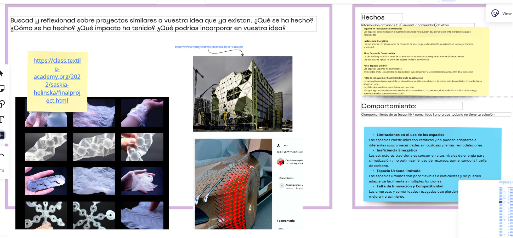

---
hide:
    - toc
---

# MD02
# DISEÑO

En el Módulo 02 del eje temático de diseño, hemos avanzado en la implementación y definición del proyecto final. 

Comenzamos revisando un gráfico de proceso de diseño de Damien Newman, que ilustra la complejidad y los múltiples pasos involucrados en la implementación de procesos de diseño. 
Este gráfico nos ayudó a comprender mejor la definición de diseño y la complejidad de sus procesos.

Iniciamos el módulo con una clase tratando los temas: La mirada del diseño, Metodología de diseño y El prototipo como herramienta de desarrollo.

Esta clase nos dio un panorama presentando los conceptos de manera clara y ordenada, lo que nos permitió avanzar con una mayor comprensión y dirección en nuestro proyecto.
Antes de abordar el ejercicio propuesto, repasamos el trabajo realizado en el primer módulo de diseño, el "Atlas de Señales Débiles", basado en las tendencias que nos ayudaron a identificar nuestros intereses y temáticas. Tambien el "Espacio Multiescalar", entendiendo nuestros presentes alternativos y traduciendo estos conceptos en acciones de diseño, aunque todavía sin un camino claro.

El primer ejercicio de este módulo nos llevó a completar la Etapa 01 en MIRO, donde definimos nuestra propuesta de valor, referencias y contexto. Este ejercicio nos permitió estructurar mejor nuestras ideas y enfoques.

JAM SESSION
En la "JAM SESSION", definimos nuestras acciones en los cuatro cuadrantes: Fácil, Relevante, Irrelevante e Imposible. Este ejercicio es importante para enfocar nuestras acciones en función de su relevancia y la posibilidad de hacerlo.

Intercambio de Proyectos y Refinamiento de Ideas

Durante el segundo día, intercambiamos ideas y proyectos, mejorando así la comprensión y enfoque. Mi proyecto, relacionado con estructuras dinámicas, aún está muy abierto y con la necesidad de un enfoque más definido. Recibí recomendaciones valiosas sobre investigar textiles deformables, con ejemplos prácticos y prototipables. Esta orientación me permitió considerar una investigación de materiales diferentes además de un segundo enfoque con orientación educativa que puede ser canalizada  a través mi laboratorio de fabricación digital.

Etapa 02 
Posteriormente, avanzamos a la Etapa 02 del ejercicio en MIRO. Definimos nuestra idea de proyecto en una frase y proporcionamos referencias adicionales. Basándonos en el ejercicio de la "JAM SESSION", comenzamos a implementar acciones y posibles prototipos para concretar el proyecto, definiendo los insumos y resultados esperados.

Entrega 

Finalmente, como entrega, trabajamos en las 3 intervenciones más relevantes para visualizar nuestro proyecto de manera clara. 

Estoy en proceso de afinar las acciones y estrategias, consciente del tiempo limitado, para avanzar de manera efectiva en el desarrollo del proyecto.
