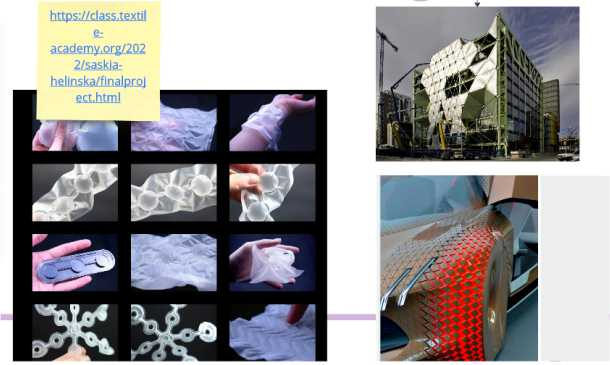
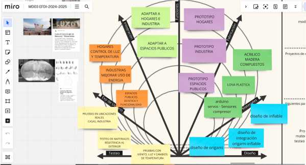
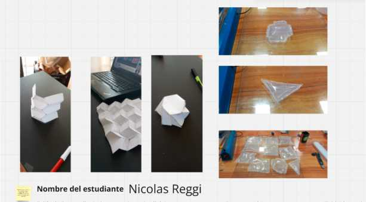
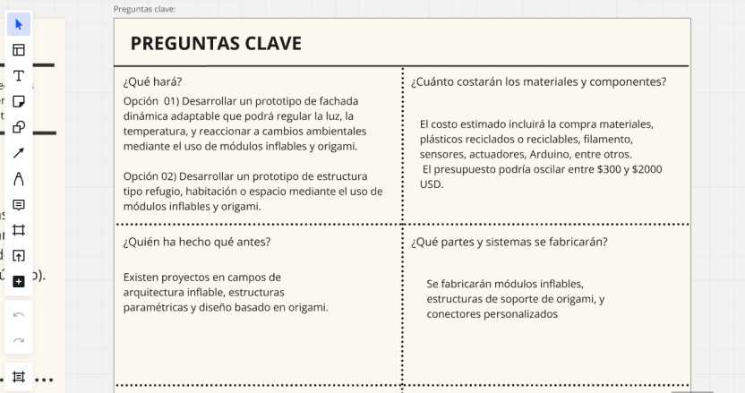
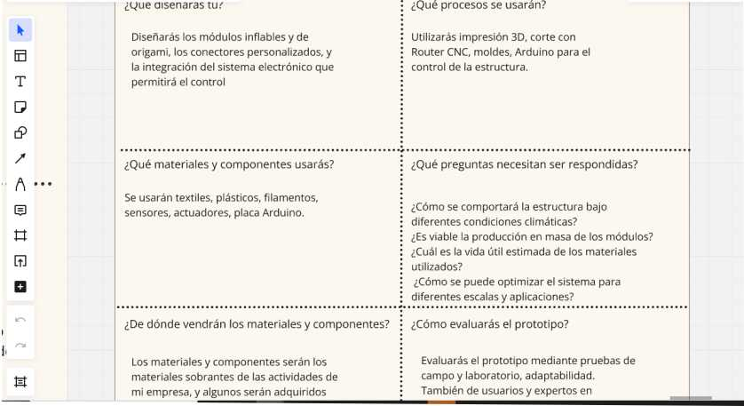
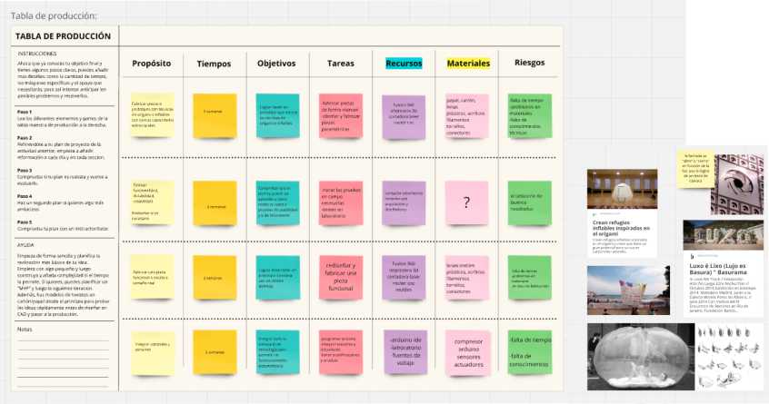

---
hide:
    - toc
---

# MD03
# MODULO DE DISEÑO

La primera clase del módulo de diseño 03 comenzó con un repaso de lo trabajado hasta el momento, con el objetivo de ir tomando un camino más concreto y aterrizando nuestras ideas.

En base a lo desarrollado en el módulo de diseño anterior, utilizando el tablero de Miro, he podido reflexionar sobre cómo han evolucionado mis ideas y cómo algunos conceptos han sido ajustados o reorientados. 

El Intercambio con docentes y compañeros en las clases por Zoom enriquece tanto mi proyecto como los de los demás compañeros, además de agregar conocimiento en diferentes áreas nos ayudan a plantearnos preguntas sobre nuestro proyecto.

Repasando mi tablero de Miro sobre mis primeras ideas, pude identificar qué conceptos se mantendrán y cuáles serán fundamentales para completar el nuevo tablero de este módulo. 

Aunque varios compañeros han cambiado y adaptado sus proyectos a medida que avanzaban, mi proyecto sigue alineado con la idea casi original y conectado con lo realizado y analizado anteriormente en el módulo anterior, al menos a nivel general.

Nuevo tablero

El desafío actual es aterrizar estas ideas en un proyecto manejable y acotado. Los docentes me han recomendado enfocar mi atención en un objtivo específico, dejando en segundo plano las ideas complementarias relacionadas con programación, electrónica y sensores.

 Estas ideas podrían integrarse posteriormente si el tiempo de fabricación del prototipo lo permite.

"Primeras pruebas de inflables y origami"

En este módulo, se nos planteó la tarea de completar un nuevo tablero de Miro, el cual se enfocó en responder una serie de preguntas clave para guiar el desarrollo de nuestro proyecto. 

Al completar estas preguntas en el tablero, logré aclarar y estructurar mejor el enfoque de mi proyecto, lo que me permitirá avanzar con mayor seguridad en las próximas etapas.

Sobre Mi Proyecto: Estructuras y Fachadas Dinámicas Adaptables

El proyecto se centra en el desarrollo de un prototipo de estructura o fachada dinámica adaptable que pueda regular la luz, la temperatura, y reaccionar a cambios ambientales utilizando técnicas de fabricación digital, estructuras inflables y origami.

La segunda opción son las estructuras dinámicas que, utilizando la misma técnica, puedan generar espacios habitables o modificables en su amplitud y utilidad. 

La finalidad es crear una solución innovadora que pueda ser aplicada en diferentes contextos, desde viviendas hasta espacios industriales y públicos, mejorando aspectos estéticos y energéticos.

Plan de Acción: Pasos para la Realización del Proyecto
Definición del Prototipo:

Enfocarme en el diseño de una estructura o fachada dinámica que sea adaptable a diferentes entornos.

Decidir si el proyecto se orientará hacia la creación de espacios funcionales o hacia soluciones decorativas y de eficiencia energética.

Testeo y Validación:

Realizar ensayos tanto en campo como en laboratorio para evaluar la resistencia y funcionalidad de los materiales y mecanismos.

Probar la estructura en diferentes escenarios: hogares, industrias, y espacios públicos.

Fabricación y Diseño:

Desarrollar y fabricar los módulos inflables, las estructuras de origami y los conectores necesarios, utilizando herramientas como impresión 3D y Router CNC.

Diseñar e implementar los componentes del prototipo, asegurando que sean funcionales y estéticamente adecuados para su entorno de aplicación.

Evaluación y Ajustes:

Evaluar el prototipo a través de pruebas, recopilando feedback para realizar los ajustes necesarios.

Iterar los diseños en función de los resultados obtenidos y preparar el proyecto para su presentación final.

El proyecto avanza con la idea general ya planteada, pero ahora enfocado en aspectos específicos y prácticos para asegurar su viabilidad. 

El proceso de prototipado y adaptación es clave, permitiendo que las ideas evolucionen hacia un prototipo funcional y efectivo.

