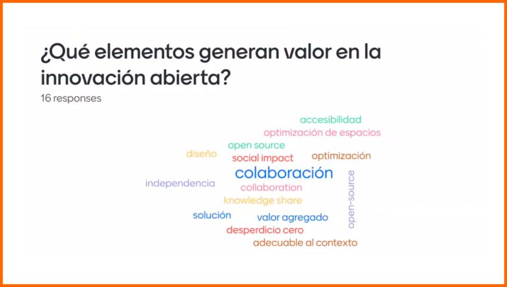

---
hide:
    - toc
---

# MI01

Diseño Distribuido e Innovación Abierta 
Desde el inicio, la docente nos propuso trabajar de forma colaborativa con preguntas como, ¿qué genera valor?, ¿para quién se genera valor? y ¿quién se queda afuera?. Estas preguntas nos invitan a reflexionar sobre los diferentes aspectos del valor en nuestros proyectos.

El ejemplo de Found Objets en Holanda me parece muy interesante, primero porque está relacionado con mi ámbito laboral y la problemática de los residuos que dejan los equipos como el router CNC, y segundo porque nos muestra cómo, aun planificando la producción de un producto para aprovechar al máximo la materia prima seguimos generando desechos. 

Este enfoque resalta la importancia de encontrar soluciones sostenibles, impulsadas tanto por nuestros valores personales como los de la empresa.
 Aunque estas soluciones no siempre generen una ganancia directa para la empresa, sí pueden generar un beneficio para la sociedad y el planeta.
Me parece interesante que se pueda desarrollar un proyecto donde artistas, diseñadores y desarrolladores de software puedan compartir y crear conocimiento en busca de una solución a este problema. 
La empresa Fiction Factory, en Ámsterdam, Holanda, utiliza un software de código abierto que crearon en colaboración con otros especialistas para generar nuevas zonas de relleno en el diseño de las piezas sobrantes. A través de este enfoque, los diseñadores utilizan los residuos de las fábricas para crear valor con nuevos diseños de productos.

Los elementos que generan valor en la innovación abierta son diversos , si tomamos como referencia los orígenes del movimiento open source vemos que está directamente relacionado con el diseño distribuido en innovación abierta. Este movimiento surgió como una respuesta a la necesidad de compartir conocimientos y recursos de manera abierta y colaborativa, permitiendo a diferentes comunidades trabajar juntas para resolver problemas y mejorar tecnologías.

1.	Un proyecto replicable: las impresoras 3D son un ejemplo destacado ya que pueden ser replicadas en cualquier parte del mundo. Este proyecto se desarrolló en un contexto muy especial, marcado por el avance de internet y un mundo cada vez más conectado. Elementos como el movimiento hacker, las computadoras personales, el software libre, la fabricación digital y los espacios maker, junto al movimiento maker, conectaron a personas con intereses y herramientas comunes. Esto permitió la creación y distribución de impresoras 3D de bajo costo democratizando el acceso a esta tecnología y fomentando la innovación a nivel global.

2.	La importancia de la definición y comprensión del open source.
 Me pareció muy importante la definición de open source y entender el proceso y la forma de trabajar mediante la documentación de planos,los procesos y los errores que tambien se comparten. 
 Este enfoque no solo facilita la replicación y mejora de proyectos, sino que también promueve una cultura de colaboración que es esencial para la innovación abierta.

3.	Interconexión y la innovación abierta.
 Siguiendo con la innovación abierta, avanzamos en la comprensión de la interconexión que existe, no solo en la industria en la que trabajamos, sino en todas las áreas. Nuestro mundo está interconectado a diferentes niveles, y los cambios en contextos políticos, tecnológicos y ambientales nos afectan a todos. La innovación abierta nos permite adaptarnos y responder a estos cambios de manera más eficiente, aprovechando el conocimiento y las capacidades distribuidas en todo el mundo.

El diseño distribuido y su evolución en la innovación abierta

•	Orígenes del diseño distribuido.
 El diseño distribuido nace del movimiento open source y la digitalización de la disciplina del diseño. Este enfoque promueve la colaboración y el intercambio abierto de ideas y recursos entre diseñadores de todo el mundo.

•	Plataforma Distributed Design Platform.
 La plataforma Distributed Design Platform se inicia en 2017 con la filosofía de entender el diseño como una red europea y mundial donde diseñadores, makers y arquitectos colaboran. La idea es practicar valores que superen el modelo actual de producción centralizada (donde se produce en un lugar, se consume en otro y los residuos se envían a otro). En cambio, se propone el modelo "data in, data out", donde se prefiere el intercambio de información y datos. Esto permite comprender mejor las capacidades y oportunidades de cada contexto para replicarlas de manera más eficiente.

•	Promoviendo el valor en un mundo de policrisis.
 El diseño distribuido busca impulsar el valor en un mundo que enfrenta múltiples crisis en diferentes aspectos. Esta disciplina entiende lo que somos capaces de hacer en nuestro contexto específico. Históricamente, hemos comprendido el diseño artesanal como la fabricación en talleres con recursos propios.

•	Evolución del diseño.
 Después de la Revolución Industrial y durante el período de entreguerras, surge el movimiento de la Bauhaus, que nos trajo nuevas herramientas de diseño, técnicas y materiales. En la era industrial, comenzamos a entender el diseño de manera más autoral, centrado en las personas y en el usuario final, para que los productos fueran lo más usables posible.

•	Hacia una producción más consciente.
 Actualmente nos encontramos en una realidad que demanda una producción más consciente, conocida como diseño des-objetivador. Para lograrlo, recurrimos a nuestros propios principios y valores a través de métodos y herramientas específicos. Prototipamos basándonos en estos valores y enfrentamos las ideas que queremos materializar para aportar a nuestro presente emergente.

El diseño distribuido al integrar estos elementos, se posiciona como una herramienta poderosa para abordar los desafíos actuales  y fomentar una producción más sostenible y colaborativa.

A continuación, realizamos un ejercicio en tableros personales. El objetivo de la tarea fue, en 15 minutos, hacer un resumen de la idea de nuestro proyecto final, respondiendo a estas preguntas:
1)	¿Qué problema quiero ayudar a resolver?
2)	¿En qué industria y contexto nace?
3)	¿Para quién generamos valor?
4)	¿Cómo genero valor en el proyecto?

Me resultó un poco complicado el análisis en tan poco tiempo y, como aún no tengo definido mi proyecto, intenté comenzar con ideas generales de las temáticas que me interesan. Muchas de estas coincidían con las de otros compañeros, como la circularidad, los materiales reciclados, el clima, entre otros.
Fue interesante escuchar y ver los ejemplos de los compañeros con sus diferentes desafíos e intereses, y cómo los relacionaron para avanzar en sus procesos creativos.
También  se nos pidió la realización de un moodboard colaborativo para investigar proyectos relacionados con los temas compartidos durante la sesión.
En mi caso, preferí repensar mi tablero, ver nuevamente la clase grabada, revisar el material recomendado y profundizar en el tema. Desde el primer módulo de diseño, donde mis ideas de proyecto estaban centradas en máquinas o dispositivos funcionales, he logrado cambiar mi perspectiva sobre el diseño, pasando de objetos de tipo artístico y de concientización a otros tipos de proyectos con más contenido, alcance y proyección en el tiempo.

Como resultado, pude avanzar en un conjunto de ideas que creo están más alineadas con mis preferencias y el objetivo del curso. Estos módulos de diseño e innovación son importantes para abrir la mente y entender mejor los proyectos que nos interesan, ya que nos plantean nuevas formas de entender el diseño.
En resumen, este ejercicio me permitió clarificar y enfocar mis ideas, así como aprender de los enfoques de mis compañeros, lo cual enriquece el proceso creativo y colaborativo en nuestro curso de diseño distribuido e innovación abierta.

Durante el curso, exploramos temas clave del diseño distribuido e innovación abierta, desde el movimiento open-source hasta la implementación de plataformas como Distributed Design Platform. La colaboración y el intercambio de información han sido fundamentales para impulsar la innovación y la sostenibilidad.

Con ejercicios prácticos como tableros personales y moodboards, hemos concretado nuestras ideas, avanzando hacia una comprensión más profunda del diseño como generador de valor social y ambiental.

En resumen, esta experiencia nos proporciona nuevas herramientas para abordar los complejos desafíos del diseño y la innovación de manera colaborativa y sostenible, preparándonos para contribuir a comunidades más conscientes y responsables.