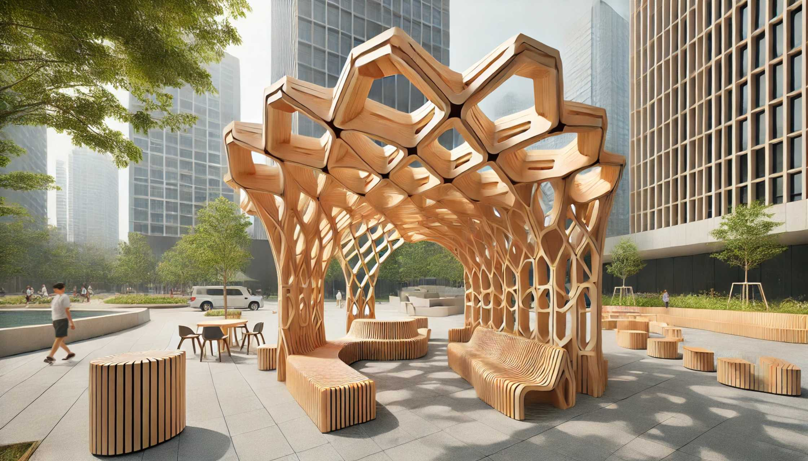
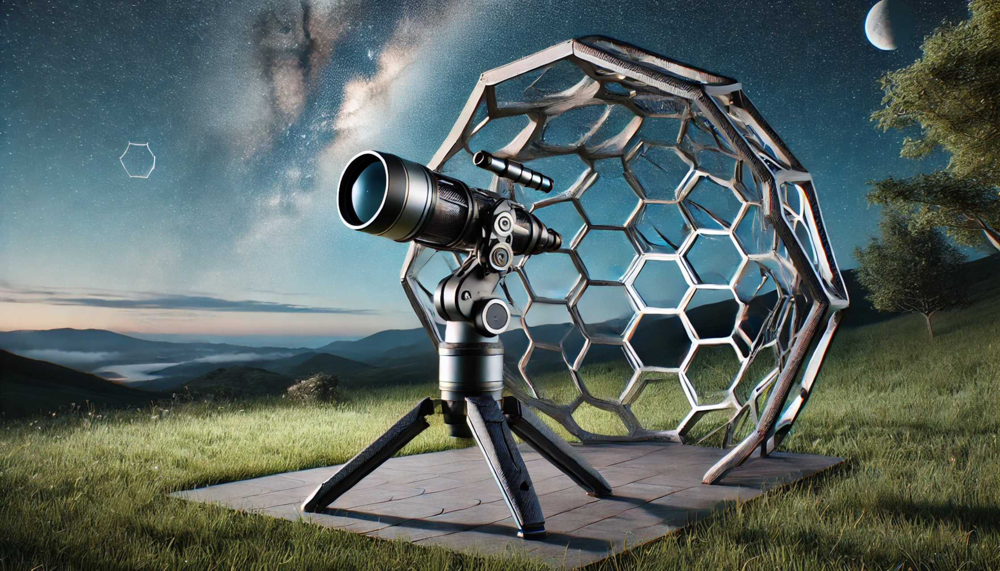
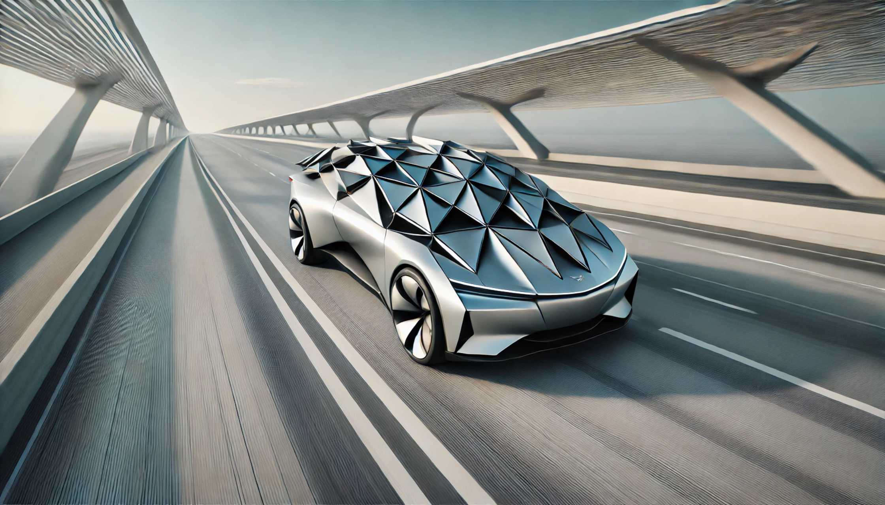

# Estructuras Dinámicas

<h3><b>Conclusiones:</b></h3>

El proyecto demostró que es viable combinar técnicas de inflables y origami con fabricación digital para crear estructuras dinámicas e innovadoras. 

Los prototipos validaron el funcionamiento de modo experimental  de estas técnicas aplicables a la arquitectura y el diseño, ofreciendo soluciones que pueden ir  más allá de las técnicas tradicionales.

La importancia de desarrollar técnicas específicas para cada material fue crucial para superar los desafíos encontrados. Además, integrar sistemas electrónicos y mecánicos permitió el control y funcionalidad en las estructuras.

La fabricación digital y el diseño colaborativo son herramientas fundamentales para desarrollar estructuras adaptativas y sostenibles.

<h3><b>Usos y aplicaciones concretas para las estructuras dinámicas.</b></h3>

Si bien las estructuras dinámicas tienen un impacto positivo en términos de innovación arquitectónica y sostenibilidad, su verdadero valor radica en sus aplicaciones prácticas. 

Algunas posibles utilidades:

Arquitectura adaptativa para espacios públicos.

Estructuras inflables que se despliegan para proteger áreas peatonales durante lluvias intensas, controladas mediante sensores que detectan cambios climáticos. Control climático en edificios comerciales o residenciales.

Coberturas Adaptativas para Instrumentos Científicos: Sistemas inflables diseñados para proteger telescopios u otros instrumentos expuestos a la intemperie, asegurando su funcionalidad frente a cambios climáticos, polvo o humedad.

Fachadas dinámicas que ajustan su posición según la intensidad de la luz solar, reduciendo la necesidad de sistemas de climatización artificial.

Aplicaciones en Vehículos: Coberturas inflables para proteger de condiciones climáticas adversas o sistemas dinámicos que mejoran la aerodinámica y la eficiencia energética mediante cambios en su envoltura externa.

Estos ejemplos demuestran cómo las estructuras dinámicas pueden integrarse en escenarios cotidianos para ofrecer soluciones prácticas, adaptativas y sostenibles.

<h3><b>Pasos a seguir:</b></h3>

<h3><b>Prototipo 1: Superficies Inflables Geométricas</b></h3>

Optimizar el Sistema de Inflado para controlar mas modulos

Mejorar el control y sincronización junto a la iluminación led

Conectar sensores que interactúen con el medio o las personas

Experimentar con diferentes materiales. 

Desarrollar Superficies Modulares: que permitan otros movimientos (por ejemplo de doble curvatura)

Crear sistemas interconectadas para formar patrones complejos como por ejemplo hexágonos.

<h3><b>Prototipo 2: Estructuras Origami Extensibles</b></h3>

Diseñar patrones de origami con mayor complejidad geométrica.

Investigar materiales alternativos que aporten flexibilidad y resistencia o aislación.

Conectar sensores que interactúen con el medio o las personas.

Adaptar las estructuras para aplicaciones a mayor escala en entornos arquitectónicos o instalaciones artísticas.

<h3><b>Proyectos Futuros</b></h3

Integración de Tecnologías:
Combinar las técnicas de inflables y origami en un prototipo con aplicaciones de programación más avanzadas.
Colaboraciones:
Trabajar con arquitectos y diseñadores para aplicar las estructuras en proyectos reales.
Difusión y Código Abierto:
Complementar la documentación y compartir los diseños y procesos para fomentar la innovación abierta.
Impacto del Diseño, Sostenibilidad:
Uso de Materiales Reciclados:
Empleo de PVC flexible, acrílico y aluminio compuesto reciclados, reduciendo el impacto ambiental.
Funcionalidad: Aplicación de técnicas no tradicionales en arquitectura y diseño, ofreciendo soluciones adaptativas y dinámicas.
Interactividad: Estructuras que responden a estímulos externos, mejorando la experiencia de usuarios y entornos.
