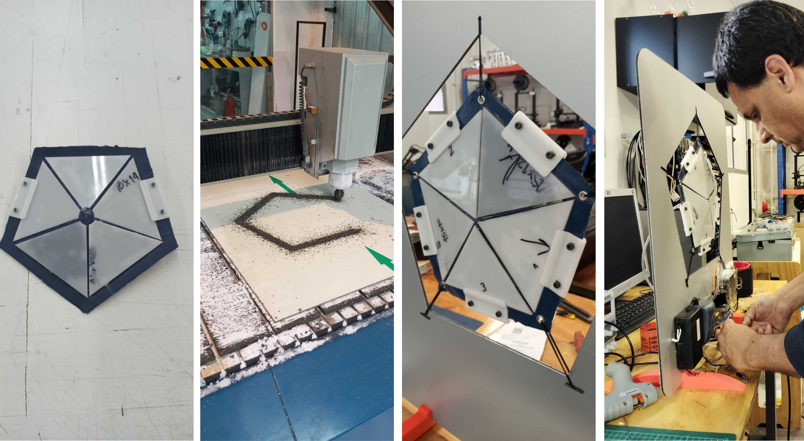
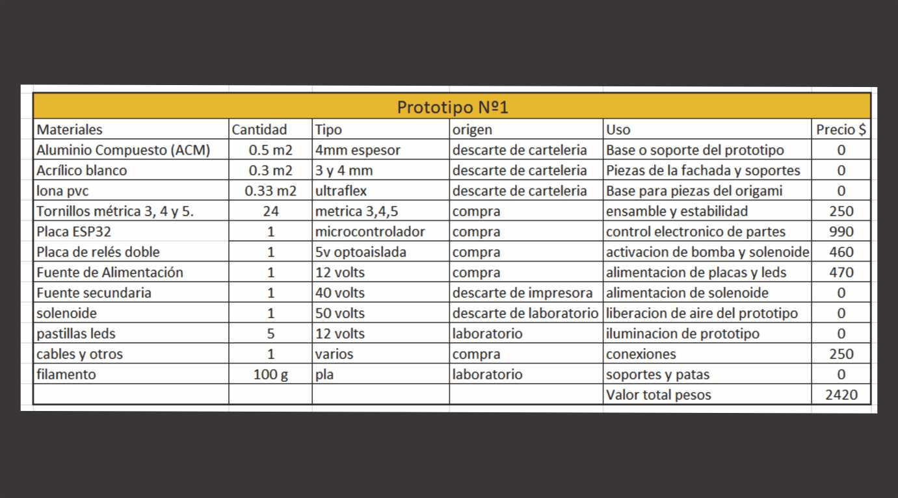
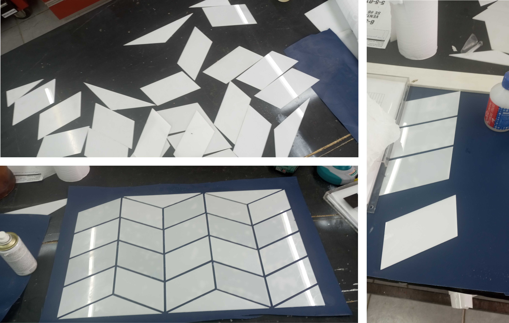
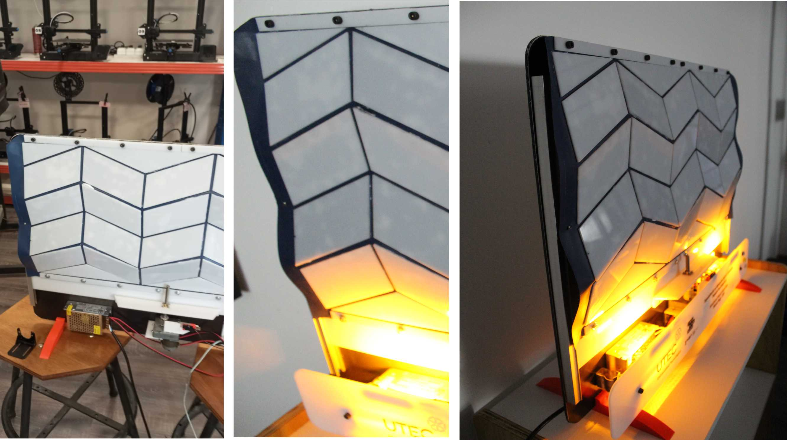
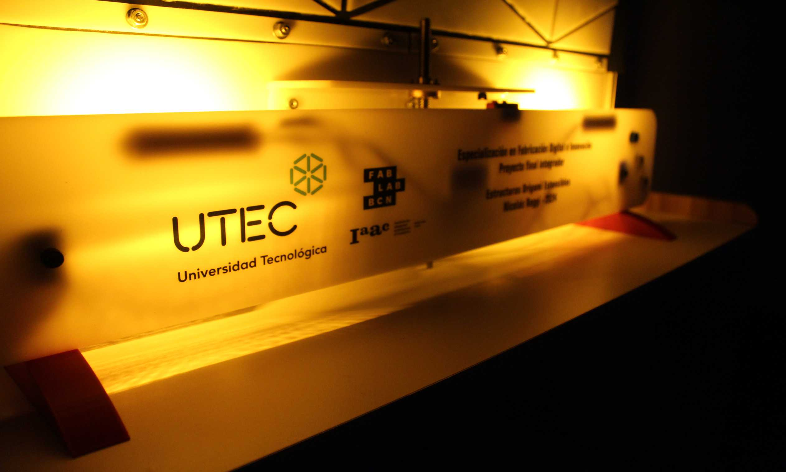
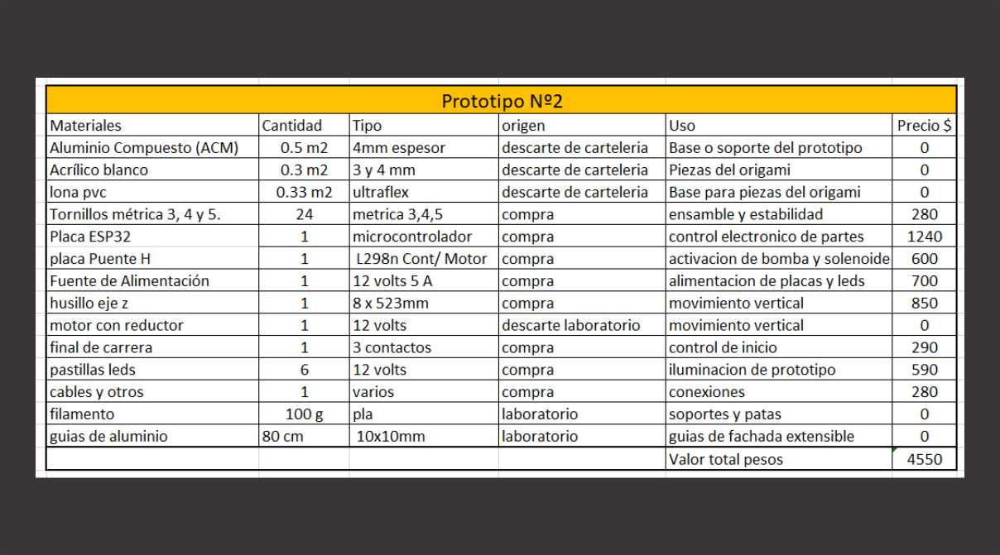

# Estructuras Dinámicas

<h3><b>Diseño de prototipos:</b></h3>

En esta etapa, desarrollé los diseños preliminares de dos prototipos principales, tomando como base los hallazgos de las fases de experimentación anteriores. 

Fue necesario utilizar herramientas de diseño digital para modelar geometrías precisas y prever su comportamiento estructural en función de los materiales seleccionados.

Durante la planificación, consideré técnicas como corte láser, router CNC, impresión 3D y sellado térmico para su futura fabricación. 

La integración de estos métodos en el proceso de diseño permitió evaluar la viabilidad técnica de los prototipos y asegurar que las propuestas fueran factibles y funcionales.

Este proceso fue muy importante para definir el rumbo teniendo en cuentas los  experimentos iniciales.

 <h3><b>Prototipo 1: Superficies Inflables Geométricas</b></h3>

El primer prototipo combina principios geométricos, materiales rígidos sobre material flexible para desarrollar una superficie inflable dinámica. 

Esta estructura modular, controlada electrónicamente, busca explorar cómo el aire puede transformar formas tridimensionales mientras crea un efecto visual atractivo.

El diseño está compuesto por dos octógonos de PVC flexible soldados en su perímetro, que contienen en su interior triángulos rígidos de acrílico.

 Al inflarse, la interacción entre estos elementos genera una estructura tridimensional dinámica, limitando el movimiento de las superficies a patrones geométricos predefinidos.

Para controlar el inflado y los cambios de forma, se utilizó un sistema basado en una placa ESP32 programada con Arduino, que opera en conjunto con un mini compresor de aire y una válvula solenoide para liberar el aire. 

Este sistema permite ajustar el flujo de aire de manera precisa, ofreciendo una gestión eficiente del movimiento. Además, se integraron LEDs que añaden un componente visual que enriquece el diseño y aspecto estético.

Este prototipo combina diseño, tecnología y materiales de forma distinta, logrando una solución funcional que me resulta muy  interesante. 

El proceso fue un reto significativo que me  permitió explorar nuevas posibilidades que podrán ser utilizadas en  instalaciones interactivas y propuestas arquitectónicas originales.

 <h3><b>Fabricación:</b></h3>

Procesos utilizados:

Corte láser: Para la fabricación de los triángulos de acrílico.

Impresión 3D: patas o soportes para los prototipos y soportes para componentes.

Router CNC: fresado de base de aluminio y tapas.

Soldadura térmica: Técnica para sellar el PVC flexible utilizando una prensa de sublimación.

Software Utilizado:

Diseño 2D y 3D: Autodesk Fusion 360 para el modelado 

Programacion: Arduino IDE

 <h3><b>Lista de materiales:</b></h3>

<h3><b>Prototipo 2: Estructuras Origami Extensibles</b></h3>
 
El segundo prototipo explora las posibilidades de estructuras extensibles basadas en patrones de origami , integrando geometrías plegables lineales, superficies flexibles, movimientos mecánicos y control electrónico. 

Este diseño combina la estética del origami con un sistema dinámico y controlado, creando una estructura adaptable que aporta movimiento y precisión.

La estructura está compuesta por polígonos de acrílico diseñadas según principios de origami, adheridas a una superficie flexible de PVC.

 Estas formas, al desplegarse, generan un movimiento dinámico y predecible, que amplifica la tridimensionalidad y la interacción con el espacio.

El movimiento lineal es controlado mediante un motor DC con reducción de engranajes, conectado a un tornillo vertical, lo que permite un desplazamiento preciso y suave. 

Este sistema es gestionado por una placa ESP32 programada en lenguaje Arduino, que coordina los movimientos mecánicos en diferentes grados.

Se integraron LEDs  que resaltan los pliegues y formas de la estructura, acentuando la transformación geométrica durante su movimiento.

Este prototipo representa un logro personal significativo, ya que inicialmente no imaginaba que podría funcionar tan bien. 

Su desarrollo requirió un considerable esfuerzo y dedicación, desde el diseño hasta la implementación del sistema de control.

 Aunque es un diseño experimental, su desempeño supera las expectativas iniciales y demuestra el potencial para integrar movimiento, estética y funcionalidad en proyectos dinámicos.

<h3><b>Fabricación:</b></h3>
<h3><b>Procesos utilizados:</b></h3>

Corte láser: polígonos de acrílico.

Impresión 3D: patas o soportes para los prototipos y soportes para componentes.

Router CNC: fresado de base de aluminio y molde para tapas.

Software Utilizado:

Diseño 2D y 3D: Autodesk Fusion 360 para el modelado y preparación de archivos e INKescape para el corte laser.

Partes y sistemas que se fabricaron:

Las partes y sistemas fueron fabricados utilizando las herramientas y recursos disponibles en el laboratorio.

Varilla Roscada y Eje Móvil: Generación de movimiento lineal en la estructura.

Motor de 12 V con Engranaje de Reducción: Uso, Impulsa el mecanismo de movimiento lineal tipo eje z de impresora.

<h3><b>Lista de materiales:</b></h3>
  
  

  <h3><b>Código Arduino para los Prototipos:</b></h3>
  

El desarrollo del código en Arduino fue una parte muy importante del proyecto, especialmente en el segundo prototipo. 

Mientras que el primer código para las superficies inflables fue sencillo y funcional, el segundo presentó un desafío significativo debido a su mayor complejidad.

Este código permite movimientos en tres niveles de diferentes, ofreciendo un punto de partida para futuras mejoras y la integración de sensores.

 A continuación, se detalla el código empleado en cada prototipo, acompañado de comentarios que hacen más sencilla su comprensión y su aplicación en nuevos desarrollos.

Código para el Prototipo 1: Superficies Inflables Geométricas

<pre>
<code>
// Definimos los pines para cada relé
#define RELAY_1 26 // Pin GPIO 26 para el Relé 1
#define RELAY_2 27 // Pin GPIO 27 para el Relé 2

void setup() {
  // Configuramos los pines de los relés como salida
  pinMode(RELAY_1, OUTPUT);
  pinMode(RELAY_2, OUTPUT);

  // Inicialmente apagamos los relés (asumiendo que LOW apaga)
  digitalWrite(RELAY_1, HIGH); // HIGH apaga el relé si es activado con LOW
  digitalWrite(RELAY_2, HIGH);
}

void loop() {
  // Encendemos el relé 1
  digitalWrite(RELAY_1, LOW); // Activa el relé 1
  delay(27000);                // Espera 27 segundos
  digitalWrite(RELAY_1, HIGH); // Apaga el relé 1

  // Encendemos el relé 2
  delay(1000);                 // Pequeña pausa entre el cambio de relés
  digitalWrite(RELAY_2, LOW);  // Activa el relé 2
  delay(11000);                // Espera 11 segundos
  digitalWrite(RELAY_2, HIGH); // Apaga el relé 2

  // Espera antes de reiniciar el ciclo
  delay(3000); // Espera 3 segundos antes de repetir el ciclo
}
</code>
</pre>

Código para el Prototipo 2: Estructuras Origami Extensibles

<pre>
<code>
// Pines del L298N
#define IN1 26   // Pin para la dirección 1
#define IN2 27   // Pin para la dirección 2
#define ENA 25   // Pin para la velocidad (PWM)

// Pin del final de carrera
#define END_STOP_PIN 32 // Pin con pull-up interno (GPIO32)

// Pines de los botones
#define BUTTON1_PIN 33 // Botón 1 con pull-up interno (GPIO33)
#define BUTTON2_PIN 14 // Botón 2 con pull-up interno (GPIO14)
#define BUTTON3_PIN 13 // Botón 3 con pull-up interno (GPIO13)

// Configuración del motor
const int motorSpeed = 200;         // Velocidad del motor (PWM: 0-255)
const unsigned long stepInterval = 5; // Intervalo entre pasos en milisegundos

// Variables de estado
bool inPositionZero = false; // Para saber si estamos en la posición cero

void stopMotor() {
  digitalWrite(IN1, LOW);
  digitalWrite(IN2, LOW);
  analogWrite(ENA, 0);
}

void moveMotor(bool clockwise) {
  analogWrite(ENA, motorSpeed);
  if (clockwise) {
    digitalWrite(IN1, HIGH);
    digitalWrite(IN2, LOW);
  } else {
    digitalWrite(IN1, LOW);
    digitalWrite(IN2, HIGH);
  }
}

void moveToZero() {
  Serial.println("Moviendo a posición cero...");
  moveMotor(false); // Mover hacia la izquierda

  while (digitalRead(END_STOP_PIN) == HIGH) {
    // Espera hasta que el final de carrera se active (LOW)
    delay(1);
  }

  stopMotor();
  inPositionZero = true;
  Serial.println("Posición cero alcanzada.");
}

void moveSteps(bool clockwise, int steps) {
  moveMotor(clockwise);
  unsigned long stepsTaken = 0;
  unsigned long lastStepTime = millis();

  while (stepsTaken < steps) {
    if (millis() - lastStepTime >= stepInterval) {
      lastStepTime += stepInterval;
      stepsTaken++;

      // Si moviendo a la izquierda se activa el final de carrera, detener
      if (!clockwise && digitalRead(END_STOP_PIN) == LOW) {
        Serial.println("Final de carrera activado durante el movimiento.");
        break;
      }
    }
  }
  stopMotor();
  inPositionZero = false;
}

void setup() {
  Serial.begin(115200);
  pinMode(IN1, OUTPUT);
  pinMode(IN2, OUTPUT);
  pinMode(ENA, OUTPUT);

  pinMode(END_STOP_PIN, INPUT_PULLUP); // Final de carrera con pull-up interno
  pinMode(BUTTON1_PIN, INPUT_PULLUP);  // Botón 1 con pull-up interno
  pinMode(BUTTON2_PIN, INPUT_PULLUP);  // Botón 2 con pull-up interno
  pinMode(BUTTON3_PIN, INPUT_PULLUP);  // Botón 3 con pull-up interno

  stopMotor();

  // Agregar lectura inicial del estado del final de carrera
  Serial.print("Estado inicial del final de carrera: ");
  Serial.println(digitalRead(END_STOP_PIN));

  moveToZero(); // Mover a la posición cero al iniciar
}

void loop() {
  // Leer el estado de los botones
  bool button1Pressed = digitalRead(BUTTON1_PIN) == LOW;
  bool button2Pressed = digitalRead(BUTTON2_PIN) == LOW;
  bool button3Pressed = digitalRead(BUTTON3_PIN) == LOW;

  if (button1Pressed) {
    Serial.println("Botón 1 presionado: Moviendo a posición cero.");
    moveToZero();
  } else if (button2Pressed) {
    Serial.println("Botón 2 presionado: Moviendo 500 pasos a la derecha.");
    if (!inPositionZero) {
      moveToZero();
    }
    moveSteps(true, 500); // Mover 500 pasos a la derecha
  } else if (button3Pressed) {
    Serial.println("Botón 3 presionado: Moviendo 1000 pasos a la derecha.");
    if (!inPositionZero) {
      moveToZero();
    }
    moveSteps(true, 1000); // Mover 1000 pasos a la derecha
  }

  delay(100); // Pequeño retraso para evitar lecturas excesivas
}
</code>
</pre>

  <h3><b>Preguntas que se respondieron:</b></h3>
  

¿Es posible desarrollar superficies inflables con control estructurado?

Sí, mediante el uso de PVC flexible y técnicas de soldadura adecuadas, es viable crear estructuras inflables controladas electrónicamente.

¿Puede el origami tener aplicaciones prácticas en estructuras dinámicas?

Sí, adaptando patrones de origami a materiales rígidos y combinándolos con sistemas de movimiento precisos, se pueden desarrollar estructuras funcionales y dinámicas.

¿Cómo contribuyen la fabricación digital y los materiales reciclados a la innovación en construcción?

La fabricación digital permite precisión y personalización en el diseño, mientras que el uso de materiales reciclados promueve la sostenibilidad y reducción de residuos.

<h3><b>¿Qué funcionó? ¿Qué no?</b></h3>

Prototipo 1: Superficies Inflables Geométricas

Funcionó:

Diseño y Estética: La estructura inflable logró el movimiento y apariencia deseada.

Control Electrónico: Sincronización exitosa entre inflado e iluminación.

Control Mecánico: Buen funcionamiento de compresor de aire y válvula de escape.

No funcionó:

Problemas Iniciales de Sellado: Las primeras técnicas de soldadura no lograron la hermeticidad.

Control de Presión: Dificultades para limitar el tiempo de inflado.

Expansión de la bolsa: Dificultad para mantener estable el perímetro.

<h3><b>Prototipo 2: Estructuras Origami Extensibles</b></h3>

Funcionó:

Mecánica de Movimiento: El servomotor con reducción proporcionó el movimiento preciso.

Integración de Electrónica: La placa controla correctamente los grados de movimiento.

No funcionó:

Motores Inadecuados: Los motores NEMA 17 resultaron complejos a la hora de ajustar y programar. Luego de muchos intentos decidí cambiar a un motor DC con reducción.

Límite: El final de carrera requirió numerosos ajustes y programación de botones.

Programación: Mi falta de experiencia en programación dificulto llegar al ajuste deseado.

