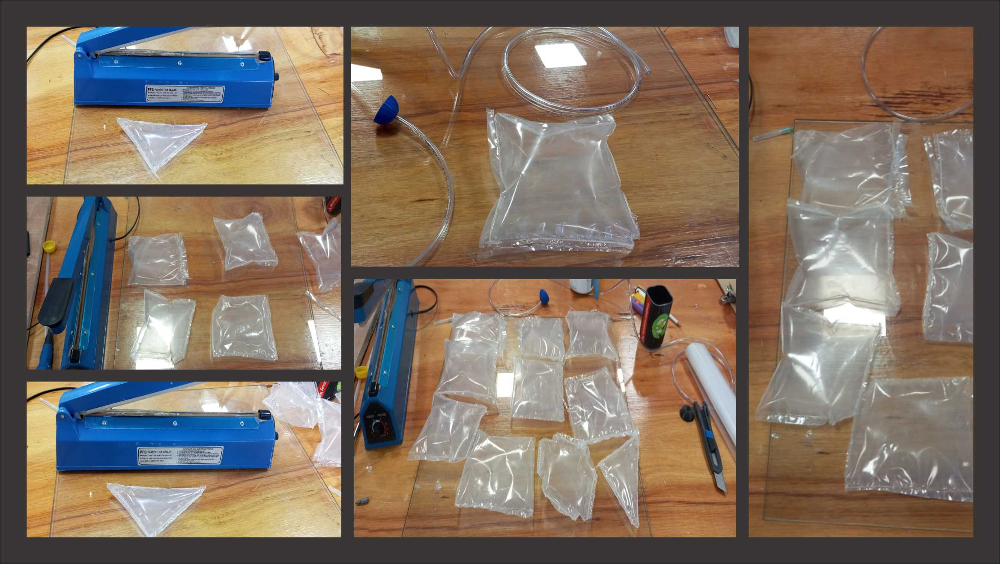
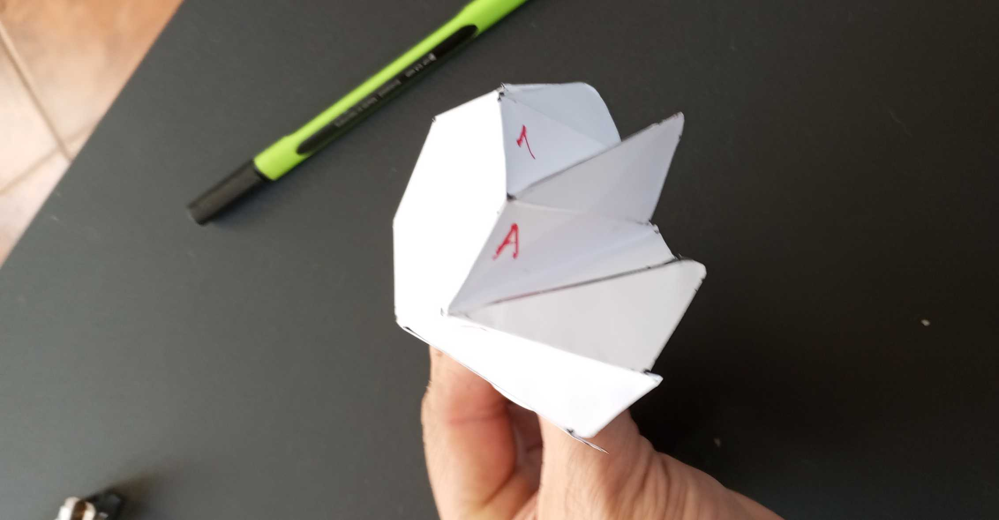
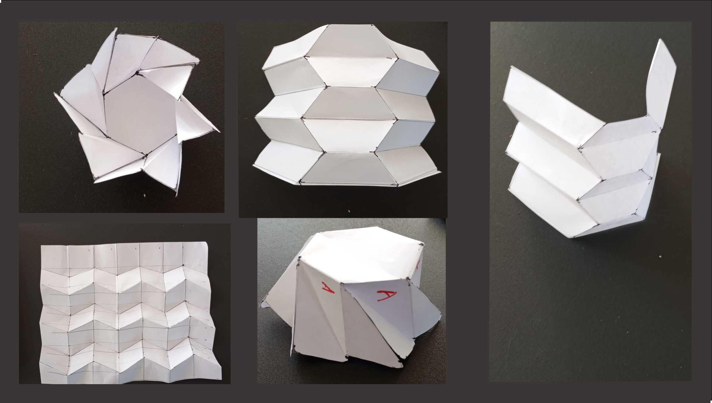

# Estructuras Dinámicas

<h3><b>Objetivos del proyecto</b></h3>

El objetivo del proyecto "Estructuras Dinámicas" es explorar y desarrollar prototipos que sirvan como base para soluciones arquitectónicas innovadoras en mi región. 

A través del uso de técnicas de fabricación digital, busco promover la tecnología y la innovación en el diseño, adaptando tendencias globales a las necesidades y posibilidades locales. 

El proyecto también persigue la sostenibilidad al reutilizar materiales desechados provenientes de mi propia actividad en la industria de la comunicación visual.

 Estos materiales son transformados en estructuras dinámicas que no solo sean funcionales, sino que también que aporten un valor estético.

 <h3><b>Fundamentación y referencias</b></h3>
<h3><b>Estructuras Inflables</b></h3>

Federico Garrido, experto en estructuras neumáticas, explica como las primeras aplicaciones industriales en el siglo XIX han evolucionado hasta convertirse en elementos arquitectónicos, funcionales y versátiles.

 Gracias a estas técnicas de moldeado, sellado  de polímeros hoy en día se utilizan en una amplia gama de aplicaciones, incluyendo exposiciones temporales, viviendas de emergencia y espacios públicos.

<a href="https://www.youtube.com/watch?v=eqxTSqorFBc" target="_blank">Ver video aquí</a>

Por otro parte, Pablo Kobayashi, arquitecto especializado en tecnologías emergentes, complementa esta perspectiva al explorar cómo las estructuras inflables han respondido a los desafíos actuales.

 Introduce el concepto de estructuras paramétricas, destacando la capacidad de la fabricación digital para crear formas complejas y adaptativas que satisfacen diferentes necesidades.

<a href="https://www.youtube.com/watch?v=ibmuiGAwDEw" target="_blank">Ver video aquí</a>

<h3><b>Combinación de Inflables y Origami</b></h3>

 El origami es una técnica japonesa que consiste en doblar papel para formar figuras y estructuras, sin utilizar tijeras ni pegamento.
 
  Es un puente entre el arte, la ciencia y la tradición. Más allá de lo decorativo, el origami tiene aplicaciones en educación, ingeniería, medicina y últimamente con un gran auge en investigaciones espaciales como las de NASA.

Tomando como referencia a ambos especialistas, podemos decir que la combinación de inflables con técnicas de origami ofrece nuevas posibilidades en el diseño arquitectónico. 

Los patrones de origami permiten desarrollar formas plegables que, al integrar sistemas inflables, pueden modificar su volumen dinámicamente, ofreciendo rigidez y flexibilidad.

<h3><b>Movimiento y Respuesta al Entorno</b></h3>

La incorporación de sensores y sistemas automatizados añade una capa de funcionalidad y permite la interacción con las personas. 

Estas estructuras pueden adaptarse a cambios en el clima o la presión interna, mejorando su eficiencia y seguridad. 

<h3><b>¿Qué hace?</b></h3>

El proyecto "Estructuras Dinámicas" se enfoca en experimentar con nuevas formas de construcción utilizando tecnología de fabricación digital con la posibilidad de utilizar nuevos materiales. 

Las estructuras desarrolladas incorporan movimientos mecánicos adaptables a diferentes necesidades, ya sea mediante presión de aire o motores eléctricos.

El objetivo es satisfacer las necesidades de diseñadores y arquitectos que buscan innovar en métodos constructivos, permitiendo proyectos que no son posibles con técnicas tradicionales.

 Además, estas estructuras interactúan con el entorno y responden a estímulos externos, creando espacios más amigables y dinámicos.

Al experimentar con estas técnicas de fabricación digital, busco fomentar la innovación en el diseño y adaptar tendencias globales a las necesidades locales, ampliando las posibilidades del diseño arquitectónico.

<h3><b>Potencial de Reutilización de Materiales</b></h3>

El proyecto explora también la oportunidad única de revalorizar materiales desechados por industrias como ejemplo la de comunicación visual que genera un volumen considerable de desechos de lonas de PVC y acrílico entre otros que representan un desafío ambiental debido a su difícil reciclaje.

 Mediante técnicas de fabricación digital, estos materiales pueden transformarse, promoviendo la economía circular y reduciendo el impacto ambiental. 

<h2 style="text-align: center; font-family: Arial, sans-serif;">PowerPoint del Proyecto</h2>
<iframe src="https://docs.google.com/presentation/d/1n0rEL1zqm7F-FAE4cZpGirk85RNG69A2/preview" 
        width="80%" 
        height="500" 
        allowfullscreen 
        style="border: 1px solid #ccc; border-radius: 8px;">
</iframe>

<h2 style="text-align: center; font-family: Arial, sans-serif; margin-top: 40px;">Video de Presentación</h2>
<iframe width="800" height="450" 
        src="https://www.youtube.com/embed/kVhsH04MgEM" 
        frameborder="0" 
        allow="accelerometer; autoplay; clipboard-write; encrypted-media; gyroscope; picture-in-picture" 
        allowfullscreen>
</iframe>

 <h3><b>Usos y Aplicaciones Prácticas</b></h3>

Las estructuras dinámicas desarrolladas ofrecen soluciones innovadoras y adaptativas para diversos sectores. Algunos de los ejemplos más destacados incluyen:

Protección Retráctil para Áreas Exteriores: Cubiertas inflables que se despliegan automáticamente en respuesta a lluvia o granizo, ideales para proteger plazas, áreas peatonales y espacios recreativos, reduciendo el uso de estructuras fijas.

Refugios Modulares para Emergencias: Estructuras extensibles y portátiles diseñadas para actuar como refugios temporales en situaciones de desastre. Su facilidad de instalación permite un despliegue rápido y eficiente.

Coberturas Adaptativas para Instrumentos Científicos: Sistemas diseñados para proteger telescopios u otros instrumentos expuestos a la intemperie, asegurando su funcionalidad frente a cambios climáticos, polvo o humedad.

Aplicaciones en Vehículos: Coberturas deformables para proteger vehículos de condiciones climáticas adversas o sistemas que mejoran la aerodinámica y la eficiencia energética mediante cambios en su envoltura externa.

 <h3><b>Prototipos Previos y Experimentación Inicial</b></h3>

 <h3><b>Pruebas con Inflables:</b></h3>

En las etapas iniciales del proyecto, me dediqué a experimentar con materiales y métodos de fabricación para desarrollar estructuras inflables herméticas y funcionales. 

Comencé probando materiales como plástico, nylon y PVC flexible, evaluando su flexibilidad, resistencia y capacidad de sellado.

El primer método que utilicé fue el corte láser CO₂ desenfocado como técnica inicial de sellado. Aunque el proceso permitió realizar uniones precisas, las pruebas demostraron que las estructuras perdían aire con el tiempo debido a fugas en las áreas selladas. Las siguientes fotos documentan estas pruebas. 

Ante estos inconvenientes, opté por emplear una selladora de bolsas combinada con patrones de kerfing para optimizar el sellado de los materiales. Esta técnica mejoró notablemente los resultados, logrando uniones más resistentes y reduciendo significativamente las fugas de aire.

Finalmente, decidí aplicar una técnica adaptada utilizando una prensa de sublimación junto con lona de PVC flexible reciclada.

 Esta prueba resultó ser el más exitoso, ya que permitió obtener estructuras inflables completamente herméticas. La combinación del calor y la presión generó un sellado uniforme que cumplió con los requisitos técnicos del proyecto.

A lo largo de esta fase, la documentación detallada de cada prueba fue clave para identificar las técnicas y materiales más efectivos. 

 <h3><b>Experimentos con Origamis:</b></h3>
 
En esta fase, experimenté con patrones de origami utilizando papel como material base para explorar formas como círculos extensibles, triángulos plegados y polígonos extensibles. 

Estas pruebas iniciales me ayudaron a comprender las propiedades geométricas y mecánicas del origami, documentando en las siguientes fotografías.

Posteriormente, adapté los patrones a cortes de acrílico, un material más rígido pegado sobre una lona de pvc que aportó mayor estabilidad a las estructuras, manteniendo su capacidad de plegarse de forma previsible.

 Este enfoque permitió avanzar hacia diseños más funcionales y duraderos, fundamentales para su posible integración en fachadas dinámicas.

 