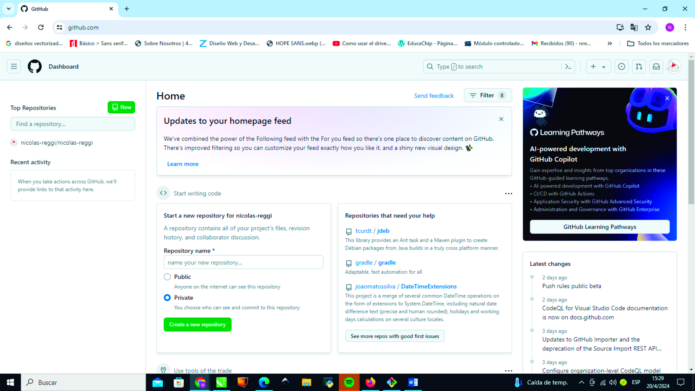
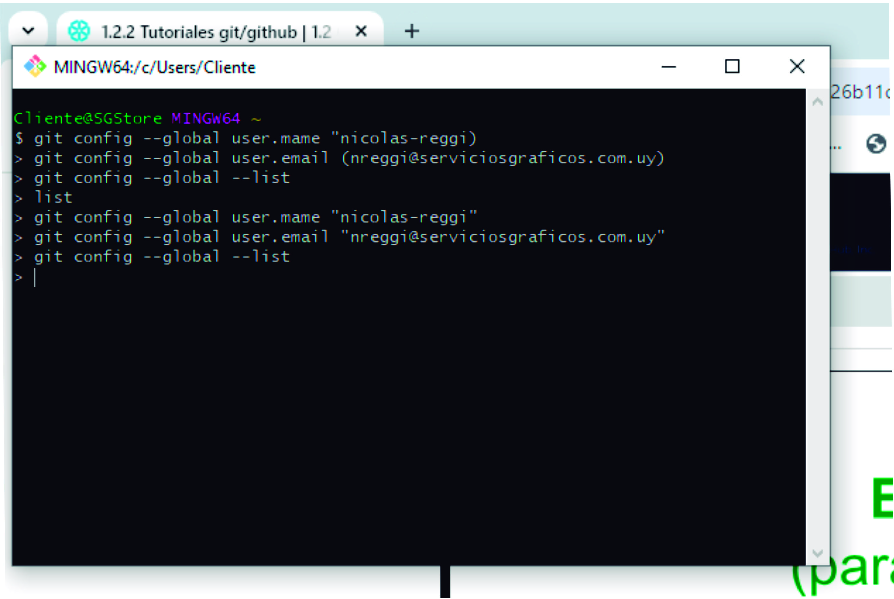
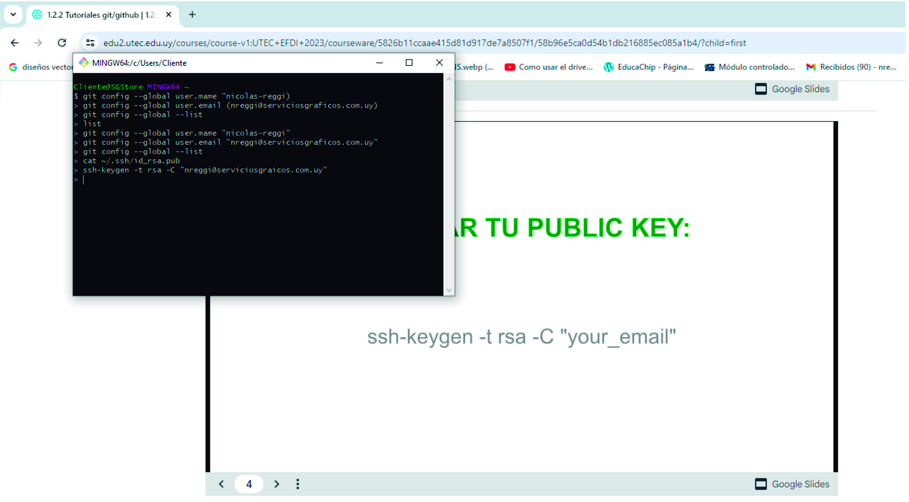
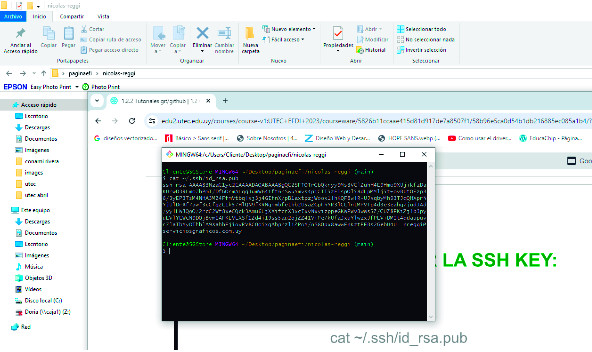
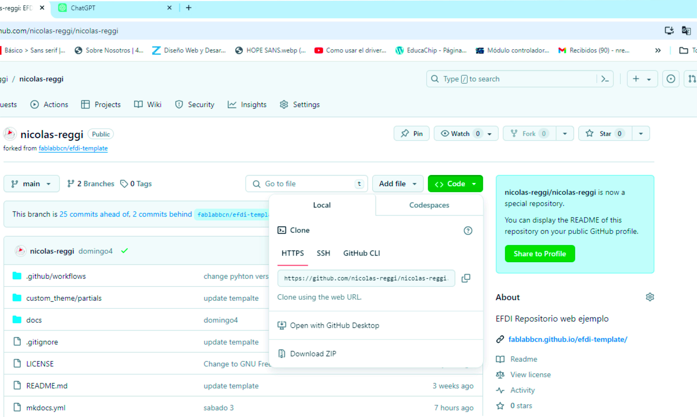
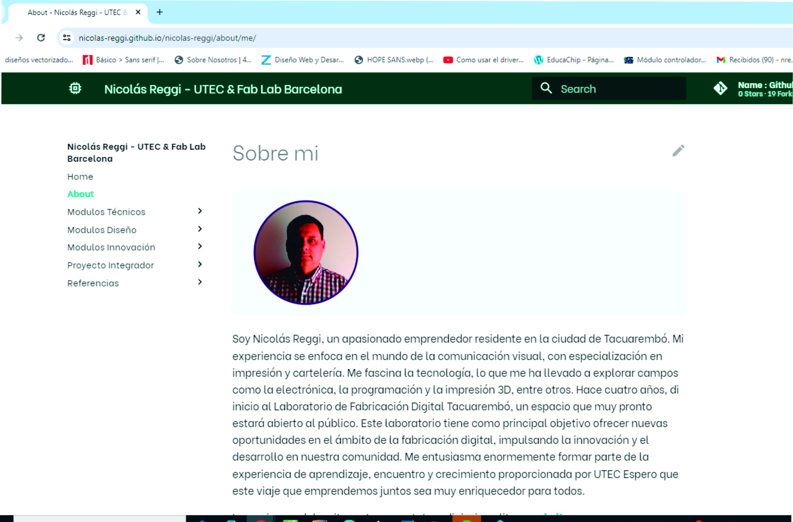

---
hide:
    - toc
---

# MT01

Comienzo así mis primeros pasos en el mundo de la documentación con GitHub.
En esta presentación, estoy explorando la importancia de la documentación de nuestros proyectos, utilizando esta poderosa herramienta para crear y mantener eficientemente mis documentos.
GitHub no es simplemente una plataforma en línea; es un espacio de colaboración que nos permite trabajar en proyectos abiertos y aplicaciones utilizando el sistema de control de versiones Git.
GitHub actúa como un centro de desarrollo colaborativo, proporcionando una amplia gama de herramientas y funcionalidades para gestionar proyectos, compartir código y realizar seguimientos. 
Comprender el funcionamiento de GitHub es fundamental ya que la utilizarè todo el año para documentar mi proceso de aprendizaje.

Paso 1: 
Ingresé a la plataforma EDU en el módulo MT01, donde seguí paso a paso el tutorial para crear mi página web personal utilizando GitHub como hosting y Git para el control de versiones.
Accedí a la página principal de GitHub en github.com.
Con un clic en "Sign up" pude crear mi nueva cuenta, completé el formulario con mi correo electrónico, contraseña y nombre de usuario. Verifiqué mi cuenta a través del correo electrónico y así quedó configurada mi cuenta en GitHub.

Paso 2:
Instalación y configuración de Git Bash en mi PC.
Descargué e instalé Git para mi sistema operativo (Windows) desde la página oficial en git-scm.com.
Luego de instalado, abrí Git Bash desde el acceso directo en mi escritorio.
En  Git Bash, ejecuté los siguientes comandos, reemplazando "Mi Nombre" y "mi@email.com" con mi información:
git config --global user.name "nicolas-reggi"
git config --global user.email "nreggi@serviciosgraficos.com.uy"
nota//En principio estos pasos no me resultaron fáciles y para poder seguir adelante recurrí a la ayuda de mi compañero.
Mi poca o casi nula experiencia en la ejecución de código directamente desde una consola me obligò a investigar, ver videos e imprimir una guía de comandos.
Luego de muchos intentos pude verificar la configuración en mi consola con el comando
git config –global --list

Paso 3:
Genere una ssh key que me permite establecer conexión segura con mi pc. Utilizando el comando cal ~/.ssh/id_rsa.pub en la terminal, verifiquè si ya tenìa una ssh key.
Nuevamente en esta etapa tuve dificultades, desde lo mas simples, como no encontrar el símbolo en el teclado (~)  que posteriormente lo encontré configurando el teclado en español latinoamericano y con las teclas AltGr mas el símbolo +,  también me dificultò el proceso por falta de practica en la utilización de comandos.
Funcionò luego de generar una nueva ssh key desde cero que verifique utilizando el comando cat ~/.ssh/id_rsa.pub

Paso 4: 
Luego de copiar la shh key la peguè en mi cuenta de github.
Entrè en Settings – ssh and gpg keys, pegue la ssh key e hice clik en Add Keys.
En owner nombre el repo como nicolas_reggi para luego hacer click en créate fork.
De esta manera quedo creado mi repositorio remoto con el template de la pagina web.

Paso 5:
Creación del repositorio local en la pc (clone)
En el escritorio de mi pc cree una carpeta (paginaefi) la que puedo acceder desde la terminal gitbash con el comando cd.
Luego copiè el link de mi repo remoto en github.
Finalmente procedi a clonar el repositorio en mi pc desde la consola con el comando  git@github.com/nicolas-reggi/nicolas-reggi.git

Activè el link de mi sitio web en github.
Para editar mi pagina decidi utilizar la herramienta Gitbook sin exito, con la guia de mi referente logre reanudar el trabajo y comenzar esta etapa nuevamente.
Esta vez para editar mi pagina web desde mi repo local utilice visual, luego de realizados los cambios ya pude subirlos.Modifique el template, primero en abaut (sobre mi) agrego mi foto guardada en la carpeta docs images de mi repo local, luego de guardar hago commit y compruebo con mucha alegria que efectivamente el link de mi pagina funciona correctamente.

