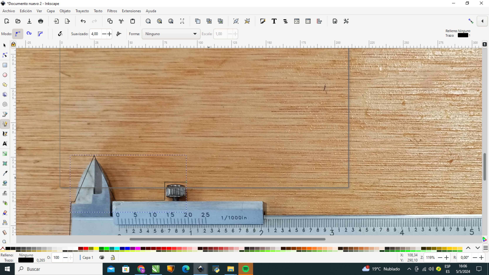

---
hide:
    - toc
---

# MT02

En este módulo doy inicio al trabajo con programas de diseño 2d y 3d.
En mi labor diario utilizo herramientas como Corel draw las cuales me permiten hacer la mayoría de los trabajos en los que estoy involucrado, como diseño de logotipos, diagramación, plantillas, etc. 
Además, recurro ocasionalmente a Photoshop para tareas relacionadas con el manejo de imágenes,  ajustes de tono, saturación y  para optimizar los archivos en diferentes aplicaciones.
Durante este módulo, el  profesor nos presentó diferentes alternativas de programas 2d para el manejo de imágenes y nos propuso experimentar con nuevas herramientas en el caso de que ya manejáramos algún software.
En mi caso instale Inkscape para diseño y vectorizado, y Gimp para manejo de imágenes.

Posteriormente comenzamos con el diseño en 3D donde mi experiencia es con el software  Freecad el cual requirió de un considerable esfuerzo de investigación y práctica. Si bien no diseño a un nivel profesional he podido fabricar piezas interesantes.
Para la propuesta de investigar un software alternativo, elegí Fusión 360.

Para el manejo de mallas en diseño 3d,  instalé el software Meshmixer que permite hacer cambios y mejoras en mallas generadas como stl. 

El proyecto asignado para este módulo consiste en diseñar y modelar un objeto en 3D que sea utilitario, compuesto por al menos dos piezas y que incluya un logotipo en relieve.

Paso 1)
Para comenzar, generé un logotipo utilizando herramientas vectoriales, con al menos una parte del logo vectorizado a partir de una imagen pixelar.
Utilicé Inkscape para este propósito, iniciando así mi proyecto que consiste en una base para calibres, una herramienta de uso cotidiano en el diseño que considero útil para mantener ordenada mi área de trabajo, a este diseño le incluiré un logo y el molde con la forma del calibre que será extruido en la base.
Una vez abierto el programa inkscape importé desde mi celular una foto que saque de mi calibre y que me permite utilizarlo como molde para el próximo paso.

Con la herramienta de mano alzada fui generando líneas tocando los bordes del calibre y una vez completado todo el perímetro utilicé la opción de curvas asimétricas para mejorar el perfil y agregarle una cuña para poder sacar el calibre del molde con los dedos. 

Sabiendo que mi diseño estaba con medidas muy parecidas a las originales del calibre genere un borde que aumentó hacia el exterior 2mm el perímetro para que tenga más soltura y no se tranque en la base.
Una vez terminada la sectorización guardé mi primera versión, luego escalé a tamaño real y centré la imagen en el punto de origen guardándolo en formato svg.

El mismo procedimiento utilicé para la vectorización del logotipo de mi empresa, al que le agregué el texto “CALIBRE” para posteriormente ubicarlo en el lado derecho del diseño.

El principal desafío fue aprender a utilizar herramientas similares a otros programas pero con uso y formas diferentes. 
Con los tutoriales proporcionados pude solucionar temas como que el llamado “convertir a curvas de Corel” que es “convertir objetos o trazos a trayectos”.
También fue difícil encontrar el modo de hacer una silueta o inclusive el vectorizado a mano alzada ya que no me permite avanzar con el zoom a más de 150%.
Igualmente comprobé que con un poco de práctica se pueden utilizar herramientas similares de software libre con buenos resultados. 

Paso 2)
Procedí a modelar las partes del objeto utilizando Fusion 360, prestando especial atención al ajuste entre las piezas
Genere un sketch en el plano xy donde dibuje un rectángulo de 25 x 12 cm, luego de fijar su origen y generar las cotas le di en finalizar al sketch para luego extruir 11 milimetros en el eje z y con esto obtuve la base.

Nuevamente genere un nuevo sketch donde importe el svg con la silueta de mi calibre ubicándolo en el centro de mi base contenedora.
Luego a partir del sketch extrui en el eje z dándole 6 mm de altura.

Posteriormente seleccione el objeto calibre y lo subi en el eje z 3 mm.
Finalmente seleccione el objeto base mas el objeto calibre y con la herramienta “combinar, opción diferencia”  logre generar el espacio para el calibre.

Paso 3)
Apliqué el logotipo vectorial diseñado en relieve sobre la superficie del objeto utilizando Fusion 360.

Importe el svg con el archivo logocalibre, reubique el logo en el espacio libre más conveniente de mi base contenedora finalice mi sketch.
Utilizando este último sketch extrui 4 mm en el eje z.
Posteriormente seleccione el objeto calibre y lo subí en el eje z 9 mm.

Finalmente seleccione el objeto base más objeto logo calibre y con la herramienta “combinar, union”  generando asi un logotipo en relieve.

Adicionalmente me pareció interesante probar hacer un redondeo con la herramienta Chanfer a los vértices con un redondeo de 1,5 y 3 mm en las esquinas

Aunque la pieza final presentaba una terminación aceptable, experimenté algunas dificultades con la extrusión del logotipo. Tras investigar durante varios días, logré resolver el problema siguiendo estos pasos: primero, importé a Fusion 360 mi SVG, lo posicioné y, tras seleccionarlo, hice clic derecho para acceder a la opción 'Fijo a no fijo'. Esta acción provocó que las líneas del logotipo se resaltaran en azul, permitiéndome seleccionar las superficies que deseaba extruir con el resultado esperado.

