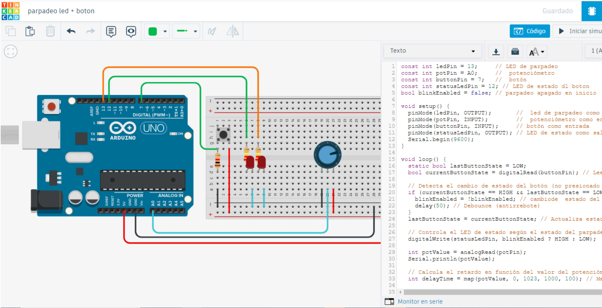
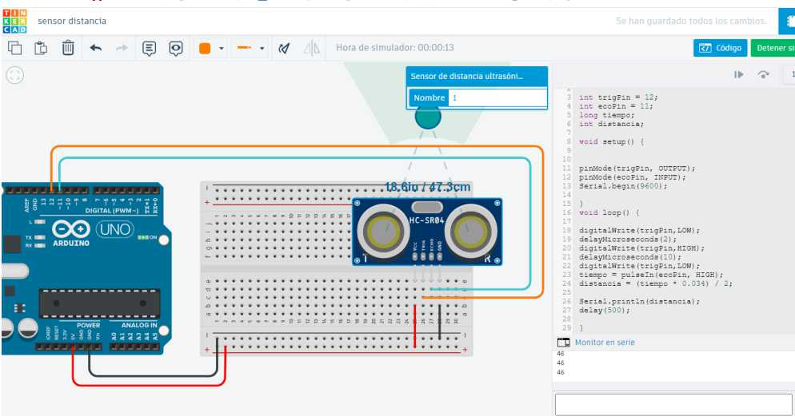
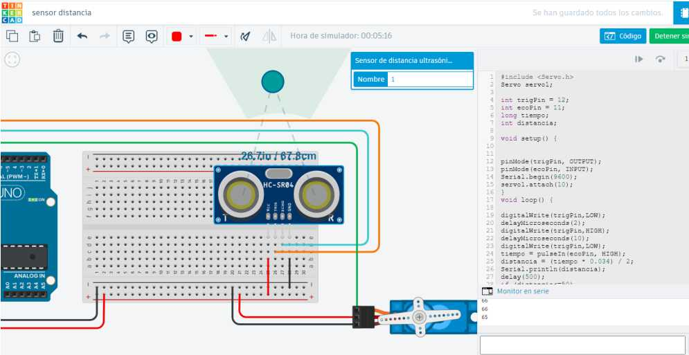
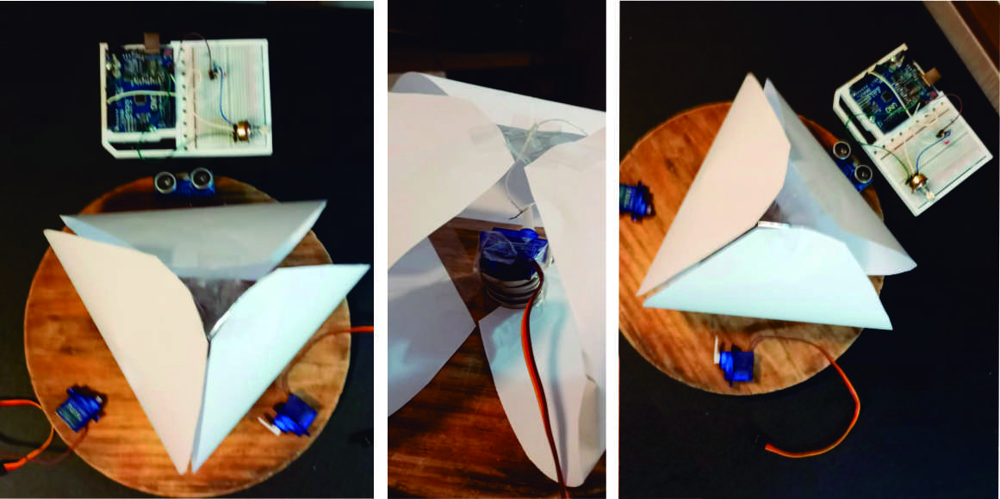
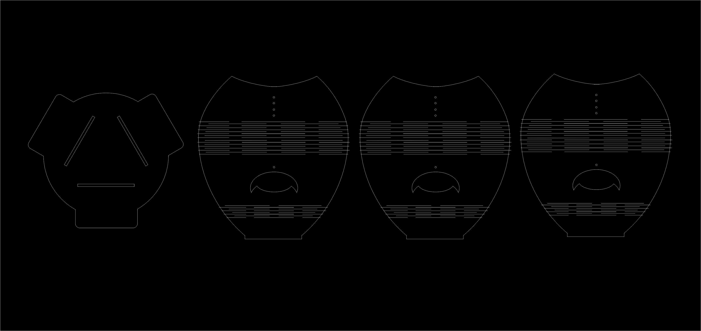
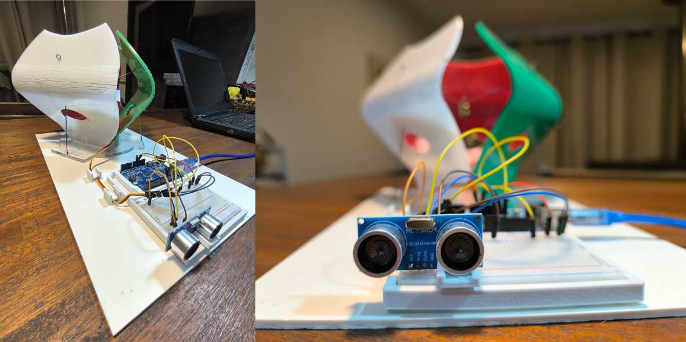
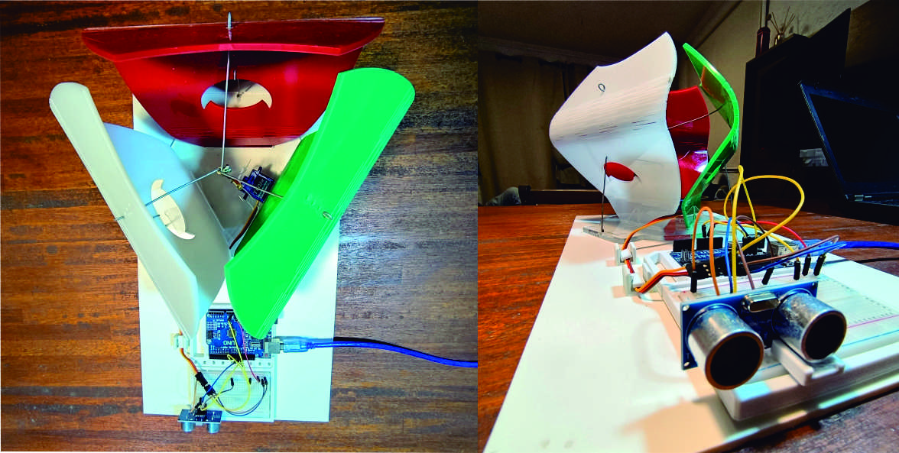

---
hide:
    - toc
---

# Módulo Técnico 04

En el Módulo Técnico 04, nos introducimos en el apasionante mundo de la electrónica y la programación, utilizando plataformas como Arduino que simplifican el proceso de prototipado y ofrecen amplias posibilidades de desarrollo. 

Antes de adentrarnos en la creación de proyectos prácticos, revisamos los conceptos básicos de la electricidad, esenciales para comprender y manejar adecuadamente los componentes electrónicos.

Este módulo nos permite combinar teoría y práctica, proporcionando una base sólida para innovar y resolver problemas con soluciones electrónicas efectivas. Para trabajar con dispositivos como Arduino es fundamental entender conceptos básicos de electricidad así como algunas fórmulas matemáticas.
   

#Voltaje
Es la diferencia de potencial eléctrico entre dos puntos y se mide en voltios. Es similar a la presión del agua en una tubería, donde mayor voltaje significa mayor presión para mover electrones.
Fórmula: V=I×R

#Corriente
Es el flujo de electrones a través de un conductor y se mide en amperios. Es como el flujo de agua que pasa por una tubería.
Fórmula: I=V/R

#Resistencia
Es la oposición al flujo de corriente y se mide en ohmios. Representa cuán difícil es para los electrones moverse a través de un material.
Fórmula: R=V/I

Entender estos conceptos es crucial para diseñar y construir circuitos que funcionen correctamente y sean seguros. 
Por ejemplo, cuando conectamos un sensor a un Arduino, debemos asegurarnos de que el voltaje y la corriente sean adecuados para evitar daños en los componentes.

#¿Qué es una Placa Arduino?
Arduino es una plataforma de prototipos electrónicos de código abierto que permite a los usuarios crear proyectos interactivos. Algunas de las ventajas de Arduino incluyen:

Económico: Las placas Arduino son accesibles en términos de costo, lo que las hace ideales para estudiantes y aficionados.

Multiplataforma: El software Arduino (IDE) funciona en Windows, macOS y Linux.
Entorno de programación sencillo: El IDE de Arduino es fácil de usar tanto para principiantes como para usuarios avanzados.

Código abierto: Tanto el software como el hardware de Arduino son de código abierto, permitiendo a los usuarios personalizar y expandir sus proyectos.

Modelos de Placas Arduino
Existen varios modelos de placas Arduino, cada uno con características específicas. Uno de los modelos más comunes es el Arduino Uno, que utiliza el microcontrolador ATmega328P, ideal para la mayoría de los proyectos de aprendizaje y prototipado.

#Sensores
Los sensores permiten a Arduino interactuar con su entorno al medir diversas variables físicas y convertirlas en señales eléctricas que el Arduino puede procesar.

Algunos sensores comunes utilizados en proyectos de Arduino son:

Sensor de distancia ultrasónico (HC-SR04): Este sensor mide la distancia a un objeto utilizando ondas de sonido de alta frecuencia. Es útil para aplicaciones como robots que evitan obstáculos.
Sensor de obstáculos (KY-033): Utiliza un emisor y receptor infrarrojo para detectar la presencia de objetos en su camino. Es comúnmente usado en robots seguidores de línea.

Ejemplo de Uso de Sensores
El sensor ultrasónico HC-SR04 funciona emitiendo un pulso de ultrasonido y midiendo el tiempo que tarda en reflejarse desde un objeto. Arduino calcula la distancia basándose en este tiempo y la velocidad del sonido. Este tipo de sensor es vital en aplicaciones donde se necesita medir distancias con precisión como en sistemas de seguridad o robots autónomos.

#Servomotores
Un servomotor es un tipo de motor que puede controlar su posición con precisión. Se utiliza ampliamente en aplicaciones que requieren movimientos controlados y específicos. Un servomotor típico tiene tres componentes principales:

Motor DC: Proporciona la fuerza de rotación.
Caja de engranajes: Reduce la velocidad del motor y aumenta el torque.
Sistema de control: Usa un potenciómetro para monitorear la posición del eje y un circuito de control para ajustar la posición según sea necesario.

Funcionamiento del Servomotor
El servomotor recibe una señal de control que determina su posición. Esta señal es una onda modulada por ancho de pulso (PWM), donde la duración del pulso indica la posición deseada del eje. 
Los servomotores son utilizados en aplicaciones como:
Robótica: Para mover brazos y articulaciones.
Modelismo: En aviones y autos para controlar dirección y aceleración.
Automatización: Para abrir y cerrar válvulas o controlar mecanismos.

#Programación en Arduino
La programación en Arduino se realiza mediante un entorno de desarrollo (IDE) basado en un lenguaje de programación sencillo, derivado de C/C++.
 A continuación, se presentan algunos conceptos clave de la programación en Arduino:

Estructura Básica de un Sketch
Un sketch en Arduino tiene dos partes principales:
setup(): Esta función se ejecuta una vez al inicio del programa. Aquí se configuran los pines de entrada y salida, y se inicializan las variables y las librerías.
loop(): Esta función se ejecuta continuamente en un bucle. Aquí se coloca el código que queremos que se repita indefinidamente.

<pre><code>
void setup() {  
// Código de configuración  
}  
void loop() 
{ 
// Código que se repite 
}  
</code></pre>
#Variables y Tipos de Datos
En Arduino, se pueden usar diferentes tipos de datos para almacenar información:

<pre><code>
int: Enteros.  
float: Números decimales.  
char: Caracteres individuales.  
boolean: Valores de verdadero o falso.  
int ledPin = 13;    // Pin digital 13 para el LED  
float temperature;  // Variable para almacenar la temperatura  
char grade = 'A';   // Variable para almacenar un carácter  
boolean isOn = true; // Variable para almacenar un valor booleano  
</code></pre>

#Librerías  
Arduino cuenta con numerosas librerías que facilitan el uso de hardware y sensores específicos. Algunas librerías comunes incluyen:

Ejemplo: Servo para controlar servomotores.  

Para usar una librería en un sketch, se debe incluir al inicio del código:

<pre><code>
#include <Servo.h>  
Servo myServo; // Crear un objeto de tipo Servo  
void setup() {    
  myServo.attach(9); // Asociar el servo al pin 9  
}
void loop() {  
  myServo.write(90); // Mover el servo a la posición 90 grados  
}  
</code></pre>

En este módulo, avanzamos en los conceptos teóricos y prácticos del uso de Arduino para crear soluciones electrónicas aplicables a dispositivos funcionales. Gracias a su flexibilidad y accesibilidad, Arduino se convierte en una poderosa herramienta que permite la creación de proyectos innovadores y eficientes.

#Ejercicio 1: utilizando Arduino, Potenciómetro y Botón para Controlar un LED
Introducción  
En mi primer ejercicio de práctica con Arduino, aprendí a utilizar un potenciómetro y un botón como entradas para controlar el encendido y apagado de un LED. 

La idea era diseñar un sistema en el que el potenciómetro ajuste la velocidad de parpadeo del LED y el botón inicie o detenga este proceso.   
Este ejercicio me permitió familiarizarme con la lectura de entradas analógicas y digitales, así como con el uso de funciones básicas de control en Arduino.

Herramientas y Materiales Utilizados  

Programas y Plataformas

Arduino IDE: Utilizado para programar la placa Arduino y cargar el código en la misma.
Tinkercad: Utilizado para simular el circuito y realizar pruebas antes de cargar el código en la placa Arduino.  

Componentes Electrónicos  

Arduino Uno: La placa de desarrollo utilizada para controlar el LED, el potenciómetro y el botón.
Protoboard: Para montar los componentes y realizar las conexiones necesarias.
LED: Utilizado como indicador visual de parpadeo.
Potenciómetro: Para ajustar la velocidad de parpadeo del LED.
Botón: Para iniciar y detener el parpadeo del LED.
Resistencias: Para proteger el LED y asegurar el funcionamiento correcto de los componentes.
Cables de conexión: Para conectar todos los componentes entre sí.
Proceso de Desarrollo

Paso 1: Configuración Inicial del Hardware

Conecté la placa Arduino Uno a la protoboard.
Monté el LED en el pin 13 de la placa Arduino, con una resistencia de 220 K en serie para proteger el LED.
Conecté el potenciómetro a la entrada analógica A0 de la placa Arduino.
Monté el botón en el pin digital 7 de la placa Arduino, con una resistencia pull-down para asegurar lecturas estables.
Conecté un segundo LED al pin digital 12 para indicar el estado del botón.

Paso 2: Programación en Arduino IDE

Configuré los pines del LED, el potenciómetro y el botón en el código:

<pre><code>
   const int ledPin = 13;     // LED de parpadeo  
   const int potPin = A0;     // potenciómetro  
   const int buttonPin = 7;   // botón  
   const int statusLedPin = 12; // LED de estado del botón  
   bool blinkEnabled = false; // parpadeo apagado en inicio  
   </code></pre>

Implementé la función setup para inicializar los pines y la comunicación serial:  

<pre><code>
 void setup() {  
   pinMode(ledPin, OUTPUT);       // LED de parpadeo como salida  
   pinMode(potPin, INPUT);        // potenciómetro como entrada  
   pinMode(buttonPin, INPUT);     // botón como entrada  
   pinMode(statusLedPin, OUTPUT); // LED de estado como salida  
   Serial.begin(9600);  
   }  
</code></pre>

Desarrollé la función loop para controlar el parpadeo del LED en función del potenciómetro y el botón:

<pre><code>
 void loop() {  
   static bool lastButtonState = LOW;  
   bool currentButtonState = digitalRead(buttonPin); // Lee el estado del botón  
   // Detecta el cambio de estado del botón (no presionado a presionado)  
   if (currentButtonState == HIGH && lastButtonState == LOW) {  
    }  
    blinkEnabled = !blinkEnabled; // Cambio de estado del parpadeo  
    delay(50); //prueba para ver si no genera error
   } 
   lastButtonState = currentButtonState; // Actualiza estado del botón  
   // Controla el LED de estado según el estado del parpadeo  
   digitalWrite(statusLedPin, blinkEnabled ? HIGH : LOW);  
   int potValue = analogRead(potPin);  
   Serial.println(potValue);  
   // Calcula el retardo en función del valor del potenciómetro.  
   int delayTime = map(potValue, 0, 1023, 1000, 100); // Mapea el valor del potenciómetro   
   if (blinkEnabled) {  
   digitalWrite(ledPin, HIGH); // Enciende LED de parpadeo   
   delay(delayTime);           // Espera un tiempo proporcional  
   digitalWrite(ledPin, LOW);  // Apaga LED de parpadeo  
   delay(delayTime);           // Espera el mismo tiempo nuevamente  
   } else {  
   digitalWrite(ledPin, LOW); // Apaga LED  
   }  
   }
</code></pre>

Puedes descargar el código de Arduino <a href="https://github.com/nicolas-reggi/nicolas-reggi/blob/main/docs/proyecto/arduino_proyects/blink_potenciometro/blink_potenciometro.ino" target="_blank">aquí</a>.

//codigo para descargar los archivos desde git

Simulacion en Tinkercad

<!DOCTYPE html>
<html lang="es">
<head>
    <meta charset="UTF-8">
    <meta name="viewport" content="width=device-width, initial-scale=1.0">
    <title>Video</title>
    
</head>
<body>
    

    
Haz clic en el siguiente video para verlo

        
    

</body>
</html>
 

#Experiencia y Reflexión 
Este ejercicio fue útil para entender cómo interactúan los componentes electrónicos y cómo se pueden utilizar entradas para controlar salidas en un proyecto de Arduino.  
 Si bien tenía experiencia básica en el manejo de Arduino para controlar motores o luces, nunca había explorado las posibilidades de las entradas, que considero muy interesantes y que abren nuevas oportunidades. Utilicé ejemplos de otros makers y comunidades para escribir el código, y realicé pruebas en Tinkercad antes de cargarlas en Arduino, lo cual fue de gran ayuda para evitar errores.

Inicialmente, tuve dificultades para asegurar que el botón respondiera probando varias opciones que me gustaría seguir profundizando. El uso del potenciómetro para ajustar la velocidad de parpadeo del LED demostró ser una forma simple para  controlar una salida. 
Finalmente logre que el LED parpadeara a una velocidad ajustable y que el botón iniciara o detuviera el parpadeo según fuera necesario.

#Ejercicio 2:  utilizando Arduino, Sensor de Distancia y Servomotor

Introducción
En mi segundo ejercicio de práctica con arduino, experimenté por primera vez con el sensor de distancia SRF05 y un servomotor. Además, la idea era complementar el proyecto integrando los componentes electrónicos a un objeto físico. Planteo crear un diseño compuesto por varias piezas de acrílico, que podrían ser cortadas con láser y utilizando la técnica del kerfing para permitir el movimiento controlado dichas piezas. Este ejercicio es una aproximación a mi proyecto final integrador.
Herramientas y Materiales Utilizados

Programas y Plataformas
•	Tinkercad: Nuevamente utilicé esta plataforma para simular el circuito antes de montarlo físicamente. 
•	Arduino IDE: Para programar la placa Arduino y cargar el código en la misma.

Componentes Electrónicos
•	Arduino Uno: Placa de desarrollo que utilicé para controlar el sensor y el servomotor.
•	Protoboard: Para montar los componentes y realizar las conexiones necesarias.
•	Sensor de Distancia SRF05: Para medir la distancia de un objeto.
•	Servomotor: Para mover las piezas del objeto en acrílico.
•	Cables de conexión: Para conectar todos los componentes entre sí.

Materiales de Fabricación del prototipo físico
•	Acrílico: Utilizado para crear las piezas del objeto con movimiento.
•	Máquina de láser CO2: Para cortar las piezas de acrílico utilizando la técnica del kerfing.
•	Papel y cinta adhesiva: Para crear un prototipo inicial y verificar el concepto de movimiento.

Proceso de Desarrollo del Prototipo

Paso 1: Configuración Inicial en Tinkercad
1.	Me registré en Tinkercad y creé un nuevo circuito.
2.	Agregué una placa Arduino Uno, una protoboard, un sensor de distancia SRF05 y un servomotor.
3.	Seguí tutoriales para copiar los códigos iniciales y comencé a experimentar con las simulaciones.

Paso 2: Dificultades Iniciales y Resolución
•	Aunque las simulaciones en Tinkercad funcionaban correctamente, el código no respondía cuando lo cargaba en la placa Arduino,(esto me paso en 4 oportunidades y  con códigos diferentes).
•	Consulté con el profesor durante la clase, quien explicó detalladamente cada paso y las  funciones de comando del código.

Simulacion en Tinkercad.

 

•	Genere un código sin librería donde funcionó correctamente el sensor y pude verificarlo en el monitor serial.

<pre><code>
 int trigPin = 12;
 int echoPin = 11;
 long tiempo;
 int distancia;
 void setup() {
  pinMode(trigPin, OUTPUT);
  pinMode(echoPin, INPUT);
  Serial.begin(9600);
 }
 void loop() {
</code></pre>

Paso 3: Código para Medir Distancia

•	Una vez que entendí el funcionamiento básico, modifiqué el código para medir la distancia en centímetros:

<pre><code>
int trigPin = 12; 
int echoPin = 11; 
long tiempo; 
int distancia;

void setup() {
   pinMode(trigPin, OUTPUT);
   pinMode(echoPin, INPUT);
   Serial.begin(9600); //
}

void loop() {
   digitalWrite(trigPin, LOW);
   delayMicroseconds(2);
   digitalWrite(trigPin, HIGH);
   delayMicroseconds(10);
   digitalWrite(trigPin, LOW);
   tiempo = pulseIn(echoPin, HIGH);
   distancia = (tiempo * 0.034) / 2; 
   //Multiplica tiempo de ida y vuelta microsegundos
   //x velocidad del sonido 340 metros/seg (0.034 cm/seg)
   //dividido por 2 (ida y vuelta)
   Serial.println(distancia);
   delay(500);
}
</code></pre>

Paso 4: Integración del Servomotor

•	Agregué la biblioteca para controlar el servomotor y modifiqué el código para mover el servo en función de la distancia medida:

<pre><code>
   #include <Servo.h> // Biblioteca Servo para controlar servo motor
   Servo servo1;
   int trigPin = 12; // Pin 12 de Arduino conectado al pin Trigger del sensor.
   int echoPin = 11; // Pin 11 de Arduino conectado al pin Echo del sensor. 
   long tiempo; // Se utiliza como variable para números grandes. 
   int distancia;
   void setup() {
   pinMode(trigPin, OUTPUT);
   pinMode(echoPin, INPUT);
   Serial.begin(9600); // Inicializa la comunicación serial a 9600 bps.
   servo1.attach(10); // Conecta el servo motor al pin 10. 
   }
   void loop() {
   digitalWrite(trigPin, LOW);
   delayMicroseconds(2);
   digitalWrite(trigPin, HIGH);
   delayMicroseconds(10);
   digitalWrite(trigPin, LOW);
   tiempo = pulseIn(echoPin, HIGH);
   distancia = (tiempo * 0.034) / 2; 
   //Multiplica tiempo de ida y vuelta del pulso en microsegundos
   //por la velocidad del sonido 340 metros/seg o 0.034 cm/seg
   //dividido por 2 ya que es ida y vuelta.
   Serial.println(distancia);
   delay(500);
   if (distancia <= 50) {
    servo1.write(180);
    // Si la distancia es menor o igual a 50 cm, gira el servo 180 grados.
   } else {
    servo1.write(0); // De lo contrario, lo gira a 0 grados.
   }
   }
</code></pre>

Puedes descargar el código de Arduino <a href="https://github.com/nicolas-reggi/nicolas-reggi/blob/main/docs/proyecto/arduino_proyects/sensor_distancia/sensor_distancia.ino" target="_blank">aquí</a>.

Simulacion en Tinkercad

 

Paso 5: Diseño y Fabricación del Objeto

	Prototipo de Papel:

    
	Diseñé un primer prototipo en papel con 4 piezas, donde 3 tuvieran movimiento y una cuarta actuara como soporte.
	Probé el concepto de movimiento utilizando tanzas o hilos para simular el movimiento de las piezas hacia el centro.

    Prototipo en Acrílico:

	Utilizando materiales de descarte y la máquina de láser CO2, corté las piezas en acrílico.
	Apliqué la técnica del kerfing para dar flexibilidad a las piezas y permitir el movimiento controlado por el servomotor.

	Uní las piezas de encastre con pegamento y tensores de alambre en cada extremo.
	Unifique piezas y electrónica en una base de pvc a fin de mantener estabilidad y mejorar la terminación del prototipo.

 

Puedes descargar el archivo SVG para cortar el diseó un tu laser <a href="https://github.com/nicolas-reggi/nicolas-reggi/blob/main/docs/proyecto/corte_laser/flor3.svg" target="_blank">aquí</a>.

 
<!DOCTYPE html>
<html lang="es">
<head>
    <meta charset="UTF-8">
    <meta name="viewport" content="width=device-width, initial-scale=1.0">
    <title>Video</title>
    
</head>
<body>
     

     
Haz clic en el siguiente video para verlo

       
    

</body>
</html>
 

#Experiencia y Reflexión Final
Inicialmente, tuve dificultades para hacer que el código funcionara en la placa Arduino, aunque las simulaciones en Tinkercad eran exitosas. Gracias a la asistencia del profesor y a una revisión del código pude identificar y corregir los problemas, principalmente relacionados con la configuración del sensor de distancia y la omisión de ciertas variables necesarias.

El resultado fue satisfactorio, logrando que el servomotor respondiera adecuadamente a las mediciones del sensor de distancia. El prototipo de papel permitió verificar el concepto de movimiento, y la fabricación de las piezas en acrílico con la técnica de kerfing demostró ser efectiva para los objetivos del proyecto.

A pesar del tiempo limitado (menos de 8 horas), el proyecto fue exitoso y representó un aprendizaje valioso en la integración de componentes electrónicos y la fabricación de estructuras físicas. Este ejercicio me preparó mejor para el proyecto final, dándome confianza en el uso de herramientas de simulación, programación y fabricación de componentes.

La elección de las herramientas y métodos utilizados fue adecuada debido a su eficiencia para prototipar y realizar pruebas rápidas. Tinkercad resultó ser una opción útil para realizar simulaciones previas y evitar errores en el hardware. Además, el fácil acceso a tutoriales y la amplia comunidad de Arduino, con todos sus recursos disponibles, facilitó la solución de problemas y la implementación del código necesario.

