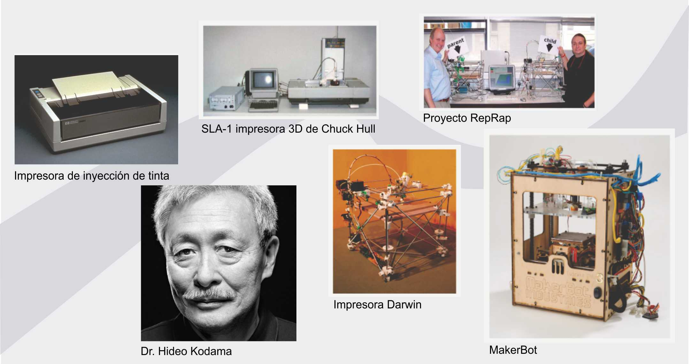
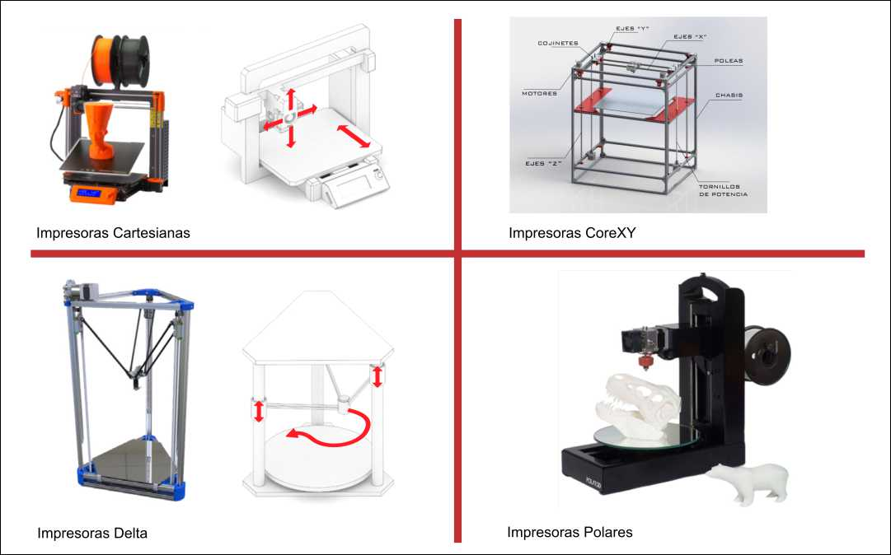

---
hide:
    - toc
---

# Módulo Técnico 05
<h2><b>Impresión y escaneo 3D</b></h2>

En este módulo, avanzamos en el eje de tecnología y fabricación, conociendo los inicios de estas tecnologías, sus componentes y funcionamiento.

 Exploramos el uso de herramientas avanzadas de diseño asistido por computadora (CAD) y manufactura asistida por computadora (CAM), profundizando en la impresión 3D, así como en tecnologías y programas para el tratamiento de imágenes en escaneo 3D.

  Con diversas técnicas y consejos para agilizar nuestros procesos de prototipado y manipulación de modelos digitales para diversas aplicaciones.

<h3><b>Objetivos del Módulo</b></h3>

1.	Comprender la Tecnología de Impresión 3D: Explorar los fundamentos y tipos de impresión 3D.

2.	Manejo de Materiales de Impresión 3D: Conocer los materiales adecuados para cada aplicación y sus características básicas.

3.	Uso de Software Slicer: Aprender a utilizar programas slicer para preparar modelos para imprimir en 3D.

4.	Calibración y Configuración de Impresoras 3D: Aprender las principales configuraciones para asegurar la calidad de nuestra impresión.

5.	Escaneo 3D: Conocer los principales métodos y programas para el tratamiento de imágenes 3D.

6.	Aplicación Práctica: Realizar un proyecto práctico de impresión 3D aplicando los conocimientos adquiridos.

<h3><b>Diseño y Manufactura Asistida por Computadora (CAD/CAM)</b></h3>

Introducción:

El diseño asistido por computadora (CAD) y la manufactura asistida por computadora (CAM) son fundamentales en la industria moderna para mejorar la calidad de los productos y aumentar la productividad.

Estos procesos son interdependientes: el diseño influye en la manufactura y viceversa. Un error en cualquiera de las etapas puede resultar en productos defectuosos.

<h3><b>CAD (Diseño Asistido por Computadora)</b></h3>
 
Definición:

El CAD se refiere al uso de software para crear diseños digitales en 2D o 3D. Este software permite a los diseñadores visualizar, modificar y optimizar sus diseños antes de la fabricación. Algunos programas populares de CAD incluyen AutoCAD, SolidWorks y Fusion 360.

<h3><b>CAM (Manufactura Asistida por Computadora)</b></h3>

Definición:

El CAM implica el uso de software para generar archivos (generalmente .gcode) con instrucciones para máquinas CNC. Este software traduce los diseños CAD en un lenguaje que las máquinas pueden entender, permitiendo la producción física del diseño.

<h3><b>Manufactura Asistida por Computadora para Impresoras 3D</b></h3>
<h3><b>Impresión 3D</b></h3>
  
La impresión 3D es un proceso de fabricación aditiva que crea objetos depositando capas de material una sobre otra. 

A diferencia de los métodos sustractivos tradicionales como el fresado CNC, la impresión 3D añade material para construir objetos. Esta tecnología, desarrollada en los años 80, ha evolucionado significativamente, haciéndose más asequible y rápida.

<h3><b>Historia e hitos de la Impresión 3D</b></h3>
 
•	1976: Se inventa la impresora de inyección por Hewlett Packard pero solo fue hasta 1988 cuando llego a los consumidores

•	1981: El Dr. Hideo Kodama en Japón solicita la primera patente para un dispositivo de impresión en 3D.

•	1984: Un equipo francés presenta una solicitud de patente para la fabricación mediante solidificación de resinas fotosensibles.

•	2005: Comienza el proyecto RepRap, un hito significativo en el desarrollo de la tecnología de impresión 3D a través del software de código abierto y la colaboración comunitaria. La idea central de RepRap era crear impresoras 3D auto-replicables.

•	2008: El proyecto RepRap lanza la impresora Darwin, la primera impresora 3D capaz de reproducir casi el 50% de sus propias partes, marcando un gran avance en el mundo maker.

•	2009: La expiración de varias patentes clave de impresión 3D permite que la tecnología se difunda más ampliamente, llegando a universidades y comunidades de makers.

•	2009: Aparece MakerBot, uno de los primeros actores relevantes en el auge de la tecnología de impresión 3D, facilitando aún más el acceso a esta tecnología.

<h2><b>Tipos de Impresoras FDM</b></h2>

<h3><b>Impresoras Cartesianas</b></h3>

  •	Descripción: Utilizan tres motores para mover las partes de la impresora a lo largo de los ejes X, Y y Z.

  •	Ventajas: Son comunes y de bajo costo, con una amplia disponibilidad de piezas y soporte.

  •	Desventajas: Pueden tener menor calidad de impresión a altas velocidades debido al peso de los ejes.

<h3><b>Impresoras CoreXY</b></h3>

  •	Descripción: Utilizan un diseño de correas específicas que mueven el cabezal de impresión en los ejes X e Y.

  •	Ventajas: Permiten impresiones rápidas y precisas, con un volumen de construcción eficiente.

  •	Desventajas: Las correas largas pueden causar problemas y requieren un marco muy estable.

<h3><b>Impresoras Delta</b></h3>

  •	Descripción: Tienen una superficie de impresión fija y tres motores que mueven el cabezal de impresión mediante brazos conectados.

  •	Ventajas: Ideales para impresiones rápidas con un extrusor liviano.

  •	Desventajas: Limitadas por una superficie de impresión pequeña y mayor dificultad en la resolución de problemas.

<h3><b>Impresoras Polares</b></h3>

  •	Descripción: Utilizan un sistema de coordenadas polares con una plataforma de impresión que se mueve y gira.

  •	Ventajas: Permiten un área de construcción grande con un marco ligero.

  •	Desventajas: Tecnología en desarrollo, cara y con menos soporte técnico disponible.

  

  <h2><b>Tecnologías de Impresión</b></h2>

<h3><b>FDM (Modelado por Deposición Fundida)</b></h3>

•	Proceso: Utiliza filamento termoplástico extruido a través de una boquilla para construir objetos capa por capa.

•	Ventajas: Económico y fácil de usar.

•	Desventajas: Las piezas pueden ser menos precisas y duraderas que con otras tecnologías.

<h3><b>SLA (Estereolitografía) y DLP (Procesamiento Digital de Luz)</b></h3>

•	Proceso: Utilizan resina fotosensible curada con luz para crear objetos con alta precisión y detalle.

•	Ventajas: Objetos detallados y suaves.

•	Desventajas: Superficie de impresión más pequeña y resinas tóxicas.

<h3><b>SLS (Sinterizado Selectivo por Láser)</b></h3>

•	Proceso: Utiliza un láser para sinterizar polvo de polímero, creando estructuras sólidas.

•	Ventajas: Alta precisión y sin necesidad de estructuras de soporte.

•	Desventajas: Requiere control estricto de la temperatura y procesos de enfriamiento. 

•	Alto costo del equipo.

<h2><b>Materiales para Impresión 3D FDM</b></h2>

<h3><b>PLA (Ácido Poliláctico)</b></h3>
  
•	Características: Biodegradable, fácil de usar, baja toxicidad.

•	Aplicaciones: Prototipos, objetos de decoración, maquetas.

(Es uno de los materiales más utilizados para impresión 3D en FMD.)

<h3><b>ABS (Acrilonitrilo Butadieno Estireno)</b></h3>

•	Características: Resistente y duradero, requiere impresora cerrada.

•	Aplicaciones: Piezas funcionales, componentes de vehículos, carcasas.

<h3><b>PET-G (Tereftalato de Polietileno Glicolizado)</b></h3>
 
•	Características: Resistente al impacto y a productos químicos.

•	Aplicaciones: Piezas en contacto con alimentos, envases.

<h3><b>TPU (Poliuretano Termoplástico)</b></h3>
 
•	Características: Flexible y resistente al desgaste.

•	Aplicaciones: Recubrimientos, protecciones. 

<h3><b>PVA (Alcohol Polivinílico)</b></h3>

•	Características: Soluble en agua, ideal para soportes.

•	Aplicaciones: Piezas con geometrías complejas. 

<h3><b>PP (Polipropileno)</b></h3>

•	Características: Ligero y flexible, resistente a químicos.

•	Aplicaciones: Componentes funcionales, elementos de protección.

<h3><b>PA (Poliamida/Nylon)</b></h3>
 
•	Características: Alta resistencia mecánica y térmica.

•	Aplicaciones: Conectores, carcasas protectoras.

<h3><b>Materiales con Fibras (Vidrio o Carbono)</b></h3>
 
•	Características: Mejora la resistencia mecánica y térmica.

•	Aplicaciones: Piezas industriales, componentes de alta resistencia.

<h2><b>Software Slicer</b></h2>

El software slicer traduce modelos 3D en comandos GCODE para impresoras 3D, dividiendo el modelo en capas y generando instrucciones precisas para la impresora; algunos ejemplos a continuación:

<h3><b>Cura</b></h3>

•	Descripción: Código abierto, fácil de usar, compatible con muchas impresoras.

•	Características: Configuraciones básicas y avanzadas, integración con CAD.

<h3><b>OrcaSlicer</b></h3>
 
•	Descripción: Derivado de Bambú Studio y PrusaSlicer, con funciones avanzadas de calibración.

•	Características: Compatible con diversas impresoras, actualizaciones periódicas.

<h3><b>PrusaSlicer</b></h3>

•	Descripción: Basado en Slicer mejorado para impresoras Prusa y otros modelos.

•	Características: Soportes personalizables, altura de capa variable.

<h3><b>IdeaMaker</b></h3>
 
•	Descripción: Optimizado para impresoras Raise3D, también compatible con otras marcas.

•	Características: Perfiles de impresión, herramientas de reparación de mallas.

<h2><b>Configuración de la Impresión</b></h2>
<h3><b>Perfiles de Impresión</b></h3>

Los perfiles de impresión aseguran la calidad y precisión de las piezas. 

Son específicos para cada impresora y material, ajustándose según el proyecto.

<h3><b>Ajustes de Temperatura</b></h3>
 
La configuración de temperatura varía según el filamento:

•	PLA: 190° - 230°C, cama caliente opcional.

•	ABS: 210° - 260°C, cama caliente a 80° - 110°C.

•	PETG: 230° - 260°C, cama caliente a 70° - 80°C.

<h3><b>Grosor de Pared y Relleno</b></h3>
 
El grosor de las paredes y el patrón de relleno afectan la resistencia y la durabilidad de las piezas, siendo los rellenos mas comunes:

•	Rectilíneo: Líneas paralelas por capa.

•	Concéntrico: Anillos concéntricos, rápido pero menos resistente.

•	Giroide: Líneas onduladas, resistencia mejorada.

•	Rejilla: Patrón cúbico, ideal para superficies planas.

•	Octetos: Volúmenes tetraédricos, mejor resistencia sin aumentar la densidad del relleno.

<h3><b>Código G</b></h3>
 
El GCODE, que contiene instrucciones generadas automáticamente por el slicer, controla el movimiento y la extrusión del filamento en la impresora.

<h2><b>Operación de la Máquina</b></h2>
<h3><b>Medidas de Seguridad</b></h3>

•	Equipo de Protección Personal: Usar guantes y lentes de protecciòn.

•	Precauciones con Partes Calientes: Evitar tocar partes calientes como cama o cabezal hotend.

•	Recomendaciones del Fabricante: Seguir las guías para evitar accidentes.

<h3><b>Mantenimiento y Configuración de la Máquina</b></h3>
 
•	Calibración Regular: Asegura la adhesión y precisión de las impresiones.

•	Uso de Adhesivos y Bases Calefaccionadas: Evita problemas de warping.

<h3><b>Conclusión</b></h3>
 
La integración de CAD y CAM, junto con el uso de impresoras 3D y software slicer adecuado, permite la producción de piezas de alta calidad y precisión. 

Con el conocimiento adecuado de materiales y las configuraciones específicas, se pueden optimizar los procesos de impresión 3D para diversas aplicaciones industriales y/o personales. 

Las impresoras 3D han evolucionado significativamente, especialmente en términos de velocidad y precisión. Las investigaciones actuales se centran en tecnologías avanzadas de impresión así como el uso nuevos materiales.

Un ejemplo es la de impresión en el aire con brazos robóticos y técnicas de líneas matriciales. Esta técnica tiene potencial para aplicaciones arquitectónicas, permitiendo la construcción rápida y estructuralmente seguras con un significativo ahorro de materiales.

----------- ----------------------- ----------------- ---------------- --------------

# Actividad y Entrega de Módulo 05

Proceso de Tratamiento con Slicer 3D IdeaMaker y Generación de Archivo Imprimible

A continuación, detallo el proceso paso a paso seguido para generar un archivo imprimible utilizando el Slicer 3D IdeaMaker como parte del módulo de fabricación digital. La consigna consta de 11 pasos documentados con capturas de pantalla y descripciones contenidas en esta página.

# Paso 1:
<h3><b>Descargar el Archivo ModeloMT05_EFDI</b></h3>

Descargué el archivo ModeloMT05_EFDI desde el link que nos indica la consigna.

# Paso 2:
<h3><b>Abrir y Exportar el Archivo en Fusión 360</b></h3>

Abrí el archivo ModeloMT05_EFDI en Fusión 360. 

Una vez abierto, fui a utilidades - crear - impresion en 3d, verifique que fuera formato STL (binario) - desmarque la opcion enviar a utilidad - le di aceptar y luego lo exporté guardando el archivo en mi escritorio. El formato .STL define la geometría del objeto, y la opción (binario) la elegimos para que el archivo sea más liviano.

# Paso 3:
<h3><b>Importar el Archivo .STL en IdeaMaker</b></h3>

Importé el archivo .STL al software Slicer 3D IdeaMaker (de la 

marca de impresoras de fdm RAISE 3D utilizados en los fab labs de UTEC). 

Este software permite preparar el modelo 3D dividiéndolo en capas horizontales, generando un archivo de código G que especifica los movimientos del cabezal de la impresora, la velocidad de impresión, la cantidad de material a extruir y otros parámetros importantes asegurando que se imprima correctamente y con la mejor calidad posible.

# Paso 4:
<h3><b>Ubicar la Pieza en IdeaMaker</b></h3>

Ubique la pieza en la posición más conveniente para su fabricación, utilizando los comandos "Mover" y "Rotar" en IdeaMaker. 

Modifiqué ángulos tanto en el eje X como en el eje Y pasándolos de 0 a 90 grados. La correcta ubicación asegura una impresión óptima y minimiza la necesidad de soportes. 
foto

Finalmente, teniendo en cuenta los detalles de diseño propios de la pieza y la necesidad de lograr una buena terminación, opté por la posición original y dejé todo a 0 grados.

# Paso 5:

<h3><b>Escalar el Archivo</b></h3>

Escalé el archivo, aumentando su tamaño al 150% mientras mantenía las proporciones. Esto asegura que el modelo final tenga el tamaño solicitado para su aplicación.

# Paso 6:
<h3><b>Generar Soportes y Base de Construcción</b></h3>

Generé los soportes y la base de construcción del tipo BALSA. Los soportes se utilizan para sostener partes del modelo que sobresalen y podrían caerse o deformarse durante la impresión. 

La base de tipo balsa es una estructura plana que mejora la adhesión del modelo a la plataforma de impresión y reduce el warping, y la utilizo frecuentemente por sus buenos resultados a pesar de aumentar el tiempo de impresión.

# Paso 7:

<h3><b>Seleccionar Altura de Capa y Perímetros de Pared</b></h3>

Seleccioné una altura de capa de 0.2 mm y configuré 2 perímetros de pared para el modelo. 

La altura de capa determina el grosor de cada capa de material depositada, afectando la resolución y el tiempo de impresión. 

Los perímetros de pared son las capas exteriores del modelo, que afectan la resistencia y calidad superficial.

# Paso 8:

<h3><b>Seleccionar el Extrusor</b></h3>

Seleccioné el extrusor izquierdo (pico) para realizar el código. Esta configuración es esencial en equipos de más de un extrusor, como en este caso.

# Paso 9:

<h3><b>Generar Corte del Modelo</b></h3>

Generé el feteo o corte del modelo, previsualizando y analizando la construcción en todas sus capas visualmente. 

En este proceso, el modelo se divide en capas horizontales para que la impresora 3D sepa cómo construir el objeto capa por capa. 

En el proceso, podemos ver la base de tipo balsa, los soportes, las diferentes capas y sus alturas, los perímetros, entre otros detalles que se muestran en las siguientes capturas.

# Paso 10:

<h3><b>Exportar el Código G</b></h3>

Exporté el archivo de Código G con el nombre nicolas_reggi.gcode. 

El código G contiene todas las instrucciones necesarias para que la impresora 3D construya el modelo siguiendo los parámetros anteriormente cargados en el slicer.

# Paso 11:

<h3><b>Envìo de Código</b></h3>
 
Este es el link de mi gcode listo para imprimir:

Descargar archivo .gcode <a href="https://github.com/nicolas-reggi/nicolas-reggi/blob/main/docs/proyecto/impresion_3d/practico_mt5/nicolas_reggi.gcode" target="_blank">aquí</a>.

