---
hide:
    - toc
---

# Módulo Técnico 06
<h1><b>Networking</b></h1>

Este módulo está enfocado en el diseño y aplicación de redes en el contexto de proyectos IoT (Internet de las Cosas). 

El objetivo principal es aprender a programar una placa con capacidades Wi-Fi y Bluetooth, interpretar y trabajar con protocolos de red como MQTT, y seleccionar el hardware adecuado (en este caso, la placa ESP32) junto con las librerías necesarias para implementar soluciones prácticas. 

La meta es adquirir los conocimientos para poder llevar a cabo proyectos reales de conectividad entre dispositivos.

<h2><b>Introducción al Networking y los Microcontroladores</b></h2>

En la primera parte del módulo, se trataron los fundamentos de las redes y cómo estas permiten que los dispositivos compartan información de manera eficiente. Se exploraron los diferentes tipos de redes que pueden formarse, como las LAN (redes locales), WAN (redes de área amplia) y PAN (redes de área personal), cada una con sus propias aplicaciones y limitaciones.

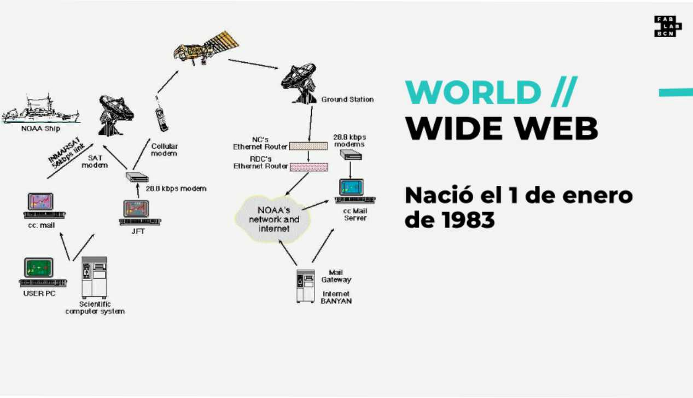

Las redes de dispositivos IoT dependen fuertemente de la comunicación inalámbrica, utilizando tecnologías como Wi-Fi y Bluetooth entre otras, para conectar sensores, actuadores y microcontroladores entre sí. 

Es clave entender el funcionamiento básico de los protocolos de comunicación que definen cómo los dispositivos deben intercambiar datos.

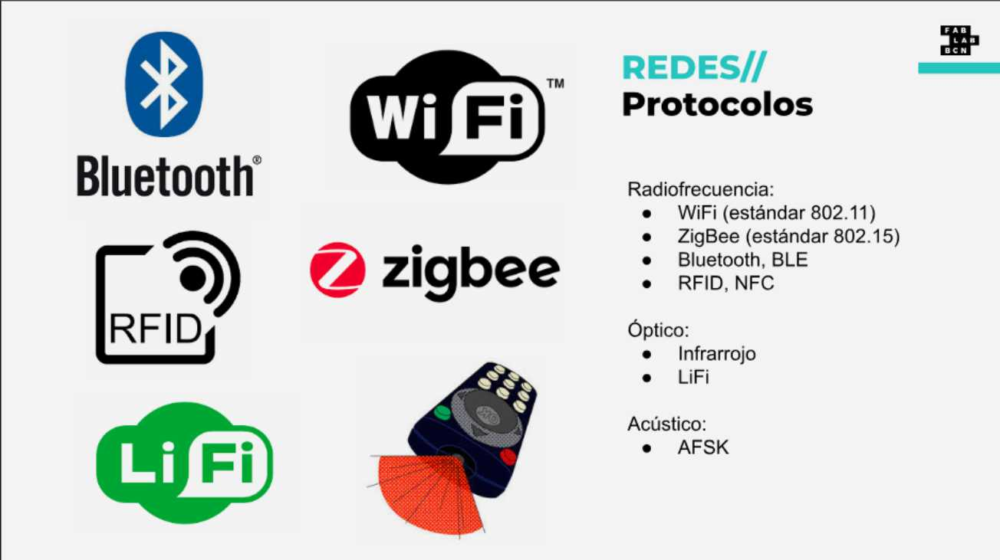

<h2><b>MQTT</b></h2>

Uno de los protocolos más importantes en el mundo de las redes IoT es MQTT (Message Queuing Telemetry Transport). Este protocolo se basa en el modelo de publicación/suscripción, lo que significa que un dispositivo no envía mensajes directamente a otro, sino que publica los mensajes en un servidor intermedio conocido como broker.

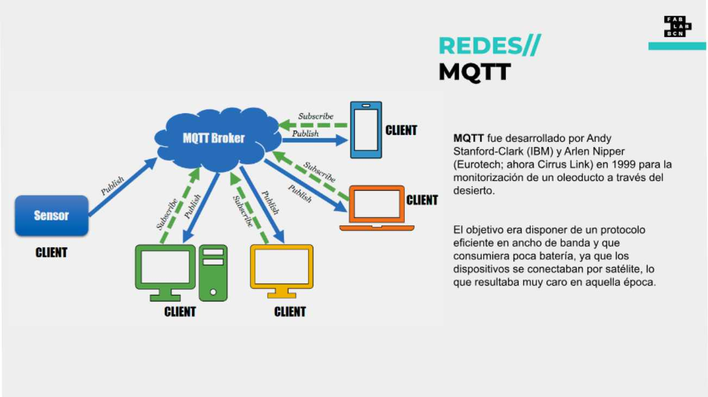

 Otros dispositivos interesados en recibir esa información se suscriben a ese broker, y este se encarga de distribuir los mensajes a los destinatarios correspondientes.
Este enfoque tiene varias ventajas:

•	Desacoplamiento temporal: Los dispositivos no necesitan estar conectados simultáneamente para enviar y recibir mensajes.

•	Escalabilidad: Es posible gestionar una gran cantidad de dispositivos con pocos recursos.

•	Ligereza: MQTT es ideal para redes con ancho de banda limitado, ya que los mensajes son pequeños y se optimiza la comunicación.

La historia de MQTT comienza en 1999, cuando fue creado para la industria del petróleo y gas, donde era necesario supervisar largas extensiones de tuberías con redes de ancho de banda reducido. Desde entonces, ha evolucionado y hoy en día es un estándar en aplicaciones IoT, siendo compatible con lenguajes de programación como Python, C y Java, lo que facilita su implementación en diversos proyectos.

<h2><b>ESP32</b></h2>

A medida que avanzamos, surge la necesidad de utilizar hardware que pueda manejar tanto la conectividad inalámbrica como la gestión de sensores y actuadores. Aquí entra en juego el ESP32, un microcontrolador diseñado por Espressif Systems que combina Wi-Fi y Bluetooth en un solo chip, junto con un procesador de doble núcleo de 32 bits.

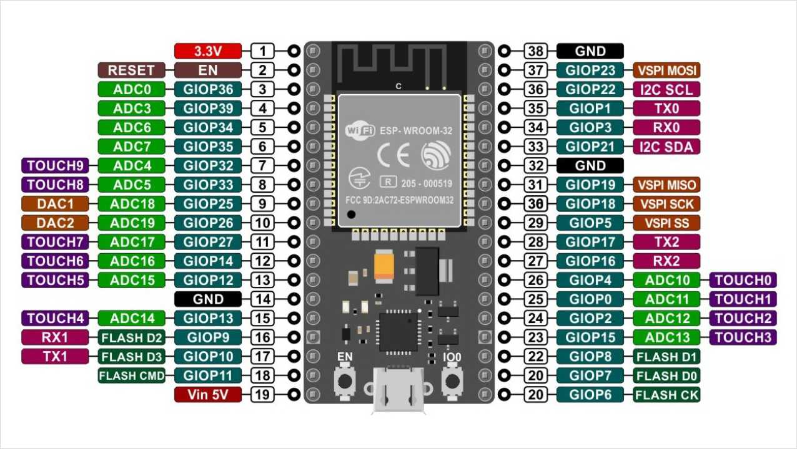

El ESP32 es una evolución del ESP8266, con mejoras en áreas como la cantidad de pines de entrada/salida, la velocidad de procesamiento y la inclusión de Bluetooth 4.2. Además, cuenta con funciones avanzadas como seguridad por hardware y varios periféricos integrados—como PWM, I2C, SPI y ADC—lo que lo hace adecuado para proyectos que requieren conectividad y procesamiento en tiempo real.

Este microcontrolador es ideal para proyectos IoT donde se necesita intercambiar datos con la nube o controlar dispositivos de manera remota. La posibilidad de utilizarlo con baterías lo convierte en una opción excelente para aplicaciones portátiles o sistemas de monitoreo.

Para finalizar el primer módulo, el docente nos planteó cuatro ejercicios como tarea, los cuales, además de simularlos en la plataforma Wokwi, teníamos que hacer la prueba real con nuestra placa ESP32.

 Esto nos desafió, ya que fue poco tiempo para familiarizarnos con el tema.

<h2><b>Primeros Pasos con ESP32 y Configuración de Arduino</b></h2>

Luego de realizar las primeras pruebas sin completar la totalidad de los ejercicios, pude compartir mi experiencia en la segunda clase de revisión, donde se explicaron los pasos necesarios para comenzar a trabajar con el ESP32 en el entorno de Arduino. 

Lo primero fue instalar las definiciones de la placa en Arduino IDE, lo que permitió programarla con el código adecuado. Este paso es crucial, ya que una configuración incorrecta puede generar problemas al compilar y cargar el código en la placa.

El proceso incluyó agregar un enlace en las preferencias del IDE de Arduino para descargar las herramientas necesarias. Luego se instaló la librería PubSubClient, indispensable para realizar proyectos de comunicación mediante MQTT. Esta librería permite que la placa se conecte a un servidor MQTT y gestione las publicaciones y suscripciones de mensajes.

Sin dudas, este repaso contribuyó a entender muchas cosas que no comprendía anteriormente.

<h2><b>Ejercicios Prácticos y Experiencias</b></h2>

Los ejercicios propuestos incluían la programación de un ESP32 para conectarse a una red Wi-Fi, suscribirse a un tópico MQTT y controlar un LED desde mensajes publicados en el servidor. 

El trabajo requería la simulación de estos ejercicios antes de ejecutarlos en hardware real, utilizando plataformas como Wokwi, que ofrece un entorno virtual para programar y probar placas de desarrollo sin riesgo de dañar el equipo físico.

<h2><b>Ejercicio 1): Control de un LED a través de comunicación serial</b></h2>

Este ejercicio consistió en simular el control de un LED con un ESP32 mediante una conexión serial y un botón físico. A través de comandos simples como "on" y "off", se pudo encender y apagar el LED, mientras que el botón llevaba un conteo de las pulsaciones. El ejercicio no presentó dificultades y permitió familiarizarse con el funcionamiento básico de la comunicación serial y el control de salidas digitales.

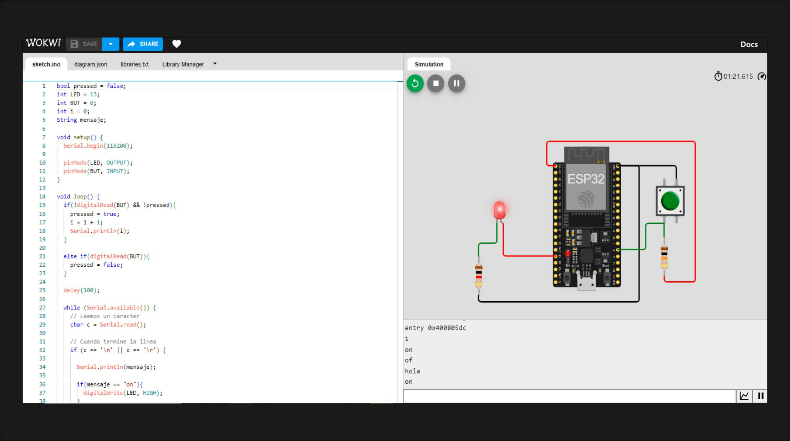

<h2><b>Ejercicio 2): Control de un LED POR WiFi y MQTT. </b></h2>

En este ejercicio nuevamente se controló un LED mediante un ESP32 pero esta vez conectado a una red WiFi y utilizando un servidor MQTT. 

El botón físico permitía enviar mensajes a un topic MQTT, mientras que el estado del LED era controlado por comandos recibidos desde otro topic. 

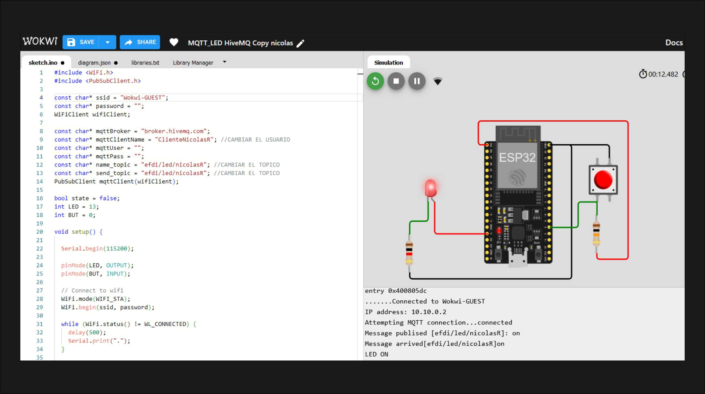

Durante el proceso, me enfrenté a algunos desafíos, como la selección incorrecta de la placa en Arduino IDE, lo que generaba errores de programación. 

Aunque no pude probar el ejercicio con otro compañero debido a los horarios, logré solucionar estos problemas y avanzar en la práctica.

<h2><b>Ejercicio 3): Encendido de un Neopixel.</b></h2>

En este  ejercicio, se utilizó un ESP32 conectado a un servidor MQTT para controlar un NeoPixel, enviando mensajes a través de topics MQTT para cambiar el color del LED.

 No fue posible realizar este ejercicio de forma física, por lo que se llevó a cabo solo en simulación, ya que contaba con un LED RGB y no logré conseguir un NeoPixel localmente. 
 
 A pesar de esto, la simulación permitió entender el control del NeoPixel mediante MQTT.

<h2><b>Ejercicio 4): Enviando y visualizando datos.</b></h2>

En este ejercicio, se utilizó un ESP32 para leer los datos de una fotoresistencia (LDR) y enviarlos a un servidor MQTT. Estos datos, que reflejaban la variación de la luz ambiente, eran enviados periódicamente a un topic específico. 

La segunda parte del ejercicio consistió en visualizar los datos enviados utilizando un script desarrollado en P5.js. Este script se conectaba al broker MQTT, se suscribía al topic y mostraba los datos de los sensores en tiempo real a través de gráficos, representando la variación de los valores en una serie de puntos y líneas con el nombre de quien lo publico para facilitar la identificación de los datos. 

Este ejercicio permitió integrar la lectura de sensores, la transmisión de datos mediante MQTT y su visualización en tiempo real.

Desafíos que encontré a la hora de realizar el ejercicio:

•	Incompatibilidad del sensor: Mi sensor LDR no era igual al de la simulación y inicialmente no funcionaba.

•	Configuración eléctrica: Gracias a las recomendaciones del docente, incorporé una resistencia de 10kΩ como pull-up entre el sensor y la alimentación.

•	Asignación de pines: Cambié de pin después de investigar y descubrir que no todos los pines son compatibles para este uso.

Finalmente, logré hacer funcionar el LDR y leer las lecturas de iluminación en la plataforma Pi4, generando diferentes gráficas, lo que me dejó muy satisfecho.

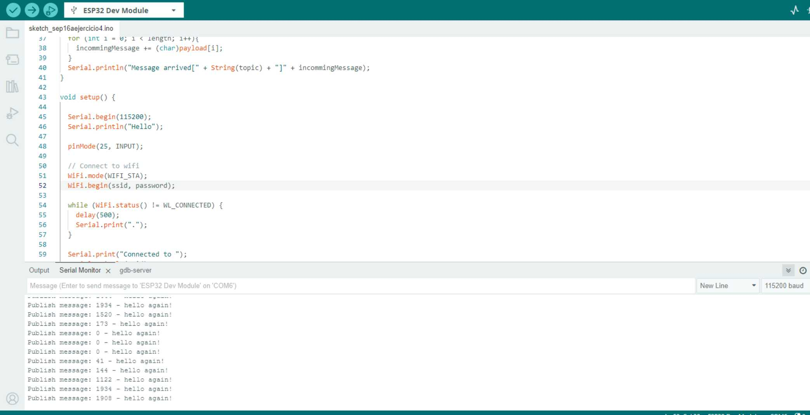

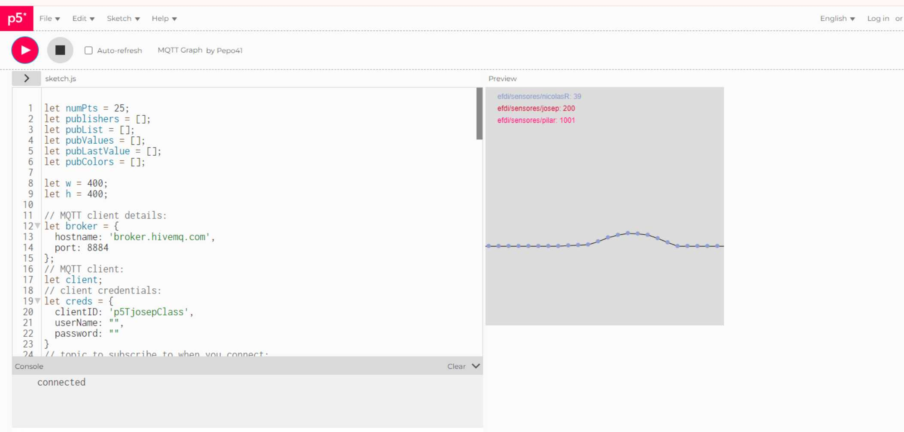

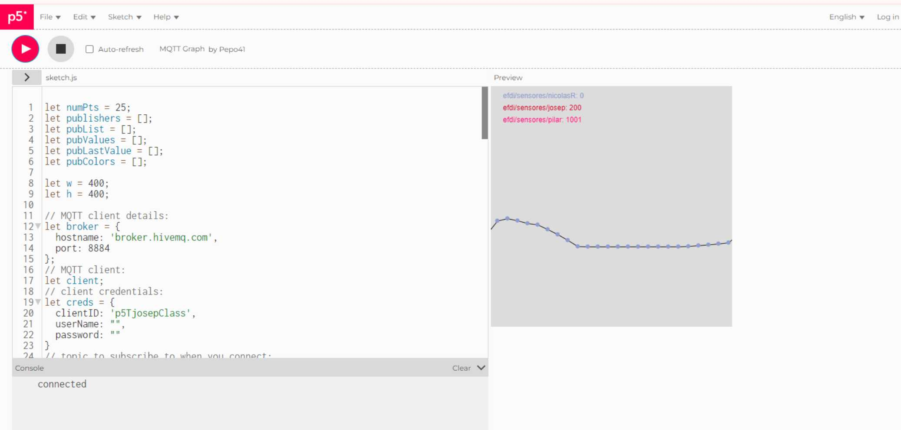

<h2><b>Proyecto Adicional: Comunicación entre dos ESP32</b></h2>

Motivado por los resultados, me animé a dar otro paso, siguiendo la sugerencia del docente  Josep. El objetivo era conectar dos placas ESP32 para que se comunicaran entre sí; una utilizaría un potenciómetro como controlador y la otra placa un servomotor, empleando MQTT y la conexión Wi-Fi.

<h2><b>Desafíos del proyecto:</b></h2>

•	Control del servomotor: Busqué código para controlar un servo similar al utilizado en ejercicios anteriores con Arduino Uno. La librería estándar no funcionaba, así que descargué ServoESP32.

•	Limitaciones de conexión Wi-Fi: El Wi-Fi de mi celular estaba limitado a dos dispositivos invitados, lo que impedía conectar dos placas y mi PC simultáneamente.

•	Conflicto de nombres: Para evitar conflictos al conectarme, nombré al emisor como nicolasR y al receptor como nicolas_receptor.

•	Problemas con el protoboard: Tuve inconvenientes con mi protoboard, que lo solucioné conectando directamente a la placa.

•	Alimentación del servo: El servomotor no funcionaba correctamente al estar conectado a 3.5 V; requería 5 V. Al proporcionar el voltaje adecuado, funcionó bien.

•	Cables inadecuados: Descubrí que uno de mis cables era solo de carga y no permitía la transferencia de datos.

Después de resolver estos problemas, logré que el emisor y el receptor funcionaran correctamente. El potenciómetro controlaba remotamente el servo de la segunda placa de forma exitosa. Este logro me entusiasma para incluir esta funcionalidad en el proyecto del trabajo final de la especialización:

<h2><b>Mi experiencia con ESP32</b></h2>

Estos ejercicios me exigieron aplicar lo aprendido e investigar más. Aunque el ESP32 comparte conceptos con Arduino, sus mayores posibilidades presentaron nuevos desafíos, especialmente en la instalación y configuración del entorno de desarrollo.

 Comienzo a entender cómo funcionan las redes en el contexto de IoT y cómo utilizar herramientas como MQTT para gestionar la comunicación entre dispositivos.
 
  Este aprendizaje práctico me ayudó a comprender la importancia de prestar atención a todos los detalles del hardware, la electrónica, la lógica y el código.
A pesar de las dificultades iniciales en la configuración y programación, la experiencia práctica fue muy buena para consolidar los conocimientos. 

Poder conectar y controlar dispositivos remotamente me mostró el potencial real de aplicar estos conceptos en soluciones como sistemas de automatización, control y monitoreo. Estoy entusiasmado por seguir explorando y llevar estos aprendizajes a mi proyecto final, así como a proyectos futuros.

<h1><b>Smart Citysens</b></h1>

Cada nuevo módulo incluye una  clase especial en la que un referente del área comparte sus experiencias. Estas oportunidades son sumamente valiosas, ya que nos permite no solo conocer personas y proyectos inspiradores, sino también ver de primera mano cómo lo que estamos aprendiendo se aplica en la práctica, más allá de la teoría. Estos encuentros son la oportunidad para conectar esas ideas con nuestros propios proyectos, ofreciéndonos una visión más clara de su potencial en el mundo real.

En esta ocasión, conocimos un proyecto emblemático dentro de la fabricación digital, software y hardware libre y la ciencia ciudadana.

Smart Citysens es un proyecto del que ya había escuchado anteriormente en un video podcast llamado "La Hora Maker" de César García, aunque en ese momento no lo había profundizado tanto.

Óscar González nos contó como este proyecto fue evolucionando, lo que empezó como una placa Arduino para la monitorización ambiental ha crecido hasta convertirse en un sistema mucho más completo que abarca kits de sensores, una plataforma abierta de datos y metodologías para la ciencia ciudadana. Todo esto se alinea perfectamente con la filosofía de democratización de los datos ambientales, algo que considero esencial para hacer accesible la tecnología a más personas. 

Me parece especialmente interesante cómo han utilizado los sensores de bajo costo y el código abierto para hacer que el proyecto sea replicable y accesible para quienes deseen involucrarse en la recolección de datos medioambientales. 

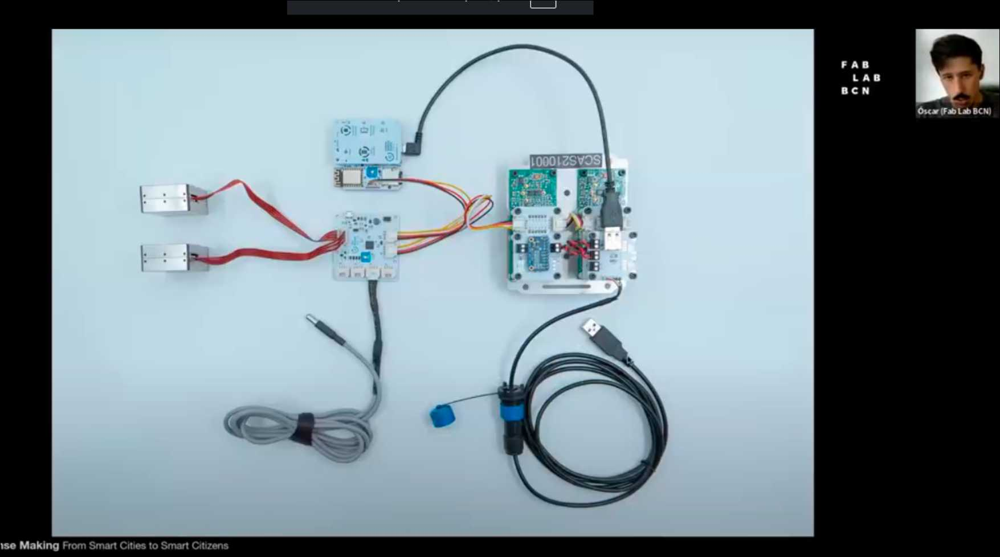

Es un ejemplo claro de cómo todos los integrantes de la sociedad, estudiantes, makers y científicos puede integrarse con la ciencia ciudadana para generar impacto tanto a nivel local como global.

Óscar González sobre los "ciudadanos inteligentes". Este concepto desafía la noción tradicional que frecuentemente se asocian con sistemas de control y vigilancia. 

En lugar de eso, se propone una visión más participativa, en la que los ciudadanos tienen las herramientas para gestionar su entorno de forma más autónoma, entendiendo y actuando sobre cuestiones como la calidad del aire, el tráfico o el uso de recursos.

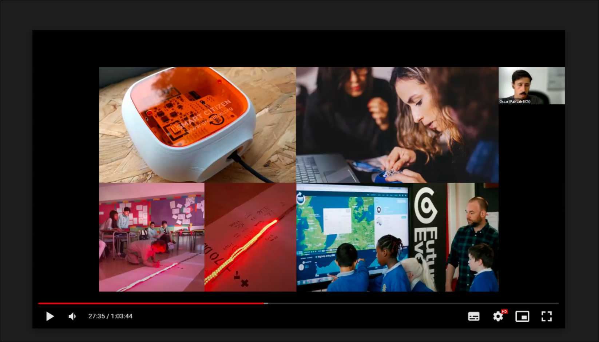

Otro aspecto que me parece clave es el uso de los datos obtenidos a través de la plataforma en políticas públicas y educación. Óscar nos compartió datos sobre cómo la actividad en Barcelona cambió durante la pandemia, revelando una reducción considerable en la contaminación y el ruido debido al confinamiento. Este tipo de información no solo es relevante desde un punto de vista académico, sino que también puede influir en la toma de decisiones a nivel de ciudad, ofreciendo nuevas perspectivas sobre cómo planificar el futuro urbano de manera más sostenible.

Más allá del impacto técnico y social, lo que realmente me inspira de este proyecto es su enfoque en la colaboración abierta. Óscar mencionó cómo trabajan con herramientas de código abierto como Arduino en su primera etapa, y esto me parece fundamental.

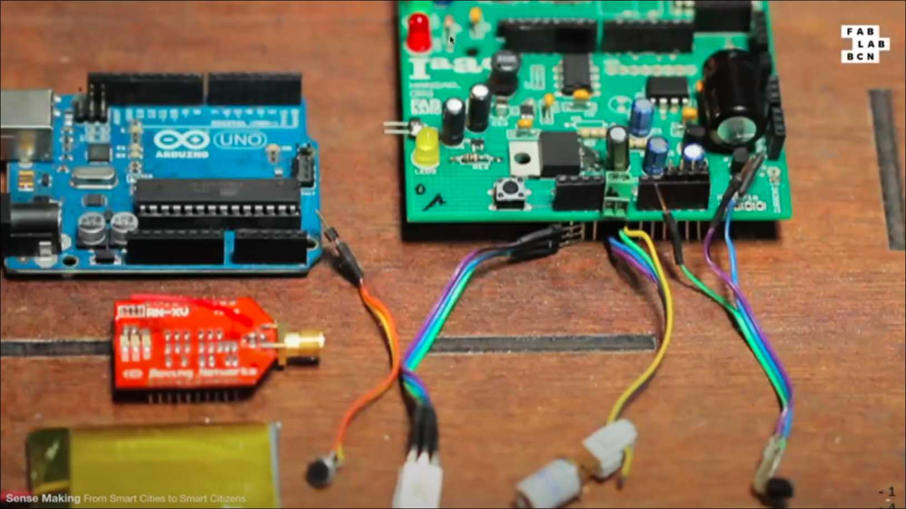

 Al mantener el código y las herramientas abiertas, se facilita la colaboración y la innovación. Cualquier persona interesada puede contribuir, modificar y mejorar el proyecto, lo que no solo fomenta la creatividad, sino que también refuerza la idea de que la tecnología puede ser accesible para todos, sin importar su formación o recursos. Este enfoque abierto y colaborativo fomenta la innovación cuando más personas tienen la oportunidad de participar.

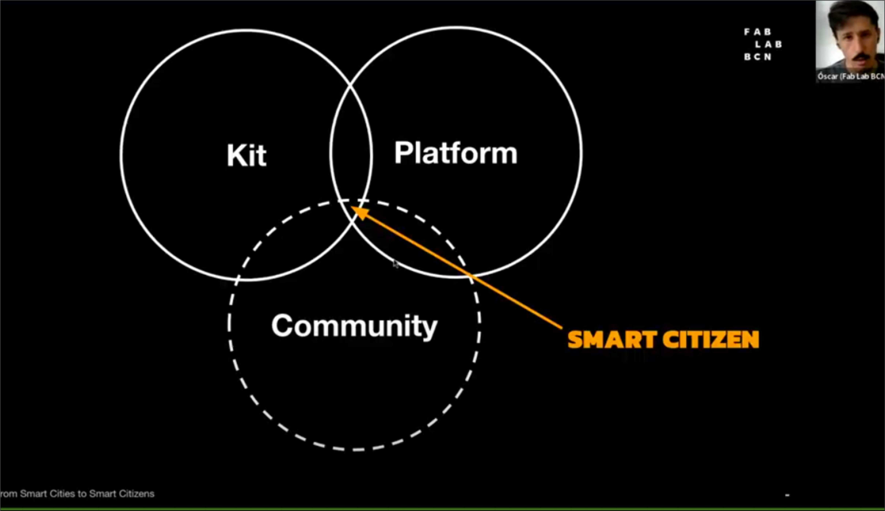

El hecho de que colaboren con instituciones científicas y otros actores demuestra que, para enfrentar los desafíos globales como el cambio climático o la contaminación, se necesita de una amplia variedad de perspectivas. Esto refuerza la idea de que las mejores soluciones surgen de equipos interdisciplinarios y de la participación activa de las comunidades.

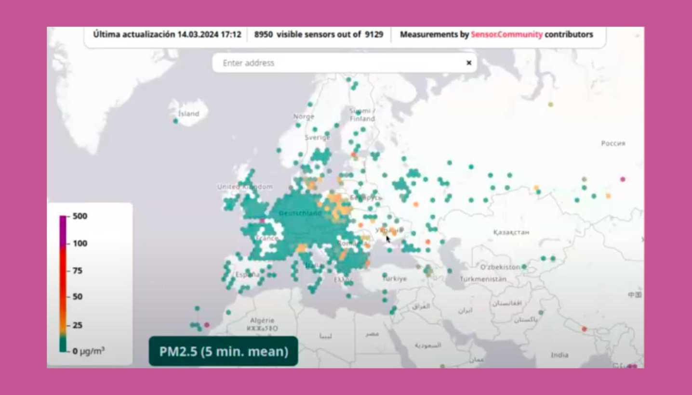

 Me parece interesante cómo el proyecto ha logrado influir en las políticas públicas y cómo involucran a los ciudadanos en la recolección de datos y la toma de decisiones. Esta es una lección importante para cualquier proyecto que busque tener un impacto más allá de lo tecnológico.

En conclusión, estas instancias de conexión con proyectos como Smart Citysens son fundamentales para mí. No solo me permiten conocer nuevas tecnologías y enfoques, sino que también me ayudan a identificar cómo puedo aplicar esos conceptos en mi propio desarrollo.

 Las dificultades que enfrentan estos proyectos en la práctica son recordatorios de que la innovación no es un camino fácil, pero también son oportunidades para aprender y adaptar nuestras ideas. Me quedo con muchas ideas útiles de esta experiencia, y la motivación de seguir explorando en mis propios proyectos. 
