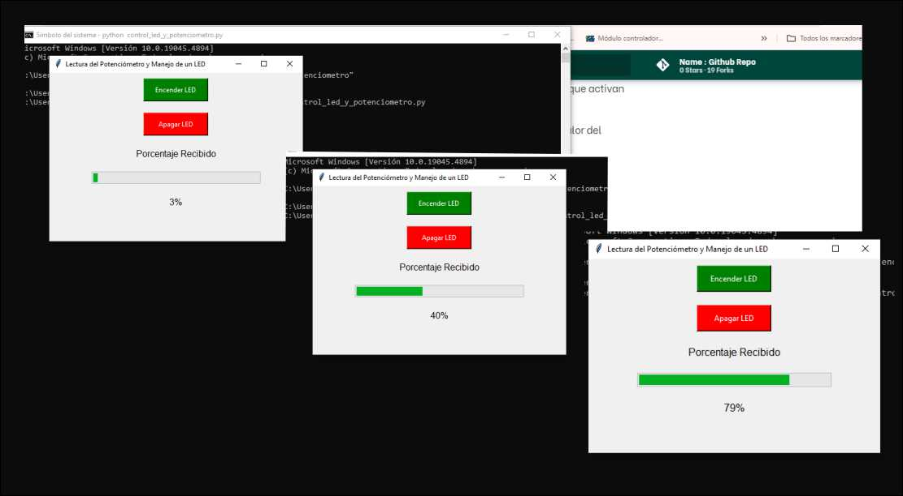
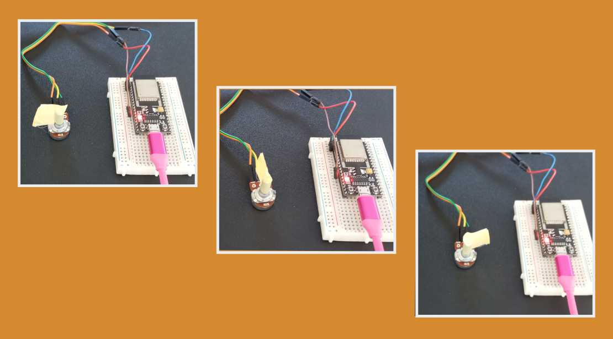

---
hide:
    - toc
---

# Módulo Técnico 07

<h1><b>Interfaces y aplicaciones</b></h1>

En este módulo avanzamos en un tema clave dentro del desarrollo digital: la creación de interfaces gráficas de usuario (GUI) que permitan la interacción entre los sistemas informáticos y el mundo real.

El objetivo es comprender los principios de programación y electrónica aplicada, y de esa forma poder crear interfaces que no solo respondan a nuestros comandos, sino que también muestren datos de sensores o servicios externos.

<h2><b>Inicio del Módulo</b></h2>

Este módulo fue impartido por el docente Xavi, quien, con gran entusiasmo por la programación, nos explicó detalladamente los conceptos clave. Aunque los temas eran complejos, su enfoque nos permitió comprenderlos, dejando espacio para seguir profundizando y practicando por nuestra cuenta.

Enfatizo en la importancia de prototipar rápidamente y utilizar herramientas accesibles para poder realizar las pruebas. 

En varias ocasiones, mencionó su propia experiencia trabajando en entornos donde la rapidez era crucial para avanzar en los proyectos. 

En la clase repasamos herramientas como Processing y Arduino, que permiten obtener resultados rápidamente, sin necesidad de configuraciones complicadas, lo que las convierte en opciones ideales para proyectos de prototipado y experimentación.

<h2><b>Lenguajes y Herramientas</b></h2>

Un tema interesante fue la diversidad de lenguajes de programación que analizamos. 

Xavi nos mostró una página web donde pudimos explorar todas las opciones de lenguajes y cómo interactúan entre sí. 

Este enfoque amplio nos permitió ver el gran ecosistema de lenguajes que existen y cómo cada uno tiene su propio propósito dentro del mundo del desarrollo digital.

En cuanto a herramientas prácticas, Processing fue una de las recomendaciones para iniciarnos en programación de interfaces. 

Este lenguaje, derivado de Java, es una versión simplificada que se utiliza especialmente para diseñar interfaces gráficas a partir de gráficos. 

Para comprender Processing, veo similitud con Arduino en la estructura de sus funciones, como setup() y draw(), que son equivalentes a setup() y loop() en Arduino. Aunque comparten ciertos aspectos, cada plataforma tiene un propósito diferente en el desarrollo de proyectos.

En uno de los ejemplos, se nos mostró cómo una interfaz gráfica leía la señal de una placa tipo Arduino, y al presionar un botón, el color de la pantalla cambiaba.

En este ejemplo pudimos ver cómo pequeños cambios en el código permitían modificar tanto el tamaño como los colores de los botones, y cómo la interfaz reaccionaba en tiempo real a las interacciones del usuario.

Para complementar, se utilizó código en Arduino que fue cargado en la placa, demostrando cómo se puede establecer comunicación entre la GUI y la electrónica. Además, se destacó la importancia de las librerías, que facilitan el desarrollo al permitir prototipar rápidamente sin tener que escribir todo el código desde cero.
 
<a href="https://processing.org/">Visita la página de Processing</a>
 <h2><b>Conexiones Web</b></h2>
 

Otro de los puntos clave fue la conexión web. 

Vimos un ejemplo de una página web alojada directamente en una placa Arduino, desde la cual podíamos interactuar con la misma, encendiendo o apagando un LED. 

Aquí comenzamos con conceptos más avanzados como WebSocket, que nos permitió conectar la placa a través de la red WiFi local. 

Aunque fue un tema más complejo espero terminar de comprenderlo a la hora de realizar los ejercicios. 

Este tipo de interacción abre muchas posibilidades para proyectos de Internet de las Cosas (IoT).

 <h2><b>Otras alternativas de Programación</b></h2>

<h3><b>P5.js</b></h3>

Otra herramienta que exploramos fue P5.js, una versión de Processing que funciona online y está basada en JavaScript. Esta versión nos permite crear gráficos en tiempo real desde el navegador, facilitando tanto la programación como la forma de compartir los proyectos.

 Al tener un editor online, se vuelve mucho más accesible y práctico para quienes necesitan trabajar con gráficos sin instalar software adicional.

<a href="https://p5js.org/">Visita la página de P5js</a>

<h3><b>Node-RED</b></h3>

Otra opción es  Node-RED, una plataforma multiplataforma que nos permite conectar sensores y dispositivos sin necesidad de escribir código de forma tradicional. 

La interfaz utiliza nodos para conectar flujos de datos, y durante la clase vimos cómo esto nos permite visualizar en tiempo real los datos que recibe una placa de Arduino. Es una herramienta muy poderosa cuando se busca una forma intuitiva de gestionar dispositivos conectados.

<a href="https://nodered.org/">Visita la página de NodeRed</a>

 <h3><b>A-Frame</b></h3>

Es un framework basado en JavaScript que permite el desarrollo de aplicaciones de realidad aumentada (AR) para la web. 

Se pueden cargar modelos 3D y manipularlos con el ratón o mediante lentes de realidad aumentada. Esto permite nuevas formas de interacción para aplicaciones en nuestros propios proyectos.

<a href="https://aframe.io/">Visita la página de A-frame</a>

 <h3><b>Python</b></h3>
 

Python fue recomendado por el docente por su versatilidad y facilidad de aprendizaje. 

Como ejemplo, nos explicó cómo, mientras realizábamos el ejercicio de Miro, utilizó una aplicación creada con Python que, junto con OpenAI y Miro, permitía leer textos e insertarlos automáticamente en una base de datos a través de Streamlit, una herramienta para desarrollar aplicaciones web de forma rápida. 

Lo más interesante fue ver cómo, a partir de las descripciones que hacíamos en Miro, la aplicación generaba automáticamente galerías de imágenes. Esto nos demostró el enorme potencial de las APIs para automatizar procesos y visualizar información de manera eficiente.

<a href="https://www.python.org/">Visita la página de Python</a>

<h2><b>Aplicaciones Móviles</b></h2>

Finalmente, vimos App Inventor, un programa desarrollado por el MIT que utiliza bloques de código para crear aplicaciones móviles. 

Este enfoque visual es ideal para aquellos que se inician en la programación, es una  excelente herramienta para diseñar aplicaciones sin tener que escribir código de manera tradicional.

<a href="https://appinventor.mit.edu/">Visita la página de App Inventor</a>

<h2><b>EJERCICIOS</b></h2>

<h3><b>Ejercicio 1</b></h3>

<h3><b>Encender led en esp32 con arduino y Processing</b></h3>

falta documentar....

<h3><b>Ejercicio 2</b></h3>

<h3><b>Lectura de ldr en web de arduino con Processing</b></h3>

El siguiente código esta realizado en Processing, este  se comunica con un ESP32 a través de un puerto serial para recibir datos del brillo de la luz ambiente y mostrarlos visualmente. 

Utiliza la librería processing.serial.* para establecer la conexión serial y recibir los datos.

 El valor del brillo recibido se muestra en una ventana con una barra de progreso y el porcentaje correspondiente.

En el método setup(), se configura la ventana (400x200 píxeles) y se selecciona el puerto serial donde está conectado el ESP32. La velocidad de comunicación se establece en 9600 baudios, y los datos se procesan una vez que se recibe un salto de línea (\n), lo que asegura la recepción de mensajes completos.

El método draw() se ejecuta continuamente y es donde se visualizan los datos. Primero, se establece un fondo blanco, luego se dibuja el título "Brillo de Luz" en la parte superior.

Luego se dibuja un rectángulo gris como fondo de la barra de progreso y, según el valor del brillo recibido, se ajusta el ancho de una barra que representa visualmente el brillo. También se muestra el porcentaje sobre la barra.

El método serialEvent() se activa cada vez que llegan datos desde el puerto serial. 

Lee la cadena de datos hasta un salto de línea, la limpia de espacios innecesarios, e intenta convertirla a un número de tipo float.

 Este valor se asigna a la variable brillo, que es utilizada para actualizar la barra de progreso en la ventana.

En resumen, el código recibe datos desde el ESP32, los procesa y los muestra en tiempo real mediante una interfaz gráfica básica , representando el brillo de una luz como una barra de progreso.

<pre><code>
import processing.serial.*;  // librería de comunicación serial

Serial myPort;               // Objeto para manejar el puerto serial
String inString = null;       // Variable para almacenar los datos recibidos
float brightness = 0;         // Variable para el porcentaje de brillo

void setup() {
  size(400, 200);            // Tamaño de ventana  alto y ancho
  println(Serial.list());    // Muestra los puertos seriales disponibles
  
  // Selecciona el puerto conectado al ESP32
  String portName = Serial.list()[1];  // Ajusta según el puerto correcto, puede ser cero o uno
  myPort = new Serial(this, portName, 9600);  // Conecta a ese puerto con 9600 baudios
  
  myPort.bufferUntil('\n');  // Procesa la entrada hasta el salto de línea
}

void draw() {
  background(255);           // Fondo blanco

  // Título "Brillo de Luz"
  fill(0);                   // Color negro para el texto
  textSize(24);
  textAlign(CENTER);
  text("Brillo de Luz", width/2, 50);  // Centra el texto

  // Dibujar rectángulo de fondo (ver si asi funciona)
  fill(200);
  rect(50, 100, 300, 30);

  //  barra de progreso con el valor del brillo
  fill(120, 180, 255);       // Color de la barra 
  float barWidth = map(brightness, 0, 100, 0, 300);  // Ajusta el porcentaje a la longitud de la barra
  rect(50, 100, barWidth, 30);  // Barra que representa el brillo

  // muestra  el porcentaje de brillo en texto (ver si asi funciona)
  fill(0);
  textSize(18);
  textAlign(CENTER);
  text(nf(brightness, 1, 2) + " %", width/2, 130);  // Muestra valor del brillo
}

void serialEvent(Serial myPort) {
  // Cuando llegan datos seriales
  inString = myPort.readStringUntil('\n');  // Lee hasta el salto de línea

  if (inString != null) {
    println("Datos recibidos: " + inString);  // Imprime los datos recibidos
    inString = trim(inString);  // Limpia los espacios en blanco

    if (inString.length() > 0) {
      try {
        brightness = float(inString);  // Intenta convertir la cadena a float
      } catch (Exception e) {
        println("Error de conversión: " + e.getMessage());  // Captura y muestra errores
      }
    }
  }
}
</code></pre>

El siguiente codigo de Arduino se utiliza para la programacion del ESP32

<pre><code>
// Definir el pin para el potenciómetro o LDR
const int sensorPin = 34;  // Pin analógico del ESP32 para leer el sensor (ajustar según tu conexión)
int valorSensor = 0;       // Variable para almacenar el valor leído del sensor

void setup() {
  // Iniciar la comunicación serial
  Serial.begin(9600);
  delay(1000);  // Esperar un segundo para estabilizar la conexión serial
}

void loop() {
  // Leer el valor del sensor analógico (0 a 4095)
  valorSensor = analogRead(sensorPin);
  
  // Mapear el valor del sensor (0 a 4095) a un rango de 0 a 100 para el brillo
  int brillo = map(valorSensor, 0, 4095, 0, 100);
  
  // Enviar el valor del brillo a través de la comunicación serial
  Serial.println(brillo);

  // Pausar por un breve periodo antes de enviar el siguiente valor
  delay(500);
}
</code></pre>

Explicacion: 

Configuro el pin 34 del ESP32 para leer valores analógicos de una resistencia o sensor LDR. 

El ESP32 se comunica con Processing mediante la comunicación serial, que está configurada a 9600 baudios. Esto permite enviar datos cada 500 milisegundos para no saturar de información a Processing.

Para obtener el valor del sensor, utilizo el comando analogRead(sensorPin), que lee los valores del potenciómetro o LDR, los cuales varían entre 0 y 4095 (correspondiente a la intensidad del brillo). 

Sin embargo, en lugar de trabajar con estos números grandes, he utilizado la función map() para convertir este rango a un porcentaje de 0 a 100 como ya lo utilize en ejercicios anteriores de arduino. 

Esto facilita la interpretación del valor del  brillo en Processing, que lo usa para mostrar visualmente una barra de progreso que representa la intensidad de la luz.

Así, el ESP32 envía los valores del brillo y Processing los muestra en tiempo real, proporcionando una interfaz gráfica basica para visualizar los cambios en el brillo de la luz.

<h3><b>Ejercicio 3</b></h3>
<h3><b>Led y potenciometro con Python 3</b></h3>

Este ejercicio consiste en la creación de una interfaz gráfica en Python y un código en Arduino que permiten controlar un LED y leer el valor de un potenciómetro en una placa ESP32.

En Python, utilicé la biblioteca Tkinter para crear una ventana que permite interactuar con el ESP32 a través de botones para encender y apagar un LED, además de una barra de progreso que muestra el valor de un potenciómetro. 

La comunicación entre el ESP32 y la PC se realiza mediante el puerto serial. Cuando presiono el botón "Encender LED", el programa envía un comando a través del puerto serial para activar el LED en la placa. Lo mismo ocurre con el botón "Apagar LED". 

Según la recomendación de un Maker genere un "segundo hilo", el valor del potenciómetro es leído constantemente y se muestra en la barra de progreso como un porcentaje.

 Este fue segundo acercamientos a Python, lo que me permitió entender cómo manejar interfaces gráficas simples y la comunicación serial.

<pre><code>
import tkinter as tk
from tkinter import ttk
import serial
import threading

# Configurar el puerto serial
ser = serial.Serial('COM4', 115200, timeout=1)  # Ajusta (COM que sea)

# Función para encender el LED
def encender_led():
    ser.write(b'encender\n')  # Enviar comando al ESP32
    print("Comando enviado: Encender LED de la placa")

# Función para apagar el LED
def apagar_led():
    ser.write(b'apagar\n')  # Enviar comando al ESP32
    print("Comando enviado: Apagar LED")

# lectura de valor del potenciómetro y actualizacion la barra 
def leer_potenciometro():
    while True:
        if ser.in_waiting > 0:
            data = ser.readline().decode('utf-8').strip()
            try:
                valor = int(data)
                porcentaje = int((valor / 4095) * 100)  # Convierte a porcentaje (original)
                progress_bar['value'] = porcentaje
                porcentaje_label.config(text=f"{porcentaje}%")
            except ValueError:
                pass

# Ejecutar la lectura del potenciómetro en un hilo separado (sugerencia numero 2)
def iniciar_lectura_potenciometro():
    hilo_lectura = threading.Thread(target=leer_potenciometro)
    hilo_lectura.daemon = True
    hilo_lectura.start()

# Crear la ventana para botones y barra
root = tk.Tk()
root.title("Lectura del Potenciómetro y Manejo de un LED")
root.geometry("450x300")

# Botón verde para encender el LED
boton_encender = tk.Button(root, text="Encender LED", command=encender_led, bg="green", fg="white", height=2, width=15)
boton_encender.pack(pady=10)

# Botón rojo para apagar el LED
boton_apagar = tk.Button(root, text="Apagar LED", command=apagar_led, bg="red", fg="white", height=2, width=15)
boton_apagar.pack(pady=10)

# Barra de progreso para mostrar el porcentaje del potenciómetro
progress_label = tk.Label(root, text="Porcentaje Recibido", font=("Helvetica", 12))
progress_label.pack(pady=10)

progress_bar = ttk.Progressbar(root, orient="horizontal", length=300, mode="determinate", maximum=100)
progress_bar.pack(pady=10)

# Etiqueta que muestra el porcentaje 
porcentaje_label = tk.Label(root, text="0%", font=("Helvetica", 12))
porcentaje_label.pack(pady=10)

# Iniciar la lectura del potenciómetro
iniciar_lectura_potenciometro()

# Ejecutar la ventana
root.mainloop()
</code></pre>

El siguiente codigo de Arduino se utiliza para la programacion del ESP32

<pre><code>
// Definir el pin del LED y el pin del potenciómetro
const int ledPin = 2;    // Pin del LED interno en el ESP32 (ajustar si es necesario)
const int potPin = 36;   // Pin del potenciómetro (ajustar según tu conexión)

int potValue = 0;        // Variable para almacenar el valor leído del potenciómetro

void setup() {
  // Iniciar la comunicación serial a 115200 baudios
  Serial.begin(115200);
  
  // configurar pin del LED como salida
  pinMode(ledPin, OUTPUT);
  
  // configurar pin del potenciómetro como entrada
  pinMode(potPin, INPUT);
}

void loop() {
  // Leer el valor del potenciómetro
  potValue = analogRead(potPin);
  
  // Enviar el valor del potenciómetro al puerto serial
  Serial.println(potValue);
  
  // Verificar si hay datos el puerto serial
  if (Serial.available() > 0) {
    // Leer el comando enviado desde el puerto serial
    String comando = Serial.readStringUntil('\n');
    
    // Si el comando es "encender", activar el LED
    if (comando == "encender") {
      digitalWrite(ledPin, HIGH);  // encender el LED
    }
    // Si el comando es "apagar", desactivar el LED
    else if (comando == "apagar") {
      digitalWrite(ledPin, LOW);   // Apagar el LED
    }
  }
  
  // Esperar antes de la siguiente lectura para no saturar el puerto serial
  delay(100);
}
</code></pre>

En el código de Arduino, el ESP32 está configurado para leer el valor del potenciómetro conectado al pin 36. El valor leído se envía repetidamente al puerto serial para ser procesado por la interfaz en Python. 

El ESP32 recibe comandos a través del puerto serial: "encender" o "apagar", que activan o desactivan el LED conectado al pin 2. 

Esto permite tener un control remoto sobre el LED mientras se monitorea el valor del potenciómetro

<h3><b>Ejercicio 4</b></h3>

<h3><b>Led y potenciometro con Python y MQTT</b></h3>

falta ............

<h3><b>Desafíos Técnicos:</b></h3>

A continuación, detallo los principales desafíos que enfrenté y cómo los abordé:

<h2><b>Problema 1: Lecturas Erráticas del Sensor LDR</b></h2>

Uno de los primeros problemas fue que el sensor LDR entregaba lecturas inconsistentes, lo que hacía muy difícil obtener valores fiables. Inicialmente, intenté cambiar la placa ESP32 en tres ocasiones, sospechando que un fallo en el hardware podría estar generando las lecturas defectuosas. A pesar de esto, las lecturas siguieron siendo erráticas.

<h3><b>Problema 2: Falta de Ficha Técnica Adecuada</b></h3>

Otro obstáculo fue la falta de una ficha técnica precisa para las placas ESP32. Esto complicó la conexión de los pines, ya que en varias ocasiones conecté los cables en los pines equivocados, generando errores en las lecturas.

<h3><b>Problema 3: Sensores LDR Defectuosos</b></h3>

Para asegurarme de que el problema no residía en el sensor en sí, probé tres modelos diferentes de LDR. A pesar de ello, los problemas de inconsistencia continuaban.

<h3><b>Problema 4: Cables de Conexión y USB Defectuosos</b></h3>

Dado que los cables pueden ser una fuente de ruido o fallas en las conexiones, también decidí cambiar los cables que conectaban el protoboard con los sensores, además del cable USB, ya que algunos informes sugieren que cables de baja calidad pueden introducir ruido y generar lecturas incorrectas.

<h3><b>Problema 5: Problemas con el Protoboard</b></h3>

Después de varios días de pruebas, decidí desconectar el protoboard de la placa para verificar si el problema provenía de ahí. Finalmente, descubrí que el protoboard estaba defectuoso, generando conexiones inestables que provocaban las lecturas erráticas. Al conectar los cables directamente al ESP32, logré solucionar el problema de forma efectiva.

<h3><b>Problema 6: Conflictos entre el Monitor Serial y el Código de Python</b></h3>

A pesar de haber resuelto los problemas de hardware, el software presentó nuevas dificultades. Al dejar abierto el monitor serial y, luego de comprobar los códigos de Arduino, el código de Python no mostraba la ventana con los datos. 

Tras varias revisiones, descubrí que el problema se debía a que ambas aplicaciones (monitor serial y Python) no podían estar abiertas al mismo tiempo, ya que competían por el acceso al puerto serial.

<h3><b>Problema 7: Configuración Incorrecta de la Velocidad en Baudios</b></h3>

Otro problema importante fue la configuración incorrecta de la velocidad en baudios. La velocidad de transmisión entre Arduino y Python no coincidía, lo que generaba errores de comunicación y lecturas incorrectas.

 Ajustar la configuración de baudios en ambos sistemas fue fundamental para solucionar este problema.

<h3><b>Problema 8: Configuración del Puerto Serial</b></h3>

También encontré que no había configurado correctamente el puerto serial habilitado en el código. Al no especificar qué puerto utilizar, Python no podía conectarse al ESP32, generando problemas de comunicación. Una vez configurado correctamente el puerto, la comunicación comenzó a funcionar adecuadamente.

<h3><b></b>Problema 9: Comprensión del Código</h3>

Finalmente, un desafío constante fue la comprensión del código. Aunque ya me estaba familiarizando con Arduino, el trabajo con Processing y Python era completamente nuevo para mí. 

Con el tiempo y la práctica, pude avanzar más en la comprensión, aunque sigue siendo un área en la que necesito seguir trabajando.
Mis avances los comento en el mismo código, ya que me facilita retomar un proyecto y puede ser útil para quien lea mi documentación.

<h2><b>Reflexión final</b></h2>

Este módulo me resultó complejo debido a la cantidad de información que debimos procesar en un tiempo limitado. La diversidad de programas que nos presentaron hizo más difícil profundizar en cada herramienta y entender su aplicación en detalle. 

Sin embargo, como reflexión general, considero que es esencial aprender a programar y experimentar con distintos lenguajes, ya que esto me permitirá seleccionar las herramientas más adecuadas según las necesidades de cada proyecto. Además, comprendí la importancia de plasmar claramente mis ideas, tener bien definido qué quiero lograr y cómo hacerlo. 

Al trabajar con interfaces y aplicaciones, cada paso debe estar cuidadosamente planificado para abordar problemas de manera eficiente y efectiva.
