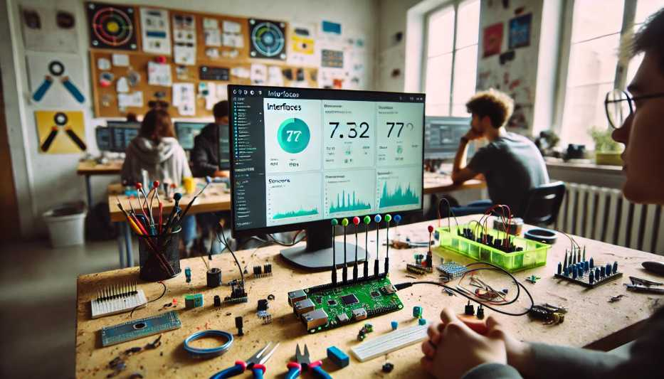

---
hide:
    - toc
---

# Módulo Técnico 07

<h1><b>Interfaces y aplicaciones</b></h1>

En este módulo avanzamos en un tema clave dentro del desarrollo digital: la creación de interfaces gráficas de usuario (GUI) que permitan la interacción entre los sistemas informáticos y el mundo real.

El objetivo es comprender los principios de programación y electrónica aplicada, y de esa forma poder crear interfaces que no solo respondan a nuestros comandos, sino que también muestren datos de sensores o servicios externos.

<h2><b>Inicio del Módulo</b></h2>

Este módulo fue impartido por el docente Javi, quien, con gran entusiasmo por la programación, nos explicó detalladamente los conceptos clave. Aunque los temas eran complejos, su enfoque nos permitió comprenderlos, dejando espacio para seguir profundizando y practicando por nuestra cuenta.

Enfatizo en la importancia de prototipar rápidamente y utilizar herramientas accesibles para poder realizar las pruebas. 

En varias ocasiones, mencionó su propia experiencia trabajando en entornos donde la rapidez era crucial para avanzar en los proyectos. 

En la clase repasamos herramientas como Processing y Arduino, que permiten obtener resultados rápidamente, sin necesidad de configuraciones complicadas, lo que las convierte en opciones ideales para proyectos de prototipado y experimentación.

<h2><b>Lenguajes y Herramientas</b></h2>

Un tema interesante fue la diversidad de lenguajes de programación que analizamos. 

Javi nos mostró una página web donde pudimos explorar todas las opciones de lenguajes y cómo interactúan entre sí. 

Este enfoque amplio nos permitió ver el gran ecosistema de lenguajes que existen y cómo cada uno tiene su propio propósito dentro del mundo del desarrollo digital.

En cuanto a herramientas prácticas, Processing fue una de las recomendaciones para iniciarnos en programación de interfaces. 

Este lenguaje, derivado de Java, es una versión simplificada que se utiliza especialmente para diseñar interfaces gráficas a partir de gráficos. 

Para comprender Processing, veo similitud con Arduino en la estructura de sus funciones, como setup() y draw(), que son equivalentes a setup() y loop() en Arduino. Aunque comparten ciertos aspectos, cada plataforma tiene un propósito diferente en el desarrollo de proyectos.

En uno de los ejemplos, se nos mostró cómo una interfaz gráfica leía la señal de una placa tipo Arduino, y al presionar un botón, el color de la pantalla cambiaba.

En este ejemplo pudimos ver cómo pequeños cambios en el código permitían modificar tanto el tamaño como los colores de los botones, y cómo la interfaz reaccionaba en tiempo real a las interacciones del usuario.

Para complementar, se utilizó código en Arduino que fue cargado en la placa, demostrando cómo se puede establecer comunicación entre la GUI y la electrónica. Además, se destacó la importancia de las librerías, que facilitan el desarrollo al permitir prototipar rápidamente sin tener que escribir todo el código desde cero.
 

 <h2><b>Conexiones Web</b></h2>
 

Otro de los puntos clave fue la conexión web. 

Vimos un ejemplo de una página web alojada directamente en una placa Arduino, desde la cual podíamos interactuar con la misma, encendiendo o apagando un LED. 

Aquí comenzamos con conceptos más avanzados como WebSocket, que nos permitió conectar la placa a través de la red WiFi local. 

Aunque fue un tema más complejo espero terminar de comprenderlo a la hora de realizar los ejercicios. 

Este tipo de interacción abre muchas posibilidades para proyectos de Internet de las Cosas (IoT).

 <h2><b>Otras alternativas de Programación</b></h2>

<h3><b>P5.js</b></h3>

Otra herramienta que exploramos fue P5.js, una versión de Processing que funciona online y está basada en JavaScript. Esta versión nos permite crear gráficos en tiempo real desde el navegador, facilitando tanto la programación como la forma de compartir los proyectos.

 Al tener un editor online, se vuelve mucho más accesible y práctico para quienes necesitan trabajar con gráficos sin instalar software adicional.

<h3><b>Node-RED</b></h3>

Otra opción es  Node-RED, una plataforma multiplataforma que nos permite conectar sensores y dispositivos sin necesidad de escribir código de forma tradicional. 

La interfaz utiliza nodos para conectar flujos de datos, y durante la clase vimos cómo esto nos permite visualizar en tiempo real los datos que recibe una placa de Arduino. Es una herramienta muy poderosa cuando se busca una forma intuitiva de gestionar dispositivos conectados.

 <h3><b>A-Frame</b></h3>

Es un framework basado en JavaScript que permite el desarrollo de aplicaciones de realidad aumentada (AR) para la web. 

Se pueden cargar modelos 3D y manipularlos con el ratón o mediante lentes de realidad aumentada. Esto permite nuevas formas de interacción para aplicaciones en nuestros propios proyectos.

 <h3><b>Python</b></h3>
 

Python fue recomendado por el docente por su versatilidad y facilidad de aprendizaje. 

Como ejemplo, nos explicó cómo, mientras realizábamos el ejercicio de Miro, utilizó una aplicación creada con Python que, junto con OpenAI y Miro, permitía leer textos e insertarlos automáticamente en una base de datos a través de Streamlit, una herramienta para desarrollar aplicaciones web de forma rápida. 

Lo más interesante fue ver cómo, a partir de las descripciones que hacíamos en Miro, la aplicación generaba automáticamente galerías de imágenes. Esto nos demostró el enorme potencial de las APIs para automatizar procesos y visualizar información de manera eficiente.

<h2><b>Aplicaciones Móviles</b></h2>

Finalmente, vimos App Inventor, un programa desarrollado por el MIT que utiliza bloques de código para crear aplicaciones móviles. 

Este enfoque visual es ideal para aquellos que se inician en la programación, es una  excelente herramienta para diseñar aplicaciones sin tener que escribir código de manera tradicional.

<h2><b>EJERCICIOS</b></h2>

<h3><b>Ejercicio 1</b></h3>

<h3><b>Ejercicio 2</b></h3>

<h3><b>Ejercicio 3</b></h3>

<h3><b>Ejercicio 4</b></h3>

<h2><b>Reflexión final</b></h2>

Este módulo me resultó complejo debido a la cantidad de información que debimos procesar en un tiempo limitado. La diversidad de programas que nos presentaron hizo más difícil profundizar en cada herramienta y entender su aplicación en detalle. Sin embargo, como reflexión general, considero que es esencial aprender a programar y experimentar con distintos lenguajes, ya que esto me permitirá seleccionar las herramientas más adecuadas según las necesidades de cada proyecto. Además, comprendí la importancia de plasmar claramente mis ideas, tener bien definido qué quiero lograr y cómo hacerlo. Al trabajar con interfaces y aplicaciones, cada paso debe estar cuidadosamente planificado para abordar problemas de manera eficiente y efectiva.
