---
hide:
    - toc
---

# Módulo Técnico 09

<h1><b>MOLDES</b></h1>

Los moldes son una de las herramientas esenciales en la fabricación de piezas, objetos artísticos y componentes industriales. 

En este módulo exploramos los moldes y las diversas técnicas y materiales que se utilizan, así como sus aplicaciones prácticas en diferentes sectores. 

El objetivo es tener un panorama completo que resulte útil para la ejecución de nuestros proyectos, permitiendo comprender tanto el proceso de diseño como los beneficios que aportan los moldes en la producción.

<h1><b>Un poco de Historia:</b></h1>

La historia de los moldes se remonta a miles de años. 

Se han encontrado ejemplos de moldes de cerámica en China que datan de hace más de 20,000 años, y registros de moldes de fundición de hierro en el antiguo Egipto y en China. 

La evolución de los moldes ha pasado por varias etapas, como el uso de arena para crear moldes en China en el 645 a.C., hasta la creación de moldes industriales de alta precisión en la actualidad. 

La variedad de materiales empleados a lo largo del tiempo incluye yeso, cera, grasa animal y metales, reflejando la adaptación de las técnicas de moldeo según los recursos disponibles.

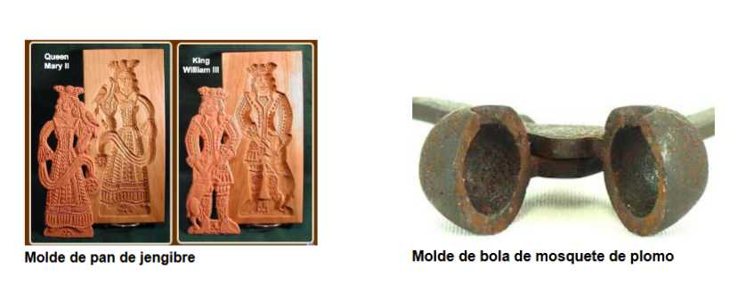

<h1><b>Tipos de Moldes y Sus Aplicaciones</b></h1>

Los moldes se pueden clasificar según su diseño y propósito, lo que determina cómo se utilizan y qué tipo de piezas producen.

 A continuación, se describen los principales tipos de moldes y sus aplicaciones más comunes:

 <h1><b>Moldes de Una Cara</b></h1>

Este tipo de molde es el más simple y consiste en una sola cavidad abierta en la que se vierte el material. Es ideal para crear piezas planas o con detalle en un solo lado, como placas decorativas, insignias y elementos arquitectónicos. 

En estos moldes se pueden utilizar materiales como yeso, resina, cemento o caucho, y el proceso de solidificación puede ser al aire libre o mediante una reacción química.

•	Aplicaciones: Los moldes de una cara son ideales para proyectos artísticos, como la creación de esculturas o piezas decorativas. 

También se emplean en la producción de elementos arquitectónicos, como frisos o molduras, que requieren detalle solo en una cara.

•	Materiales Utilizados:  Los materiales más comunes incluyen yeso, resinas y caucho de silicona. Estos materiales permiten una fácil manipulación y una rápida creación de moldes, siendo accesibles tanto para principiantes como para expertos.

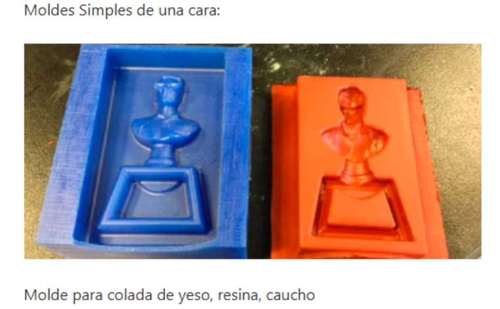

<h1><b>Moldes de Múltiples Caras</b></h1>

Para piezas tridimensionales o con detalles complejos, se utilizan moldes de múltiples caras. 

Estos moldes constan de varias partes que se ensamblan para formar una cavidad cerrada, donde se vierte el material. Son adecuados para producir objetos completamente tridimensionales, como figuras de acción, componentes industriales y esculturas detalladas.

•	Técnicas de Producción:

- Colada: Consiste en verter el material dentro del molde para que solidifique y forme la pieza. Se utiliza para materiales como resinas, yeso o cemento.

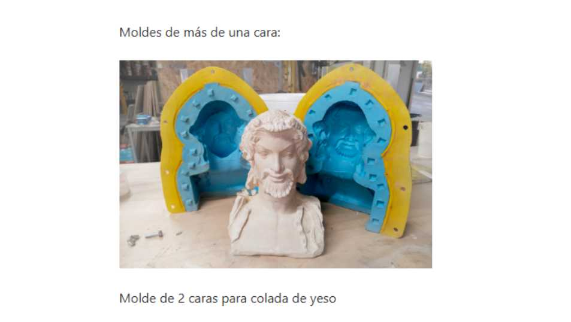

- Laminado: En esta técnica, se colocan fibras, como las de vidrio o carbono, junto con resinas en el molde. 

Luego se trabaja con presión o vacío para eliminar el exceso de material y las burbujas de aire, creando piezas resistentes y ligeras.

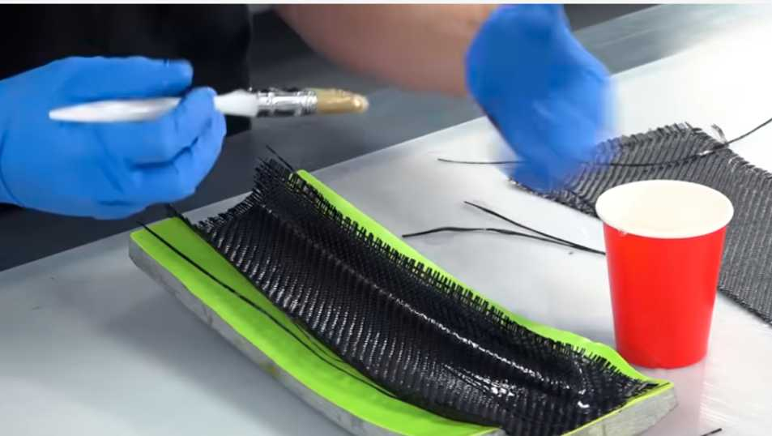

- Inyección: Utilizada en la fabricación industrial, consiste en inyectar material caliente (por ejemplo, plástico) dentro del molde a alta presión. 

Esto permite la producción en masa de objetos como juguetes, componentes electrónicos y piezas automotrices.

•	Aplicaciones: Los moldes de múltiples caras se emplean principalmente en la producción industrial de piezas complejas que requieren gran precisión. 

También se utilizan en la creación de objetos personalizados y prototipos, ya que permiten una alta fidelidad en la reproducción de detalles.

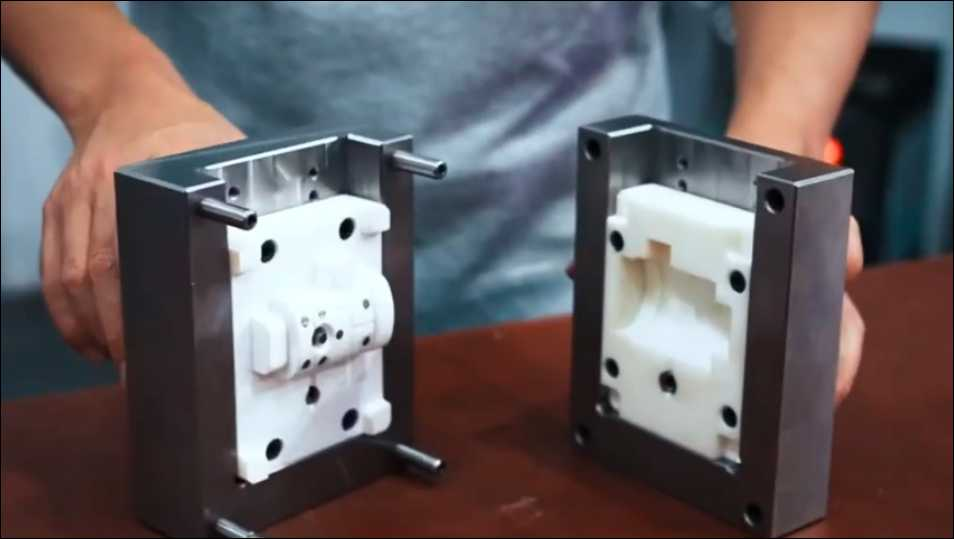

<h1><b>Herramientas de Moldeo y Técnicas de Liberación</b></h1>

El proceso de moldeo no se limita a la creación del molde y el vertido del material. Un aspecto fundamental  es la liberación de la pieza una vez que se ha solidificado. 

Para facilitar esta etapa y evitar dañar el molde o la pieza, se emplean agentes desmoldantes que permiten que la pieza se separe del molde sin adherirse a sus superficies, minimizando el desgaste y permitiendo reutilizarlo en múltiples ocasiones.

•	Tipos de Agentes Desmoldantes:

-	Aerosoles y Pinceles: Se aplican para cubrir las superficies del molde con una fina capa de desmoldante, asegurando que no haya adherencia en los detalles más pequeños.

-  Cera y Silicona: Comúnmente usados en moldes de caucho o resina, proporcionan una liberación suave y limpia, lo que resulta esencial cuando se busca un acabado sin imperfecciones.

•	Moldeo por Presión y Vacío:

- Presión: Se utiliza un tanque de presión para eliminar las burbujas de aire atrapadas en el material, asegurando que la pieza final esté libre de defectos internos. 

Es ideal para piezas de resina que requieren un acabado completamente liso y sin burbujas.

- Vacío: En el moldeo al vacío, el aire atrapado en la mezcla se elimina mediante una cámara de vacío antes de que el material solidifique. 

Este método es ideal para materiales como el caucho de silicona, que requieren tiempos de curado más largos y una eliminación precisa del aire.

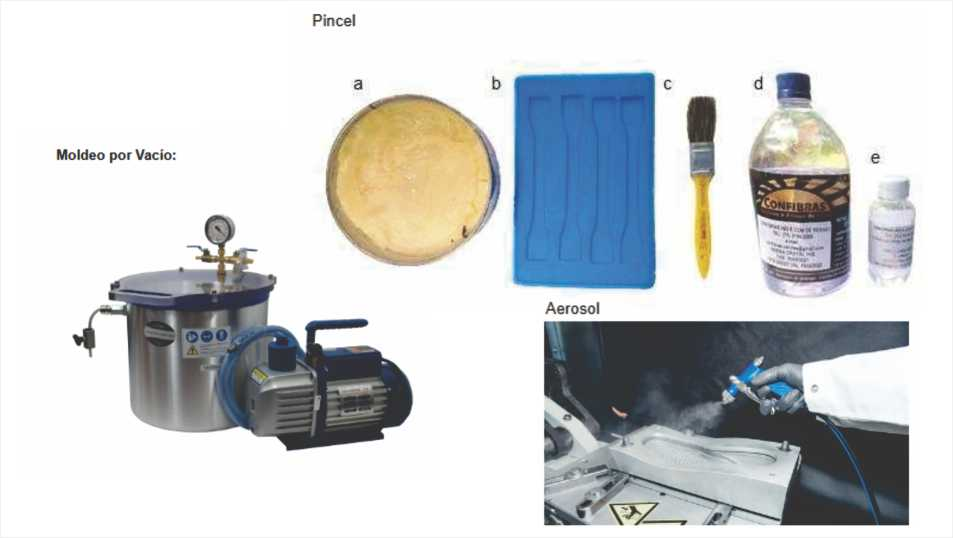

<h1><b>Diseño de Moldes:</b></h1>

Comencé mi experiencia en diseño 3D utilizando FreeCAD, y con la especialización incorporé Fusion 360, que ha demostrado ser una herramienta ventajosa para el diseño de moldes.

 Este software facilita un diseño detallado y preciso, especialmente en aspectos como el ángulo de desmoldeo, que permite una extracción suave de las piezas, reduciendo fricciones y minimizando el desgaste. 
 
 
 La correcta aplicación de estos ángulos previene deformaciones y asegura la calidad de las superficies, lo cual es esencial en producciones repetitivas.

Además, los orificios de vertido y ventilación son fundamentales para garantizar el flujo uniforme del material en moldes cerrados de varias partes. 

Estos respiraderos deben colocarse estratégicamente donde el canal de vertido se encuentra con la cavidad del modelo y en posibles puntos de formación de bolsas de aire, permitiendo un escape rápido del aire y evitando defectos en la pieza final.

Por otro lado, los alineadores o centradores de molde aseguran que ambas partes del molde se ajusten con precisión, evitando desalineaciones y logrando una reproducción fiel de la pieza. Esta alineación es crucial, especialmente en moldes con detalles complejos, ya que garantiza que cada pieza tenga una estructura sólida y bien definida.

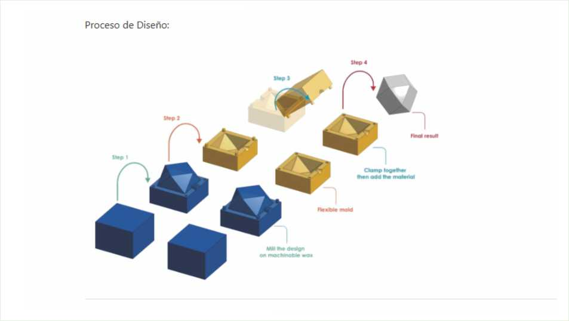

<h1><b>Materiales para Moldes: Características y Usos</b></h1>

Existen varios materiales que se pueden emplear para fabricar moldes, cada uno con sus características particulares y ventajas específicas. 

La elección del material adecuado dependerá del tipo de pieza que se desea producir, las propiedades requeridas y las condiciones del proceso.

- Resina Epoxi

•	Características: La resina epoxi es conocida por su transparencia y resistencia química. Tiene un acabado brillante y es extremadamente duradera, lo que la convierte en una opción popular para proyectos que requieren alta calidad visual.

•	Aplicaciones: Se utiliza en la creación de joyería, recubrimientos protectores y componentes decorativos. La resina epoxi es perfecta para proyectos donde la estética es una prioridad, ya que ofrece un acabado cristalino.

- Resina de Poliuretano

•	Características: Se cura rápidamente y es menos propensa al amarilleo con el tiempo, a diferencia de la resina epoxi. 

Además, tiene una alta resistencia a la abrasión y es capaz de reproducir detalles finos.

•	Aplicaciones: Es ideal para la fabricación de prototipos y piezas industriales, donde se requiere rapidez en el proceso de curado y resistencia mecánica. 

También se usa en proyectos donde la precisión es crucial, como piezas mecánicas y componentes estructurales.
Resina de Poliéster

•	Características: Es económica y adecuada para grandes volúmenes de producción. Sin embargo, tiene un fuerte olor y requiere trabajar en un área bien ventilada. Su durabilidad y resistencia la hacen ideal para proyectos de gran escala.

•	Aplicaciones: Se utiliza en la fabricación de carcasas para automóviles, botes y componentes arquitectónicos.

 Aunque menos popular en las artesanías debido a su olor, es una excelente opción para aplicaciones industriales donde el costo es un factor importante.

<h1><b>Medidas de Seguridad en el Trabajo con Moldes</b></h1>

Trabajar con moldes y los materiales utilizados en su fabricación implica ciertos riesgos, por lo que es importante seguir medidas de seguridad adecuadas para garantizar un entorno de trabajo seguro y evitar daños a la salud.

•	Equipos de Protección Personal (EPP): Se recomienda el uso de guantes de nitrilo, que ofrecen una excelente resistencia a los productos químicos y un buen ajuste, evitando el contacto directo con resinas y catalizadores.

 Además, se deben usar mascarillas para evitar la inhalación de vapores y gafas de seguridad para proteger los ojos.

•	Ventilación: Trabajar en un área bien ventilada es crucial, especialmente cuando se manipulan resinas de poliéster que emiten vapores fuertes. 

La ventilación cruzada o el uso de extractores garantiza que los gases no se acumulen en el área de trabajo, reduciendo el riesgo de intoxicación.

•	Limpieza y Mantenimiento de Herramientas: Después de cada uso, los moldes y herramientas deben limpiarse adecuadamente para prolongar su vida útil y evitar la acumulación de residuos. 

Esto también facilita el trabajo en futuros proyectos, ya que asegura superficies limpias y lisas.

Aplicaciones Actuales de los Moldes: Desde la Industria hasta el Arte

Los moldes son una herramienta versátil que se aplica en una gran variedad de industrias y disciplinas artísticas.

 Gracias a los avances tecnológicos y a la disponibilidad de nuevos materiales, el uso de moldes se ha expandido, permitiendo a los fabricantes y diseñadores crear piezas únicas y productos en serie de alta calidad.

Industria Automotriz y Electrónica

En la producción de vehículos y dispositivos electrónicos, los moldes juegan un papel fundamental en la creación de carcasas, piezas estructurales y componentes que requieren alta precisión. Los moldes de inyección permiten la producción en masa de estos elementos, garantizando uniformidad y resistencia.

Prototipado y Fabricación de Productos Personalizados

Se utilizan moldes para crear prototipos que les permitan evaluar la funcionalidad y apariencia de un producto antes de proceder con la producción en serie. 

Este proceso es fundamental para perfeccionar los detalles y asegurar que el diseño cumpla con las expectativas tanto de terminación como su funcionalidad.

Arte y Artesanía

Los moldes son utilizados por muchos artistas para reproducir esculturas y crear piezas de joyería. Con esta técnica se puede capturar detalles finos y fabricar réplicas y obras,  manteniendo la calidad y el acabado en cada pieza.

<h1><b>Conclusiones</b></h1>

Este módulo sobre moldes ha sido un buen punto de partida para comprender la importancia de esta técnica en la fabricación. El moldeo es fundamental en muchos sectores y tiene un enorme potencial para la creación de piezas personalizadas.
Creo que habría sido útil contar con más clases para profundizar en las técnicas y materiales, lo cual nos permitiría acercarnos más a su aplicación en proyectos complejos.
En mi caso, ya había experimentado con moldes de resina poliéster de forma artesanal y en piezas simples. Este módulo me ha mostrado las enormes posibilidades que ofrece el moldeo y me ha motivado a explorar técnicas más avanzadas.
Mis expectativas son continuar aprendiendo y desarrollando mis habilidades para aplicarlas en próximos proyectos.

<h1><b>Ejercicio práctico, diseño de maceta</b></h1>
<h1><b>Requerimientos:</b></h1>

El ejercicio consistía en diseñar una maceta con dimensiones máximas de 10 cm de alto y 15 cm de diámetro, utilizando Fusion 360. El diseño debía incluir detalles decorativos y requería la creación de un molde que permitiera la fabricación de la maceta en materiales como yeso o cemento. Además, el molde debía dividirse en piezas que facilitaran el desmoldeo, incluyendo guías de encastre y características específicas para asegurar un proceso de fabricación eficiente. La entrega final requería documentar cada etapa del proceso con capturas de pantalla y enviar los archivos .f3d y .stl para su posterior impresión 3D.
Paso a Paso del Proceso de Diseño

Paso 1: Boceto Inicial y Extrusión del Cuerpo Principal.

 Para comenzar, creé dos bocetos rectangulares en Fusion 360. 
 
 El primero, más pequeño, definiría la base de la maceta, y el segundo, de mayor tamaño, se utilizaría para el cuerpo principal. Extruí ambos bocetos, formando así la estructura inicial de la maceta.

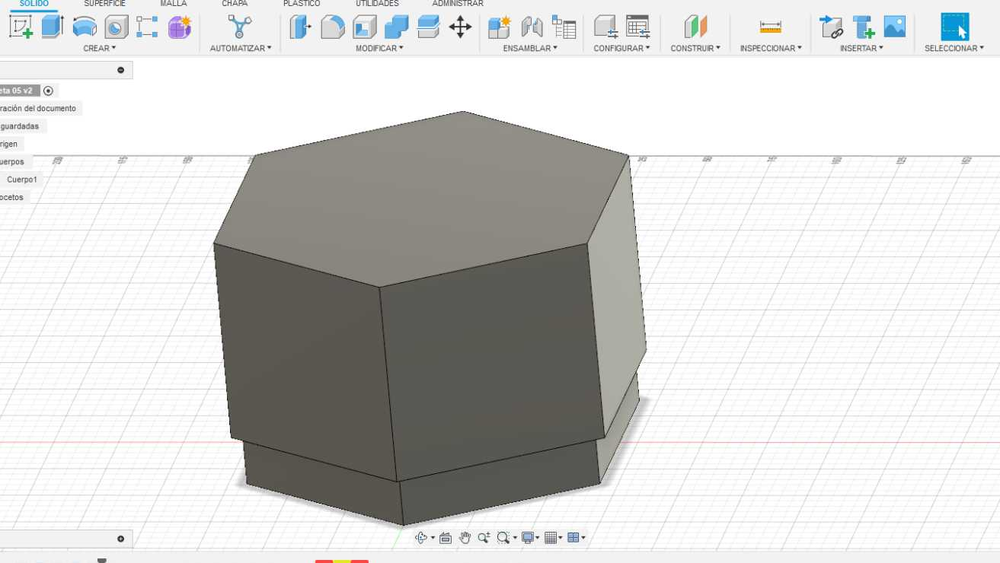

Paso 2: Creación de Molduras Decorativas.

 Para añadir detalles decorativos, generé un nuevo boceto rectangular que sobresalía 2 milímetros del perímetro exterior de la maceta. 
 
 Este boceto fue extruido para formar una moldura en dos de las caras opuestas de la maceta.

 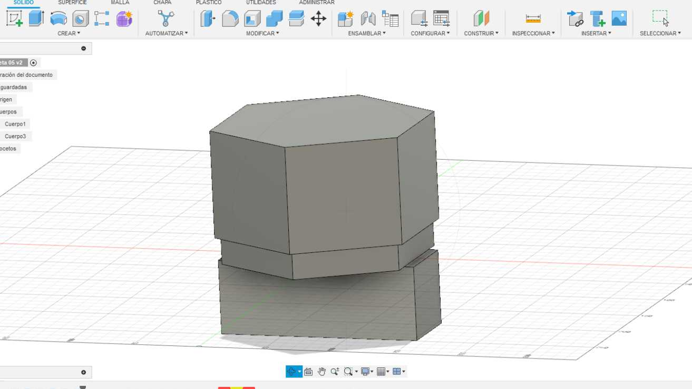

  Ajusté la altura de esta moldura para que cumpliera con el objetivo estético, y la combiné con el cuerpo principal utilizando las herramientas Modificar y Combinar.

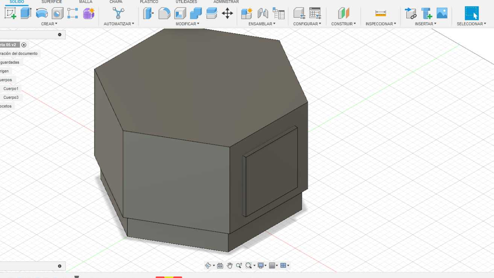

Paso 3: Terminación de Molduras.

Redondeé las esquinas de las molduras con la herramienta de Empalme, dándoles una apariencia más suave y estética, adecuada para el estilo final del diseño.

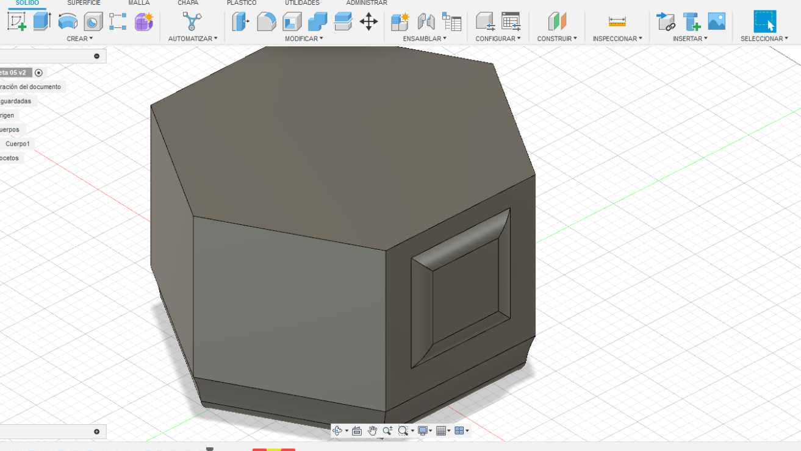

Paso 4: Vaciado del Interior de la Maceta.

Con el diseño exterior terminado, utilicé la herramienta de vaciado para crear el espacio interior de la maceta, manteniendo un espesor uniforme en las paredes, lo que garantiza la resistencia y estabilidad de la pieza.

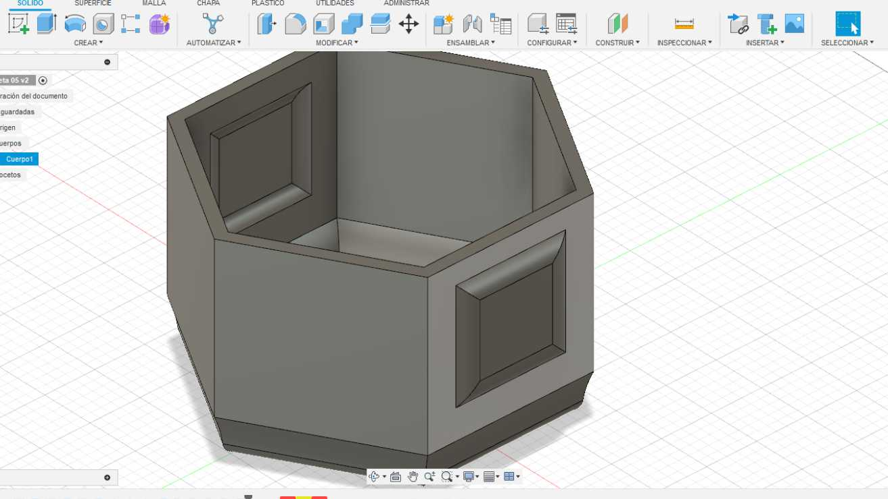

Paso 5: Diseño de guia para el Molde.

 Para asegurar que el molde fuera fácil de manejar, generé un boceto adicional compuesto por dos rectángulos de 10 x 10 mm. Estos rectángulos fueron extruidos y posicionados en puntos estratégicos para facilitar la sujeción con pinzas o bandas elásticas. Finalmente, uní estos accesorios al cuerpo principal.

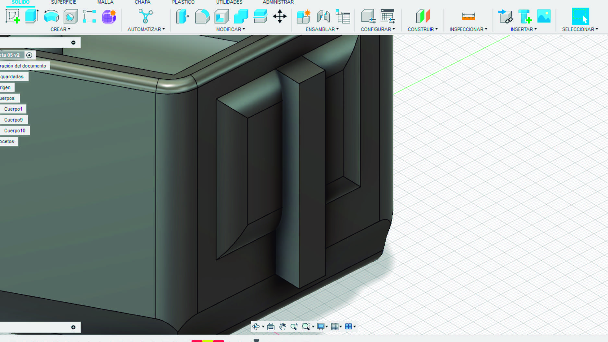

Paso 6: División del Modelo en Moldes Separados.

 Para dividir la maceta en dos moldes independientes, realicé un corte transversal que atravesaba las dos molduras. 
 
 Esto permitió crear dos piezas simétricas que facilitarían el desmolde durante la fabricación.

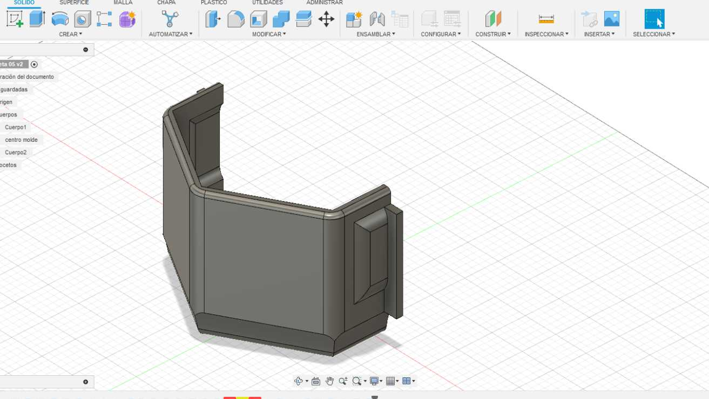

Paso 7: Creación del Hueco Interior de la Maceta.

Para generar el espacio donde se colocará la tierra y la planta, diseñé un elemento cilíndrico en la parte interior del diseño.

 A partir de un boceto circular, extruí un cilindro que define el hueco interior y aumenté su diámetro en 5 mm en la cara superior. Realicé un vaciado desde la parte superior manteniendo una estructura resistente sin desperdiciar material a la hora de imprimirlo.

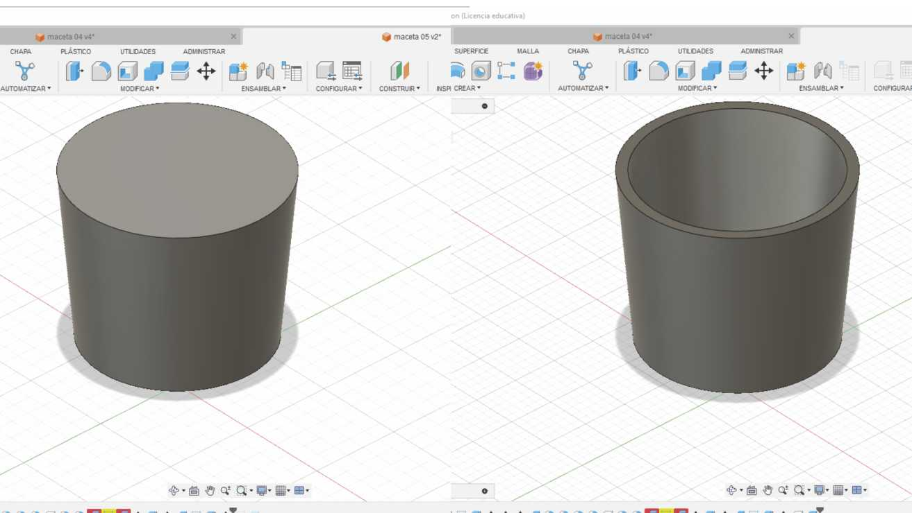

Documentación y Entrega.

El diseño final se completó en Fusion 360, documentando cada etapa con capturas de pantalla detalladas.

 Subí toda la documentación al sitio web correspondiente. 
 

 Además, convertí cada componente en archivos .stl separados, adecuados para la impresión 3D, y los incluí en un archivo comprimido (.zip) que fue enviado para la fase de práctica presencial en el laboratorio de UTEC.

"La siguiente imagen muestra una captura de los tres archivos STL de los cuerpos generados por separado, previsualizados en el software de corte Cura. En esta vista se pueden apreciar las piezas listas para la impresión 3D, a la espera de la configuración final de parámetros en el equipo."

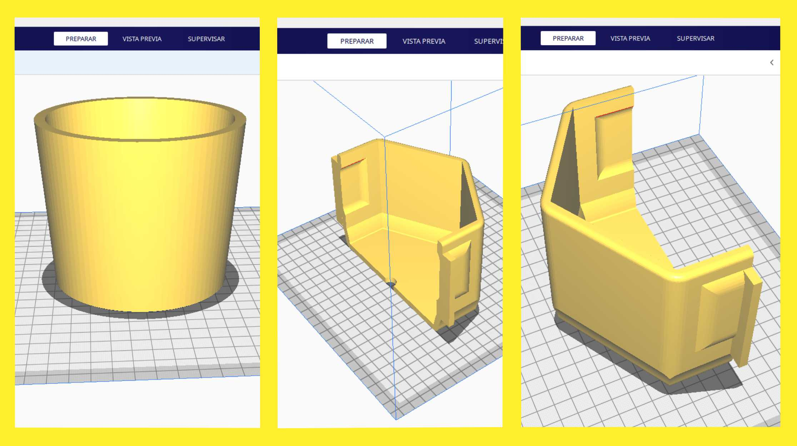

Puedes descargar los STL <a href="https://github.com/nicolas-reggi/nicolas-reggi/blob/main/docs/proyecto/moldes/maceta_v5" target="_blank">aquí</a>.

